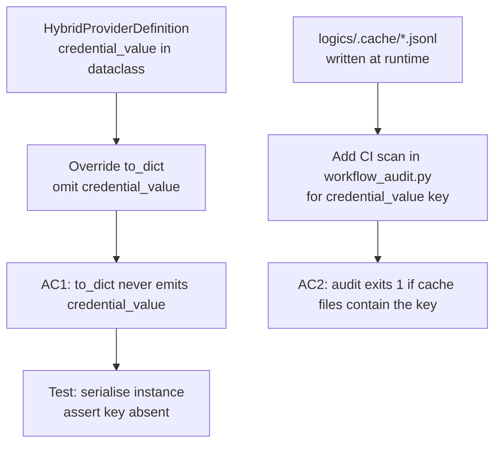

## item_296_harden_hybridproviderdefinition_credential_serialisation_and_audit_cache_files - Harden HybridProviderDefinition credential serialisation and audit cache files
> From version: 1.25.0
> Schema version: 1.0
> Status: Ready
> Understanding: 90%
> Confidence: 85%
> Progress: 100%
> Complexity: Medium
> Theme: Quality
> Derived from `logics/request/req_162_address_logics_kit_audit_findings_from_april_2026_structural_review.md`

# Problem

`HybridProviderDefinition` (in `logics_flow_hybrid_transport_core.py`) is a frozen dataclass carrying `credential_value: str | None`. This field holds a live API key in memory and circulates through structures that may be:
- serialised to JSON for observability/audit output
- logged via Python's standard `dataclasses.asdict()` helper

The audit cache files (`logics/.cache/hybrid_assist_audit.jsonl`, `logics/.cache/hybrid_assist_measurements.jsonl`) are excluded from git but are written at runtime. If `credential_value` leaks into them, any developer with local file access can read credentials in plain text.

# Scope

- In: add a `__post_init__` guard or a custom `to_dict()` that omits `credential_value` from serialisation; add a lightweight CI check in `workflow_audit.py` that scans the two `.jsonl` cache files for `credential_value` keys; write a test asserting the omission.
- Out: changes to credential loading/storage logic; API key rotation; plugin-side changes.

# Acceptance criteria

- AC1: `HybridProviderDefinition.to_dict()` (or equivalent serialisation path used by the hybrid runtime) never includes a `credential_value` key; a unit test asserts this explicitly.
- AC2: `workflow_audit.py` (invoked by `npm run audit:logics`) exits with a non-zero code and a clear error message if either `logics/.cache/hybrid_assist_audit.jsonl` or `logics/.cache/hybrid_assist_measurements.jsonl` contains a `credential_value` key.

# AC Traceability

- AC1 -> Test in `logics/skills/tests/` asserts `"credential_value" not in instance.to_dict()`. Proof: test passes in `npm run coverage:kit`.
- AC2 -> `npm run audit:logics` fails on a synthetic cache file containing `"credential_value"`. Proof: CI output.

# Decision framing

- Architecture framing: Required — defines a serialisation contract for a security-sensitive field.
- Architecture follow-up: Document the credential exclusion contract in a brief inline comment or ADR if the pattern is reused for other sensitive fields.

# Links

- Product brief(s): (none)
- Architecture decision(s): (none)
- Request: `logics/request/req_162_address_logics_kit_audit_findings_from_april_2026_structural_review.md`
- Primary task(s): `logics/tasks/task_127_orchestrate_april_2026_audit_remediation_across_plugin_and_logics_kit.md`

# AI Context

- Summary: Exclude credential_value from HybridProviderDefinition serialisation and add a CI guard that fails if the field appears in runtime cache files.
- Keywords: credential, serialisation, HybridProviderDefinition, audit, cache, security, jsonl
- Use when: Hardening the credential serialisation path or adding the CI cache scan.
- Skip when: The work targets unrelated kit logic or plugin changes.

# Priority

- Impact: High — potential credential exposure in local files.
- Urgency: High — security-adjacent, should be delivered early in the wave.

# Notes
