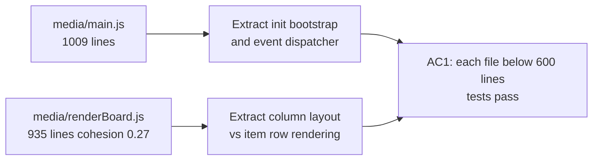

## item_297_split_oversized_webview_files_per_adr_020 - Split oversized webview files per ADR-020
> From version: 1.25.0
> Schema version: 1.0
> Status: Ready
> Understanding: 90%
> Confidence: 80%
> Progress: 100%
> Complexity: Medium
> Theme: Quality
> Derived from `logics/request/req_161_address_plugin_audit_findings_from_april_2026_structural_review.md`

# Problem

Two webview JavaScript files exceed 900 lines and have poor internal cohesion per the knowledge graph:

| File | Lines | Community cohesion |
|---|---|---|
| `media/main.js` | 1 009 | — (entry point, mixed concerns) |
| `media/renderBoard.js` | 935 | `media-board`: 0.27 |

`media/main.js` is the webview entry point but accumulates initialisation, event wiring, and rendering logic that should be delegated. `media/renderBoard.js` has the lowest cohesion of any media file flagged by the graph (0.27), indicating it mixes column layout, item rendering, and state mutation in a single file.

ADR-020 mandates splitting oversized plugin surfaces into focused modules. The first modularisation pass (req_131) addressed the `src/` side; this item targets the remaining webview files.

# Scope

- In: extract coherent sub-responsibilities from `media/main.js` (likely initialisation bootstrap and event dispatcher) and `media/renderBoard.js` (likely column layout vs item row rendering); each resulting file must stay below 600 lines.
- Out: CSS changes; changes to `src/` TypeScript files; functional behaviour change; changes to already-split webview files (`mainCore.js`, `mainInteractions.js`, etc.).

# Acceptance criteria

- AC1: `media/main.js` and `media/renderBoard.js` are each below 600 lines; the webview harness tests (`npm run test`) pass without modification; no functional regression in board rendering or event handling.

# AC Traceability

- AC1 -> New extracted files exist; `wc -l media/main.js media/renderBoard.js` shows each below 600. Proof: `npm run test` green.

# Decision framing

- Architecture framing: Reference `adr_020` — this item is a direct application of that decision to the webview layer.

# Links

- Product brief(s): (none)
- Architecture decision(s): `logics/architecture/adr_020_split_the_oversized_plugin_and_workflow_surfaces_into_focused_modules.md`
- Request: `logics/request/req_161_address_plugin_audit_findings_from_april_2026_structural_review.md`
- Primary task(s): `logics/tasks/task_127_orchestrate_april_2026_audit_remediation_across_plugin_and_logics_kit.md`

# AI Context

- Summary: Split media/main.js (1009 lines) and media/renderBoard.js (935 lines, cohesion 0.27) into focused modules per ADR-020, each below 600 lines.
- Keywords: webview, split, main.js, renderBoard.js, ADR-020, cohesion, modularisation
- Use when: Splitting the two oversized webview entry point and board renderer files.
- Skip when: The work targets src/ TypeScript files or unrelated webview files.

# Priority

- Impact: Medium — reduces cognitive load for frontend changes; addresses the last high-line-count webview files.
- Urgency: Low — P3, no correctness risk, but blocks further webview feature work cleanly.

# Notes
