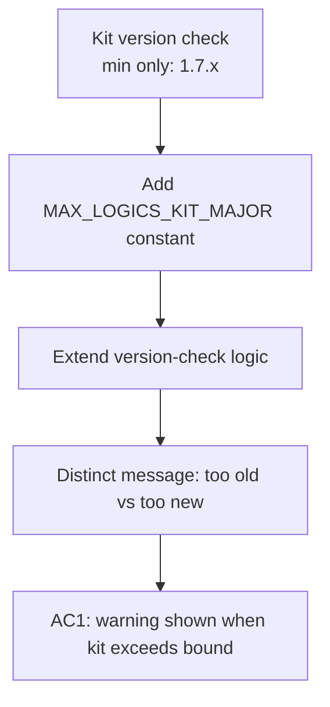

## item_298_add_maximum_kit_version_bound_in_plugin - Add maximum kit version bound in plugin
> From version: 1.25.0
> Schema version: 1.0
> Status: Ready
> Understanding: 95%
> Confidence: 90%
> Progress: 100%
> Complexity: Low
> Theme: Quality
> Derived from `logics/request/req_162_address_logics_kit_audit_findings_from_april_2026_structural_review.md`

# Problem

The plugin currently enforces only a **minimum** kit version (`MIN_LOGICS_KIT_MAJOR = 1`, `MIN_LOGICS_KIT_MINOR = 7`) in `src/logicsViewProviderSupport.ts`. There is no upper bound.

This means a breaking change in the kit (e.g. a rename of a required CLI command, or a changed document schema) can silently reach production as long as the kit major/minor remains ≥ 1.7. The plugin would launch without warning and fail at runtime in an unexpected way.

A `MAX_LOGICS_KIT_MINOR` (or `MAX_LOGICS_KIT_MAJOR`) constant, paired with a clear user-facing message when the kit is too new, would surface compatibility breaks at startup rather than mid-workflow.

# Scope

- In: add `MAX_LOGICS_KIT_MAJOR` and/or `MAX_LOGICS_KIT_MINOR` constants (naturally in `src/logicsViewProviderConstants.ts` after item_290); extend the version-check logic to warn when the installed kit exceeds the tested upper bound; update the user-facing message to distinguish "too old" from "too new".
- Out: automated kit update; changes to kit itself; CI version pinning.

# Acceptance criteria

- AC1: When the installed kit version exceeds `MAX_LOGICS_KIT_MAJOR` (or the configured upper bound), the plugin surfaces a clear user-facing warning at startup distinguishing "kit too new" from "kit too old"; `npm run test` and `npm run lint:ts` pass.

# AC Traceability

- AC1 -> Version-check logic in `src/logicsViewProviderSupport.ts` branches on both min and max. Proof: unit test asserting the warning message for an over-bound version; `npm run test` green.

# Decision framing

- Architecture framing: Not needed — additive constant + logic extension, no boundary change.

# Links

- Product brief(s): (none)
- Architecture decision(s): (none)
- Request: `logics/request/req_162_address_logics_kit_audit_findings_from_april_2026_structural_review.md`
- Primary task(s): `logics/tasks/task_127_orchestrate_april_2026_audit_remediation_across_plugin_and_logics_kit.md`

# AI Context

- Summary: Add MAX_LOGICS_KIT_MAJOR/MINOR constants to the plugin so kit versions above the tested upper bound trigger a clear startup warning.
- Keywords: kit, version, bound, maximum, MIN_LOGICS_KIT, MAX_LOGICS_KIT, compatibility, startup warning
- Use when: Adding or testing the upper-bound kit version check in the plugin.
- Skip when: The work targets the kit itself or unrelated plugin logic.

# Priority

- Impact: Medium — prevents silent runtime failures after a kit breaking change.
- Urgency: Medium — depends on item_290 (constants extraction) being done first.

# Notes
- Task `task_127_orchestrate_april_2026_audit_remediation_across_plugin_and_logics_kit` was finished via `logics_flow.py finish task` on 2026-04-11.
