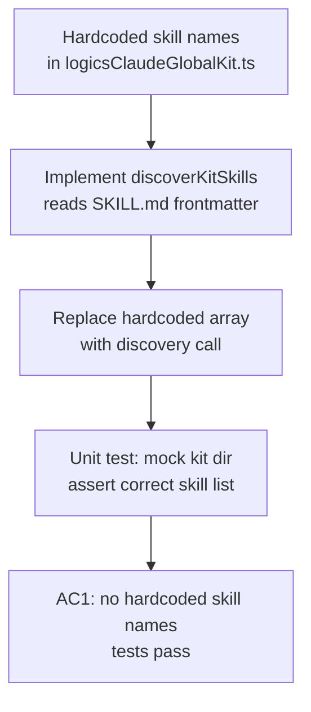

## item_299_add_programmatic_skill_discovery_to_replace_hardcoded_names - Add programmatic skill discovery to replace hardcoded names
> From version: 1.25.0
> Schema version: 1.0
> Status: Ready
> Understanding: 85%
> Confidence: 75%
> Progress: 100%
> Complexity: Medium
> Theme: Quality
> Derived from `logics/request/req_162_address_logics_kit_audit_findings_from_april_2026_structural_review.md`

# Problem

`src/logicsClaudeGlobalKit.ts` references skill names as hardcoded strings (e.g. `"logics-flow-manager"`, `"logics-hybrid-delivery-assistant"`). When a skill is renamed, added, or removed in the kit, the plugin must be manually updated — there is no compile-time or runtime signal that a referenced skill no longer exists.

The kit already has a discovery surface: each skill exposes a `SKILL.md` with a `name:` frontmatter field. A lightweight scan of `logics/skills/*/SKILL.md` at plugin activation (or at kit-update time) could build the authoritative list of available skills rather than relying on a manually-maintained array.

# Scope

- In: implement a `discoverKitSkills(kitRoot: string): string[]` function that reads `logics/skills/*/SKILL.md` and extracts the `name:` frontmatter; replace the hardcoded array in `src/logicsClaudeGlobalKit.ts` with a call to this function; add a unit test.
- Out: UI changes; changes to how skills are invoked; changes to the kit itself.

# Acceptance criteria

- AC1: `src/logicsClaudeGlobalKit.ts` no longer contains a hardcoded list of skill names; a `discoverKitSkills` function (or equivalent) reads `logics/skills/*/SKILL.md` at runtime and returns the available skill names; a unit test verifies the discovery against a fixture directory; `npm run lint:ts` and `npm run test` pass.

# AC Traceability

- AC1 -> `grep -n "logics-flow-manager\|logics-hybrid" src/logicsClaudeGlobalKit.ts` returns zero hardcoded strings. Proof: unit test green; `npm run lint:ts` passes.

# Decision framing

- Architecture framing: Not needed — additive function, no existing boundary changed.

# Links

- Product brief(s): (none)
- Architecture decision(s): (none)
- Request: `logics/request/req_162_address_logics_kit_audit_findings_from_april_2026_structural_review.md`
- Primary task(s): `logics/tasks/task_127_orchestrate_april_2026_audit_remediation_across_plugin_and_logics_kit.md`

# AI Context

- Summary: Replace hardcoded skill name strings in logicsClaudeGlobalKit.ts with a discoverKitSkills function that scans SKILL.md frontmatter at runtime.
- Keywords: skill, discovery, hardcoded, logicsClaudeGlobalKit, SKILL.md, frontmatter, kit
- Use when: Implementing or testing the skill discovery function.
- Skip when: The work targets skill invocation logic, UI, or the kit itself.

# Priority

- Impact: Low-Medium — prevents silent skill reference drift after kit updates.
- Urgency: Low — P3, no correctness risk today but blocks clean kit evolution.

# Notes
- Task `task_127_orchestrate_april_2026_audit_remediation_across_plugin_and_logics_kit` was finished via `logics_flow.py finish task` on 2026-04-11.
