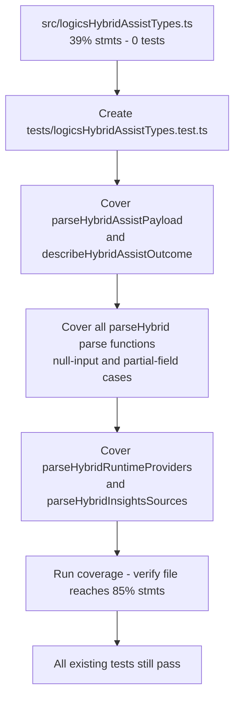

## item_300_add_missing_tests_for_logicshybridassisttypes - Add missing tests for logicsHybridAssistTypes
> From version: 1.25.2
> Schema version: 1.0
> Status: Ready
> Understanding: 95%
> Confidence: 95%
> Progress: 100%
> Complexity: Medium
> Theme: Quality
> Reminder: Update status/understanding/confidence/progress and linked request/task references when you edit this doc.

# Problem

`src/logicsHybridAssistTypes.ts` has no test file at all (39% statements, 50% functions). It exports 11 pure parse/describe functions (`parseHybridAssistPayload`, `describeHybridAssistOutcome`, `parseHybridCommitPlanSteps`, `parseHybridTriageResult`, `parseHybridDiffRiskResult`, `parseHybridValidationSummaryResult`, `parseHybridChangelogSummaryResult`, `parseHybridValidationChecklistResult`, `parseHybridDocConsistencyResult`, `parseHybridPrepareReleaseResult`, `parseHybridPublishReleaseResult`, `parseHybridInsightsSources`, `parseHybridRuntimeProviders`) — all side-effect-free and directly testable with plain input fixtures. Without tests, regressions in payload parsing used by the hybrid assist views and controller go completely undetected.

# Scope

- In: create `tests/logicsHybridAssistTypes.test.ts` covering all exported parse/describe functions.
- Out: `gitRuntime.ts` and `runtimeLaunchers.ts` gaps (handled in item_301 and item_302), threshold updates (handled in item_302).

# Acceptance criteria

- AC1: A new file `tests/logicsHybridAssistTypes.test.ts` exists and covers all exported parse/describe functions, including null-input guards, partial-field scenarios, and type-narrowing branches. Coverage for `logicsHybridAssistTypes.ts` reaches at least 85% statements.
- AC2: All 383+ existing tests continue to pass. No regressions introduced.

# AC Traceability

- AC1 -> Scope: new test file covers all 11+ exported functions with null-input, partial-field, and type-narrowing cases. Proof: `npm run test:coverage:src` shows ≥ 85% stmts for `logicsHybridAssistTypes.ts`.
- AC2 -> Scope: full test suite passes without modification to existing tests. Proof: `npm run test` exits 0.
- AC5 -> Scope: all existing tests continue to pass after adding the new test file. Proof: `npm run test` exits 0 with ≥ 383 passing tests.

# Decision framing

- Product framing: Not needed
- Architecture framing: Not needed — pure unit tests for deterministic parse functions, no structural decisions required.

# Links

- Product brief(s): (none)
- Architecture decision(s): (none)
- Request: `req_163_improve_test_coverage_for_hybrid_assist_types_git_runtime_and_runtime_launchers`
- Primary task(s): (none yet)

# AI Context

- Summary: Create tests/logicsHybridAssistTypes.test.ts to cover all pure parse/describe functions in logicsHybridAssistTypes.ts, which currently has no tests.
- Keywords: logicsHybridAssistTypes, parse functions, vitest, unit tests, coverage, hybrid assist
- Use when: Implementing or reviewing the new test file for logicsHybridAssistTypes.
- Skip when: Working on gitRuntime, runtimeLaunchers, webview, or media coverage.

# References

- `logics/request/req_163_improve_test_coverage_for_hybrid_assist_types_git_runtime_and_runtime_launchers.md`

# Priority

- Impact: Medium — closes the single largest no-test gap in src
- Urgency: Normal

# Notes

- Derived from `logics/request/req_163_improve_test_coverage_for_hybrid_assist_types_git_runtime_and_runtime_launchers.md`.
- No mocking required: all functions are pure, deterministic, and take plain JS objects as input.
