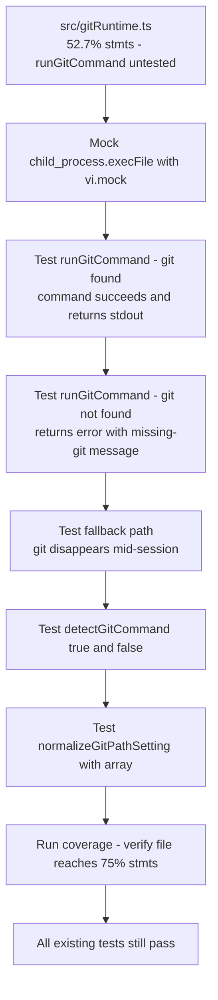

## item_301_extend_unit_tests_for_gitruntime - Extend unit tests for gitRuntime
> From version: 1.25.2
> Schema version: 1.0
> Status: Ready
> Understanding: 95%
> Confidence: 95%
> Progress: 100%
> Complexity: Medium
> Theme: Quality
> Reminder: Update status/understanding/confidence/progress and linked request/task references when you edit this doc.

# Problem

`src/gitRuntime.ts` sits at 52.7% statements and 42.1% functions. The existing test file covers only `isMissingGitFailureDetail`, `buildMissingGitMessage`, and `getGitCommandCandidates`. The three most important runtime paths are untested:

- `runGitCommand` happy path (git found, command succeeds)
- `runGitCommand` with git missing (returns error result with `buildMissingGitMessage`)
- `runGitCommand` fallback path — when git disappears mid-session (`resolvedGitCommandPromise` is reset and a fallback candidate is tried)
- `detectGitCommand` returning `true` and `false`
- `normalizeGitPathSetting` with an array input

These gaps mean that the core function used by every git operation in the extension has no behavioral tests.

# Scope

- In: extend `tests/gitRuntime.test.ts` with tests for `runGitCommand`, `detectGitCommand`, and `normalizeGitPathSetting` using `vi.mock('child_process')`.
- Out: `logicsHybridAssistTypes.ts` (item_300), `runtimeLaunchers.ts` (item_302), threshold updates (item_302).

# Acceptance criteria

- AC1: `tests/gitRuntime.test.ts` is extended to cover `runGitCommand` (git found + git missing), `detectGitCommand` (true/false), the fallback-on-missing-git path, and `normalizeGitPathSetting` with an array. Coverage for `gitRuntime.ts` reaches at least 75% statements.
- AC2: `vi.mock('child_process')` or equivalent is used so tests are fully hermetic — no real process spawning. Existing tests in the file are not broken.
- AC3: All 383+ existing tests continue to pass. No regressions introduced.

# AC Traceability

- AC1 -> Scope: gitRuntime.test.ts has new test cases for the four named paths. Proof: `npm run test:coverage:src` shows ≥ 75% stmts for `gitRuntime.ts`.
- AC2 -> Scope: `vi.mock` or `vi.spyOn` keeps tests hermetic. Proof: tests pass in CI with no real git invocation in mocked tests.
- AC3 -> Scope: full test suite passes. Proof: `npm run test` exits 0.

# Decision framing

- Product framing: Not needed
- Architecture framing: Not needed — hermetic unit tests using existing injectable interface, no structural changes.

# Links

- Product brief(s): (none)
- Architecture decision(s): (none)
- Request: `req_163_improve_test_coverage_for_hybrid_assist_types_git_runtime_and_runtime_launchers`
- Primary task(s): (none yet)

# AI Context

- Summary: Extend tests/gitRuntime.test.ts to cover runGitCommand, detectGitCommand, the fallback-on-missing-git path, and normalizeGitPathSetting using vi.mock on child_process.
- Keywords: gitRuntime, runGitCommand, detectGitCommand, vi.mock, child_process, unit tests, coverage
- Use when: Implementing or reviewing the gitRuntime test extensions.
- Skip when: Working on logicsHybridAssistTypes, runtimeLaunchers, or webview coverage.

# References

- `logics/request/req_163_improve_test_coverage_for_hybrid_assist_types_git_runtime_and_runtime_launchers.md`

# Priority

- Impact: High — runGitCommand is the core function behind all git operations in the extension
- Urgency: Normal

# Notes

- Derived from `logics/request/req_163_improve_test_coverage_for_hybrid_assist_types_git_runtime_and_runtime_launchers.md`.
- The existing test file uses `configureGitPathSettingReader` for injection — the new tests for `runGitCommand` will need `vi.mock('child_process', ...)` to control `execFile` responses without spawning real processes.
- The fallback path (lines 106–117 in `src/gitRuntime.ts`) is triggered when `isMissingGitError` returns true on the first attempt — mock two sequential `execFile` calls to exercise it.
