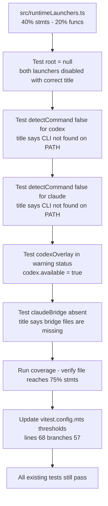

## item_302_extend_unit_tests_for_runtimelaunchers - Extend unit tests for runtimeLaunchers
> From version: 1.25.2
> Schema version: 1.0
> Status: Done
> Understanding: 95%
> Confidence: 95%
> Progress: 100%
> Complexity: Medium
> Theme: Quality
> Reminder: Update status/understanding/confidence/progress and linked request/task references when you edit this doc.

# Problem

`src/runtimeLaunchers.ts` sits at 40% statements and 20% functions. Only 2 of the 5 meaningful scenario branches are tested. Missing coverage:

- `root = null` → both `codex.available` and `claude.available` must be `false`, and titles must say "Select a project root first"
- `detectCommand` returns `false` for one or both commands → correct `title` messages ("Codex CLI not found on PATH" / "Claude CLI not found on PATH")
- `codexOverlay` in `warning` status → `codex.available` is `true` (overlay in warning is still usable)
- `claudeBridge` absent when globalKit is not healthy → title contains "bridge files are missing"
- `detectCommandOnPath` win32 multi-candidate loop (lines 65–76) — currently 0% covered

Additionally, once item_300 and item_301 are merged, this item is responsible for raising the `vitest.config.mts` thresholds to lock in the overall coverage gains.

# Scope

- In: extend `tests/runtimeLaunchers.test.ts` with the 5 missing scenario branches; update `vitest.config.mts` thresholds after all three items are complete.
- Out: `logicsHybridAssistTypes.ts` (item_300), `gitRuntime.ts` (item_301).

# Acceptance criteria

- AC1: `tests/runtimeLaunchers.test.ts` is extended to cover: `root = null` (both launchers disabled), `detectCommand` returning `false` for codex, `detectCommand` returning `false` for claude, `codexOverlay` in `warning` status (`codex.available = true`), and `claudeBridge` absent with unhealthy globalKit. Coverage for `runtimeLaunchers.ts` reaches at least 75% statements.
- AC2: `vitest.config.mts` thresholds are updated — `lines` raised to at least `68`, `branches` raised to at least `57` — to lock in the gains from all three items (300, 301, 302).
- AC3: Overall src statement coverage reaches at least 68% and branch coverage reaches at least 57% after the threshold update. `npm run test:coverage:src` passes without threshold violations.
- AC4: All 383+ existing tests continue to pass. No regressions introduced.

# AC Traceability

- AC1 -> Scope: runtimeLaunchers.test.ts covers 5 new scenario branches. Proof: `npm run test:coverage:src` shows ≥ 75% stmts for `runtimeLaunchers.ts`.
- AC2 -> Scope: vitest.config.mts thresholds updated. Proof: file shows `lines: 68, branches: 57` (or higher).
- AC3 -> Scope: overall coverage at or above new thresholds. Proof: `npm run test:coverage:src` exits 0 with no threshold violation.
- AC4 -> Scope: full test suite passes. Proof: `npm run test` exits 0.

# Decision framing

- Product framing: Not needed
- Architecture framing: Not needed — hermetic unit tests via existing `detectCommand` injection option, no structural changes.

# Links

- Product brief(s): (none)
- Architecture decision(s): (none)
- Request: `req_163_improve_test_coverage_for_hybrid_assist_types_git_runtime_and_runtime_launchers`
- Primary task(s): (none yet)

# AI Context

- Summary: Extend tests/runtimeLaunchers.test.ts for null root, missing commands, codexOverlay warning, and missing claudeBridge; then raise vitest.config.mts thresholds to lock in gains from all three coverage items.
- Keywords: runtimeLaunchers, inspectRuntimeLaunchers, detectCommand, vitest thresholds, coverage, unit tests
- Use when: Implementing runtimeLaunchers test extensions or updating vitest thresholds after items 300 and 301 are done.
- Skip when: Working on logicsHybridAssistTypes or gitRuntime.

# References

- `logics/request/req_163_improve_test_coverage_for_hybrid_assist_types_git_runtime_and_runtime_launchers.md`

# Priority

- Impact: Medium — closes runtimeLaunchers gaps and owns the threshold gate for all three items
- Urgency: Normal — should be delivered last, after item_300 and item_301

# Notes

- Derived from `logics/request/req_163_improve_test_coverage_for_hybrid_assist_types_git_runtime_and_runtime_launchers.md`.
- The `detectCommand` option in `inspectRuntimeLaunchers` already accepts an async injection function — no mocking infrastructure needed, just pass the right mock directly like the existing tests do.
- Threshold update in `vitest.config.mts` should be done after confirming item_300 and item_301 are merged and coverage has stabilized.
