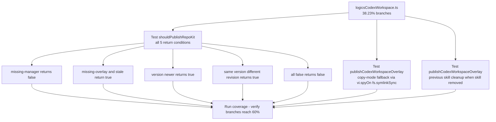

## item_303_extend_branch_tests_for_logicscodexworkspace - Extend branch tests for logicsCodexWorkspace
> From version: 1.25.2
> Schema version: 1.0
> Status: Done
> Understanding: 95%
> Confidence: 95%
> Progress: 100%
> Complexity: Medium
> Theme: Quality
> Reminder: Update status/understanding/confidence/progress and linked request/task references when you edit this doc.

# Problem

`src/logicsCodexWorkspace.ts` has 38.23% branch coverage despite 67.9% statement coverage — a 30-point gap. The existing 5 tests cover the happy path and the `missing-overlay` status but leave two key surfaces completely unbranched:

1. **`shouldPublishRepoKit`** (lines 274–299): 5 distinct return paths, zero currently tested. Missing cases: `missing-manager` → false; `missing-overlay`/`stale` → true; version newer → true; same version different revision → true; all conditions false → false.
2. **`publishCodexWorkspaceOverlay`** (lines 203–272): copy-mode fallback when `publishSkill` returns `"copy"` instead of `"symlink"`; cleanup loop that removes previously-published skills absent from the new publication set.

# Scope

- In: extend `tests/logicsCodexWorkspace.test.ts` with `shouldPublishRepoKit` (all 5 branches) and `publishCodexWorkspaceOverlay` (copy-mode + previous-skill cleanup).
- Out: `logicsGlobalKitLifecycle.ts` branches (item_304), threshold update (item_304).

# Acceptance criteria

- AC1: `logicsCodexWorkspace.ts` branch coverage reaches at least 60%. New tests cover all 5 `shouldPublishRepoKit` return conditions, the copy-mode fallback in `publishCodexWorkspaceOverlay`, and the previous-skill cleanup loop.
- AC4: All 410+ existing tests continue to pass. No regressions introduced.

# AC Traceability

- AC1 -> Scope: logicsCodexWorkspace.test.ts extended with 7+ new cases. Proof: `npm run test:coverage:src` shows ≥ 60% branches for `logicsCodexWorkspace.ts`.
- AC4 -> Scope: full test suite passes. Proof: `npm run test` exits 0 with ≥ 410 tests.

# Decision framing

- Product framing: Not needed
- Architecture framing: Not needed — hermetic filesystem fixture tests, no structural changes.

# Links

- Product brief(s): (none)
- Architecture decision(s): (none)
- Request: `req_164_improve_branch_coverage_for_logicscodexworkspace_and_logicsglobalkitlifecycle`
- Primary task(s): (none yet)

# AI Context

- Summary: Extend logicsCodexWorkspace.test.ts to cover shouldPublishRepoKit (5 branches) and publishCodexWorkspaceOverlay (copy-mode and previous-skill cleanup), targeting ≥ 60% branch coverage.
- Keywords: logicsCodexWorkspace, shouldPublishRepoKit, publishCodexWorkspaceOverlay, branch coverage, vi.spyOn, fs.symlinkSync
- Use when: Implementing or reviewing the branch test extensions for logicsCodexWorkspace.
- Skip when: Working on logicsGlobalKitLifecycle or webview coverage.

# References

- `logics/request/req_164_improve_branch_coverage_for_logicscodexworkspace_and_logicsglobalkitlifecycle.md`

# Priority

- Impact: High — closes the largest statement-vs-branch gap in src
- Urgency: Normal

# Notes

- Derived from `logics/request/req_164_improve_branch_coverage_for_logicscodexworkspace_and_logicsglobalkitlifecycle.md`.
- For copy-mode: use `vi.spyOn(fs, 'symlinkSync').mockImplementationOnce(() => { throw new Error('symlink not supported'); })` to force the fallback to `fs.cpSync`.
- For previous-skill cleanup: publish with skill A+B, then re-publish with skill A only — verify skill B directory is removed from globalSkillsRoot.
- `shouldPublishRepoKit` accepts an optional `snapshot` parameter — pass a pre-built snapshot to avoid filesystem setup for all 5 cases.
