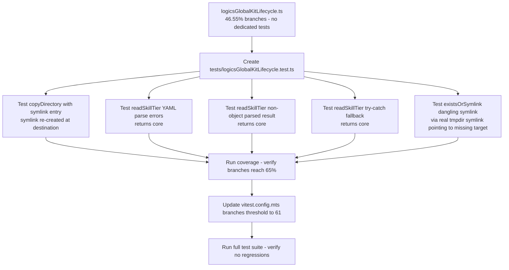

## item_304_create_branch_tests_for_logicsglobalkitlifecycle - Create branch tests for logicsGlobalKitLifecycle
> From version: 1.25.2
> Schema version: 1.0
> Status: Done
> Understanding: 95%
> Confidence: 95%
> Progress: 100%
> Complexity: Medium
> Theme: Quality
> Reminder: Update status/understanding/confidence/progress and linked request/task references when you edit this doc.

# Problem

`src/logicsGlobalKitLifecycle.ts` has 46.55% branch coverage and **no dedicated test file**. The file is currently tested only indirectly through `logicsCodexWorkspace.test.ts`. Three defensive branches are completely uncovered:

1. **`copyDirectory`** (line 382–385): `entry.isSymbolicLink()` — symlink entries inside a directory being copied; instead of copying file contents, it re-creates the symlink at the destination.
2. **`readSkillTier`** (lines 398–407): three fallback paths all returning `"core"`: YAML parse errors array non-empty; `parsed` is null or an array; `try/catch` exception on `parseDocument`.
3. **`existsOrSymlink`** (lines 354–357): `lstatSync` fallback — when `existsSync` returns false but the path is a dangling symlink, `lstatSync` still returns a result with `isSymbolicLink() === true`.

Additionally, this item owns the **vitest threshold update** (AC3 in the request) since it is delivered last.

# Scope

- In: create `tests/logicsGlobalKitLifecycle.test.ts` covering the 3 uncovered branch surfaces; update `vitest.config.mts` `branches` threshold to ≥ 61.
- Out: `logicsCodexWorkspace.ts` branches (item_303).

# Acceptance criteria

- AC2: A new file `tests/logicsGlobalKitLifecycle.test.ts` exists and covers `copyDirectory` (symlink entry), `readSkillTier` (YAML error, non-object, try/catch), and `existsOrSymlink` (dangling symlink). `logicsGlobalKitLifecycle.ts` branch coverage reaches at least 65%.
- AC3: Overall src branch coverage reaches at least 61%. `vitest.config.mts` `branches` threshold is updated to at least 61.
- AC4: All 410+ existing tests continue to pass. No regressions introduced.

# AC Traceability

- AC2 -> Scope: new test file covers 3 branch surfaces. Proof: `npm run test:coverage:src` shows ≥ 65% branches for `logicsGlobalKitLifecycle.ts`.
- AC3 -> Scope: vitest.config.mts updated and coverage passes threshold. Proof: `npm run test:coverage:src` exits 0 with `branches ≥ 61`.
- AC4 -> Scope: full test suite passes. Proof: `npm run test` exits 0 with ≥ 410 tests.

# Decision framing

- Product framing: Not needed
- Architecture framing: Not needed — pure test additions using real tmpdir fixtures, no structural changes.

# Links

- Product brief(s): (none)
- Architecture decision(s): (none)
- Request: `req_164_improve_branch_coverage_for_logicscodexworkspace_and_logicsglobalkitlifecycle`
- Primary task(s): (none yet)

# AI Context

- Summary: Create tests/logicsGlobalKitLifecycle.test.ts covering copyDirectory symlink branch, readSkillTier YAML error paths, and existsOrSymlink dangling symlink; then raise vitest branches threshold to 61.
- Keywords: logicsGlobalKitLifecycle, copyDirectory, readSkillTier, existsOrSymlink, branch coverage, vitest threshold, dangling symlink
- Use when: Implementing or reviewing the new test file for logicsGlobalKitLifecycle and the threshold update.
- Skip when: Working on logicsCodexWorkspace or webview coverage.

# References

- `logics/request/req_164_improve_branch_coverage_for_logicscodexworkspace_and_logicsglobalkitlifecycle.md`

# Priority

- Impact: Medium — creates a dedicated test file and owns the threshold gate
- Urgency: Normal — should be delivered after item_303

# Notes

- Derived from `logics/request/req_164_improve_branch_coverage_for_logicscodexworkspace_and_logicsglobalkitlifecycle.md`.
- For `existsOrSymlink` dangling symlink: `fs.symlinkSync('/nonexistent/target', path.join(tmpdir, 'dangling'))` creates a dangling symlink; `existsSync` returns false, but `lstatSync` succeeds and `isSymbolicLink()` returns true.
- For `readSkillTier` YAML error: write malformed YAML to `agents/openai.yaml` so `parseDocument` returns a non-empty `errors` array.
- For `copyDirectory` symlink: create a directory with a symlink entry inside (`fs.symlinkSync`), then call `copyDirectory` — verify the symlink is re-created at the destination rather than copied as a file.
- Threshold update should be done after confirming item_303 is merged and total branch coverage has stabilized at or above 61%.
