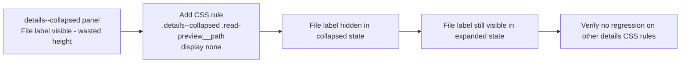

## item_305_hide_file_label_in_collapsed_detail_panel - Hide File label in collapsed detail panel
> From version: 1.25.2
> Schema version: 1.0
> Status: Done
> Understanding: 95%
> Confidence: 95%
> Progress: 100%
> Complexity: Low
> Theme: UI
> Reminder: Update status/understanding/confidence/progress and linked request/task references when you edit this doc.

# Problem

In vertical (stacked) layout, when the detail panel is collapsed, the `File: <path>` line (`
`) is still visible inside the read-preview header. In reduced mode this label wastes the limited height and is not actionable — the user cannot navigate to the file when the panel is collapsed. The label should be hidden when the panel carries the `details--collapsed` CSS class.

# Scope

- In: add a CSS rule in `media/css/details.css` hiding `.details--collapsed .read-preview__path`.
- Out: any other read-preview fields, panel layout changes, stacked vs. horizontal layout behaviour.

# Acceptance criteria

- AC1: The `File: <path>` label (`read-preview__path`) is hidden when the detail panel is in collapsed state (`details--collapsed`). It remains visible in the expanded state.
- AC4: All 410+ existing tests continue to pass. No regressions introduced.

# AC Traceability

- AC1 -> Scope: CSS rule added in `media/css/details.css`. Proof: manual check in collapsed panel shows no File label; expanded panel shows it.
- AC4 -> Scope: full test suite passes. Proof: `npm run test` exits 0 with ≥ 410 tests.

# Decision framing

- Product framing: Not needed
- Architecture framing: Not needed — single CSS rule addition, no structural impact.

# Links

- Product brief(s): (none)
- Architecture decision(s): (none)
- Request: `req_165_plugin_ux_feedback_panel_detail_cell_labels_and_insights_timeline_period`
- Primary task(s): (none yet)

# AI Context

- Summary: Hide the File path label in the read-preview header when the detail panel is in collapsed state by adding .details--collapsed .read-preview__path { display: none } to details.css.
- Keywords: collapsed detail panel, read-preview__path, File label, details--collapsed, CSS, vertical layout
- Use when: Implementing the File label visibility fix.
- Skip when: Working on Flow row, timeline, or coverage items.

# References

- `logics/request/req_165_plugin_ux_feedback_panel_detail_cell_labels_and_insights_timeline_period.md`

# Priority

- Impact: Low — visual polish, no functional change
- Urgency: Normal

# Notes

- Derived from `logics/request/req_165_plugin_ux_feedback_panel_detail_cell_labels_and_insights_timeline_period.md`.
- The collapsed class is applied by `media/mainCore.js:369`: `details.classList.toggle("details--collapsed", state.uiState.detailsCollapsed)`.
- The read-preview HTML is in `src/logicsReadPreviewHtml.ts:347` — the label element has class `read-preview__path`.
- Fix is a single CSS line: `.details--collapsed .read-preview__path { display: none; }` in `media/css/details.css`.
