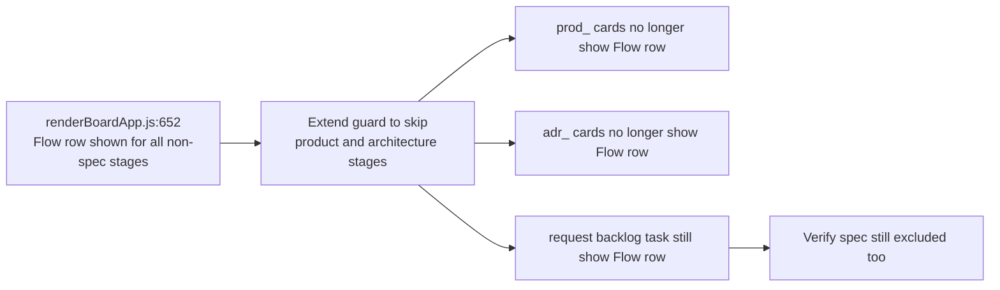

## item_306_suppress_flow_row_in_product_brief_and_adr_card_previews - Suppress Flow row in product brief and ADR card previews
> From version: 1.25.2
> Schema version: 1.0
> Status: Done
> Understanding: 95%
> Confidence: 95%
> Progress: 100%
> Complexity: Low
> Theme: UI
> Reminder: Update status/understanding/confidence/progress and linked request/task references when you edit this doc.

# Problem

In the board and list card previews, the "Flow" row (`createPreviewRow("Flow", linkage)` at `media/renderBoardApp.js:652`) appears for all stages except `"spec"`. This means product brief (`stage === "product"`) and ADR (`stage === "architecture"`) cards also show a Flow row, which is meaningless for companion docs — they don't belong to a workflow chain in the same way as requests, backlog items, and tasks.

# Scope

- In: extend the stage guard at `media/renderBoardApp.js:652` to also skip the Flow row for `"product"` and `"architecture"` stages.
- Out: other card preview rows (Status, Updated), any changes to the flow linkage logic itself.

# Acceptance criteria

- AC2: The "Flow" row is no longer shown in the card preview for `product` (product brief `prod_*`) and `architecture` (ADR `adr_*`) stage items. It continues to appear for `request`, `backlog`, `task`, and `spec` stages where it is meaningful.
- AC4: All 410+ existing tests continue to pass. No regressions introduced.

# AC Traceability

- AC2 -> Scope: guard at `renderBoardApp.js:652` extended to include `"product"` and `"architecture"`. Proof: prod_ and adr_ cards show no Flow row in board preview; request/backlog/task cards still show it.
- AC4 -> Scope: full test suite passes. Proof: `npm run test` exits 0 with ≥ 410 tests.

# Decision framing

- Product framing: Not needed
- Architecture framing: Not needed — one-line guard extension, no structural impact.

# Links

- Product brief(s): (none)
- Architecture decision(s): (none)
- Request: `req_165_plugin_ux_feedback_panel_detail_cell_labels_and_insights_timeline_period`
- Primary task(s): (none yet)

# AI Context

- Summary: Extend the stage guard in renderBoardApp.js createCardPreview to suppress the Flow row for product and architecture stage items (product briefs and ADRs).
- Keywords: Flow row, product brief, ADR, card preview, renderBoardApp, createCardPreview, stage guard
- Use when: Implementing the Flow row suppression for companion doc cards.
- Skip when: Working on the File label, timeline, or coverage items.

# References

- `logics/request/req_165_plugin_ux_feedback_panel_detail_cell_labels_and_insights_timeline_period.md`

# Priority

- Impact: Low — visual clarity for companion doc cards
- Urgency: Normal

# Notes

- Derived from `logics/request/req_165_plugin_ux_feedback_panel_detail_cell_labels_and_insights_timeline_period.md`.
- Current guard at `renderBoardApp.js:650`: `String(item?.stage || "").trim() === "spec"` — change to also exclude `"product"` and `"architecture"`.
- Stage values confirmed in `media/logicsModel.js:72–75`: `prod_` → `"product"`, `adr_` → `"architecture"`.
- One-liner change: `const linkage = ["spec", "product", "architecture"].includes(String(item?.stage || "").trim()) ? "" : createPrimaryFlowSummary(item);`
