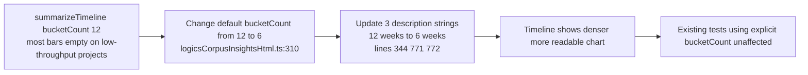

## item_307_reduce_insights_timeline_default_window_from_12_to_6_weeks - Reduce insights timeline default window from 12 to 6 weeks
> From version: 1.25.2
> Schema version: 1.0
> Status: Done
> Understanding: 95%
> Confidence: 95%
> Progress: 100%
> Complexity: Low
> Theme: UI
> Reminder: Update status/understanding/confidence/progress and linked request/task references when you edit this doc.

# Problem

The delivery timeline in Logics Insights uses a 12-week window (`bucketCount = 12` at `src/logicsCorpusInsightsHtml.ts:310`). On projects with modest weekly throughput, most of the 12 bars are empty and only 1–2 data points are visible, making the chart nearly unreadable and useless for trend detection. Halving the window to 6 weeks concentrates visible activity, fills more bars, and produces an actionable trend view without losing meaningful history.

# Scope

- In: change the default `bucketCount` from `12` to `6` in `summarizeTimeline` (`logicsCorpusInsightsHtml.ts:310`); update the three description strings that say "12 weeks" to say "6 weeks" (lines 344, 771, 772).
- Out: making the window user-configurable (separate request), changing other chart windows, the `summarizeVelocity` function.

# Acceptance criteria

- AC3: The delivery timeline in Logics Insights renders a 6-bar (6-week) chart by default. The description text reads "6 weeks" instead of "12 weeks". The chart shows denser, more readable data.
- AC4: All 410+ existing tests continue to pass. `summarizeTimeline` tests that pass an explicit `bucketCount` are unaffected by the default change.

# AC Traceability

- AC3 -> Scope: `summarizeTimeline` default changed to 6; three description strings updated. Proof: Logics Insights panel shows a 6-bar timeline with "6 weeks" copy.
- AC4 -> Scope: full test suite passes. Proof: `npm run test` exits 0 with ≥ 410 tests.

# Decision framing

- Product framing: Not needed
- Architecture framing: Not needed — single constant change + string updates, no structural impact.

# Links

- Product brief(s): (none)
- Architecture decision(s): (none)
- Request: `req_165_plugin_ux_feedback_panel_detail_cell_labels_and_insights_timeline_period`
- Primary task(s): (none yet)

# AI Context

- Summary: Change the summarizeTimeline default bucketCount from 12 to 6 and update the three description strings in logicsCorpusInsightsHtml.ts to reduce the insights timeline window.
- Keywords: summarizeTimeline, bucketCount, delivery timeline, 6 weeks, logicsCorpusInsightsHtml, insights
- Use when: Implementing the timeline default window reduction.
- Skip when: Working on the File label, Flow row, or coverage items.

# References

- `logics/request/req_165_plugin_ux_feedback_panel_detail_cell_labels_and_insights_timeline_period.md`

# Priority

- Impact: Low — readability improvement for the insights timeline chart
- Urgency: Normal

# Notes

- Derived from `logics/request/req_165_plugin_ux_feedback_panel_detail_cell_labels_and_insights_timeline_period.md`.
- Change signature: `function summarizeTimeline(items, nowMs, bucketCount = 6)` at line 310.
- Update line 344: `"No closed items in the last 12 weeks."` → `"No closed items in the last 6 weeks."`
- Update line 771: `"Closed workflow items bucketed by week across the last 12 weeks."` → `"...last 6 weeks."`
- Existing tests in `logicsHtml.test.ts` that call `summarizeTimeline` with an explicit `bucketCount` argument are completely unaffected.
