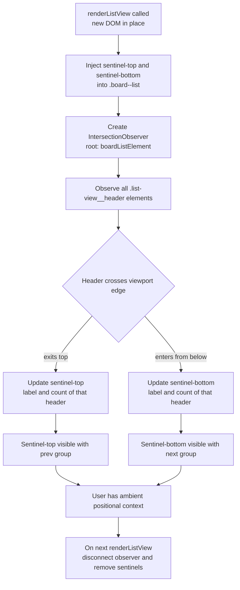

## item_308_sticky_ambient_section_headers_in_list_view_showing_prev_and_next_group_context - sticky ambient section headers in list view showing prev and next group context
> From version: 1.25.2
> Schema version: 1.0
> Status: Done
> Understanding: 95%
> Confidence: 90%
> Progress: 100%
> Complexity: Medium
> Theme: UI
> Reminder: Update status/understanding/confidence/progress and linked request/task references when you edit this doc.

# Problem

When the list view has many sections and the user scrolls deep into one group, they lose spatial context — they no longer know which group is above or which is next without scrolling back up or down. Two ambient sticky sentinels solve this:

- **Top sentinel**: always shows the header of the group that most recently scrolled off the top — the group the user just left.
- **Bottom sentinel**: always shows the header of the nearest group whose header has not yet entered the viewport at the bottom — the next group approaching.

Both sentinels display the same label and item count badge as the real `.list-view__header` elements, giving immediate ambient navigation context without requiring any scroll action.

# Scope

- In: a `position: relative` wrapper around `.board--list`; two `position: absolute` sentinel elements (`top: 0` / `bottom: 0`) injected into that wrapper; `IntersectionObserver` logic tracking `.list-view__header` visibility with `root` set to the wrapper; chevron direction indicator on each sentinel; CSS for the sentinels.
- Out: board column mode, clickable/tappable sentinels (deferred), column headers, mobile-specific overrides.

**Design decisions (locked):**
- **D1 — Overlay**: sentinels use `position: absolute` on a `position: relative` wrapper — no layout shift on appear/disappear.
- **D2 — Chevron**: reuse `chevronIcon()` pointing up on top sentinel, down on bottom sentinel.
- **D3 — Collapsed groups participate**: observer treats collapsed group headers identically to expanded ones.
- **D4 — Bottom sentinel triggers immediately**: activates as soon as any header is below the visible area, regardless of the current header's position.

# Acceptance criteria

- AC1: In list mode, a top sentinel is visible at the top of `.board--list` whenever at least one group header has scrolled off the top. It shows the label and count of the most recently scrolled-off header. It is hidden (`hidden` attribute) when no header has scrolled off the top yet.
- AC2: A bottom sentinel is visible at the bottom of `.board--list` whenever at least one group header is below the visible area. It shows the label and count of the nearest upcoming header. It is hidden when all group headers are visible or no more groups exist below.
- AC3: Both sentinels are read-only — no click handler, no effect on section collapse/expand, no interference with keyboard navigation.
- AC4: Sentinels are absent in board column mode (no `.board--list` class).
- AC5: The `IntersectionObserver` is disconnected and sentinel elements are removed before each new `renderListView` call so stale references do not accumulate.
- AC6: All 410+ existing tests continue to pass. `IntersectionObserver` absence (jsdom) is handled gracefully — sentinel logic is skipped without throwing.

# AC Traceability

- AC1 -> Scope: sentinel-top injected and updated on scroll. Proof: manual scroll — top sentinel shows correct previous group.
- AC2 -> Scope: sentinel-bottom injected and updated on scroll. Proof: manual scroll — bottom sentinel shows correct next group.
- AC3 -> Scope: no event listeners on sentinels beyond display. Proof: clicking a sentinel produces no action; keyboard nav still works.
- AC4 -> Scope: observer only attached when `.board--list` class is present. Proof: board column mode shows no sentinel elements in the DOM.
- AC5 -> Scope: cleanup called on re-render. Proof: DevTools shows only 1 observer active after rapid re-renders.
- AC6 -> Scope: `typeof IntersectionObserver !== "undefined"` guard in place. Proof: `npm run test` exits 0 with ≥ 410 tests.

# Decision framing

- Product framing: Consider — ambient navigation affects how users perceive the list depth and orientation. No product brief needed for this scope.
- Architecture framing: Not needed — self-contained DOM injection pattern with no impact on state management or message passing.

# Links

- Product brief(s): (none)
- Architecture decision(s): (none)
- Request: `req_166_sticky_ambient_section_headers_in_list_view_showing_prev_and_next_group_context`
- Primary task(s): (none yet)

# AI Context

- Summary: Inject two sticky ambient sentinel elements into .board--list after list rendering, driven by IntersectionObserver on .list-view__header elements, to show the user the previous and next group label at the top and bottom of the scroll container.
- Keywords: sticky header, sentinel, ambient navigation, IntersectionObserver, board--list, list-view__header, list view, prev group, next group
- Use when: Implementing or reviewing the ambient sticky header feature.
- Skip when: Working on board column mode, coverage, or unrelated plugin surfaces.

# References

- `logics/request/req_166_sticky_ambient_section_headers_in_list_view_showing_prev_and_next_group_context.md`

# Priority

- Impact: Medium — meaningful UX improvement for long list views with many groups
- Urgency: Normal

# Notes

- Derived from `logics/request/req_166_sticky_ambient_section_headers_in_list_view_showing_prev_and_next_group_context.md`.
- **CSS**: wrap `.board--list` in a `position: relative` div; sentinels are `position: absolute; left: 0; right: 0; top: 0` / `bottom: 0`. Background `var(--vscode-sideBar-background)`, `z-index: 10`, `pointer-events: none`. Height matches `.list-view__header` (~28px).
- **Chevron**: each sentinel contains a `` using `chevronIcon(false)` (pointing up) for top and `chevronIcon(true)` (pointing down) for bottom — reusing the existing helper, no new icon assets.
- **Observer**: `root: wrapperEl`, `threshold: [0, 1]`. Track state in `Map<Element, "above"|"visible"|"below">`. Top sentinel ← last header with `boundingClientRect.bottom < rootBounds.top`. Bottom sentinel ← first header with `boundingClientRect.top > rootBounds.bottom` (D4: triggers immediately without waiting for current header to scroll past top).
- **Collapsed groups**: included in observer — their header has real DOM height (D3).
- Cleanup: `disconnectSentinels()` called at the top of `renderListView` before rebuilding the DOM.
