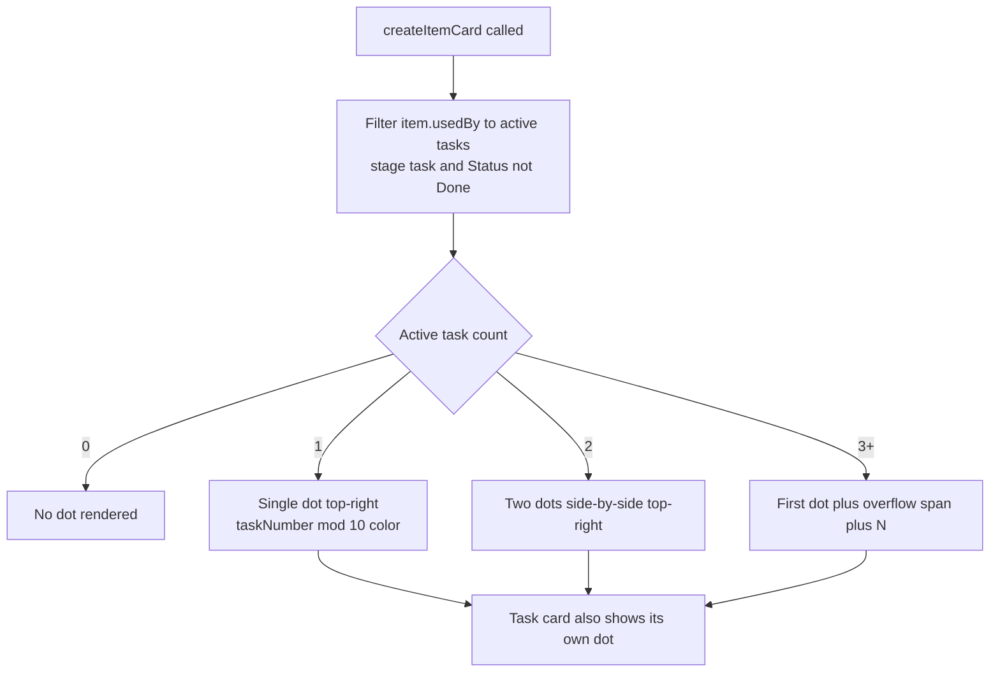

## item_309_task_color_badge_on_cards_to_visualize_active_task_coverage_at_a_glance - task color badge on cards to visualize active task coverage at a glance
> From version: 1.25.2
> Schema version: 1.0
> Status: Done
> Understanding: 95%
> Confidence: 90%
> Progress: 100%
> Complexity: Medium
> Theme: UI
> Reminder: Update status/understanding/confidence/progress and linked request/task references when you edit this doc.

# Problem

When multiple tasks are active simultaneously there is no visual way to tell which cards are covered by which task. The board looks uniform regardless of how many tasks are in flight. A small deterministic color dot pinned top-right on each card makes task coverage instantly scannable: a purple cluster means "covered by task_131", teal means "covered by task_128", no dot means "not yet in a task".

# Scope

- In: color derivation utility (`taskNumber % 10` → 10-color palette); `card__task-dot` CSS; dot injection in `createItemCard` reading `item.usedBy` filtered to active tasks; multi-dot handling (up to 2, then `+N`).
- Out: dot in detail panel, activity view, column headers; user-configurable colors; tooltip on dot (deferred); board column mode headers.

**Design decisions:**
- **Color source**: `parseInt(taskId.match(/\d+$/)[0]) % 10` → index into a fixed 10-color muted palette. Deterministic, zero config.
- **Position**: `position: absolute; top: 6px; right: 6px` inside the card (already `position: relative`).
- **Size**: 8×8px circle, `border-radius: 50%`, `opacity: 0.9`, 1px border `rgba(255,255,255,0.2)` for dark/light theme contrast.
- **Active filter**: `usedBy` entries with `stage === "task"` AND `Status` indicator not in `["Done", "Archived", "Obsolete"]`.
- **Multiple tasks**: ≤2 dots placed side-by-side with 3px gap; ≥3 show first dot + `+N`.

# Acceptance criteria

- AC1: Each active task has a deterministic color: `parseInt(taskId.match(/\d+$/)[0]) % 10` maps to a fixed 10-color palette. Same task always produces the same color.
- AC2: Task cards show their own color dot top-right.
- AC3: Backlog and request cards that are in an active task's `usedBy` show that task's dot top-right.
- AC4: 2 active tasks → 2 side-by-side dots. 3+ → first dot + `+N` label.
- AC5: Task closing (Status → Done/Archived/Obsolete) removes its dot from all cards on the next render — no manual action.
- AC6: Dots appear only on board/list view item cards. Not in detail panel, activity view, or column headers.
- AC7: All 410+ existing tests continue to pass.

# AC Traceability

- AC1 -> Scope: `getTaskColor(id)` utility returns consistent color. Proof: task_128 and task_131 always yield the same distinct colors across reloads.
- AC2 -> Scope: task card has `.card__task-dot` injected. Proof: task cards in board show colored dot top-right.
- AC3 -> Scope: backlog/request cards filtered via `usedBy` get dot. Proof: item_309 card shows task_132's color dot when task_132 is active.
- AC4 -> Scope: multi-dot rendering logic. Proof: item covered by 2 tasks shows 2 dots; 3+ shows dot + `+N`.
- AC5 -> Scope: active filter excludes Done/Archived/Obsolete. Proof: marking task Done → dot disappears on next render.
- AC6 -> Scope: dot injection only in `createItemCard`, not in detail or activity renderers. Proof: detail panel and activity view have no `.card__task-dot` elements.
- AC7 -> Scope: no changes to indexer or message types. Proof: `npm run test` exits 0 with ≥ 410 tests.

# Decision framing

- Product framing: Consider — this feature makes task coverage a first-class visual concept in the board.
- Architecture framing: Not needed — reads existing `usedBy` data, no indexer or state changes required.

# Links

- Product brief(s): (none)
- Architecture decision(s): (none)
- Request: `req_167_task_color_badge_on_cards_to_visualize_active_task_coverage_at_a_glance`
- Primary task(s): (none yet)

# AI Context

- Summary: Add a deterministic color dot badge (top-right, 8px circle) to task cards and their covered backlog/request cards, derived from taskId % 10 on a 10-color palette, reading item.usedBy filtered to active tasks.
- Keywords: task badge, color dot, usedBy, card__task-dot, deterministic color, taskNumber mod 10, board, list view, top-right
- Use when: Implementing or reviewing the task color badge feature.
- Skip when: Working on coverage, sticky headers, or unrelated plugin surfaces.

# References

- `logics/request/req_167_task_color_badge_on_cards_to_visualize_active_task_coverage_at_a_glance.md`

# Priority

- Impact: Medium — makes task grouping instantly readable without opening any doc
- Urgency: Normal

# Notes

- Derived from `logics/request/req_167_task_color_badge_on_cards_to_visualize_active_task_coverage_at_a_glance.md`.
- Color palette (10 entries, dark-theme tuned): `["#2dd4bf", "#a78bfa", "#fbbf24", "#f87171", "#38bdf8", "#a3e635", "#fb923c", "#f472b6", "#818cf8", "#22d3ee"]`
- `getTaskColor(id)`: `const n = parseInt(id.match(/(\d+)$/)?.[1] ?? "0"); return TASK_COLORS[n % TASK_COLORS.length];`
- Active filter: `item.usedBy.filter(u => u.stage === "task" && !["done","archived","obsolete"].includes((u.indicators?.Status || "").toLowerCase()))`
- The card element already has `position: relative` — no structural change needed.
- Overflow label `.card__task-dot-overflow`: `font-size: 9px; color: var(--vscode-descriptionForeground); margin-left: 2px; align-self: center;`
- Delivered in `media/renderBoardApp.js`, `media/css/board.css`, and `tests/webview.board-renderer.test.ts`.
