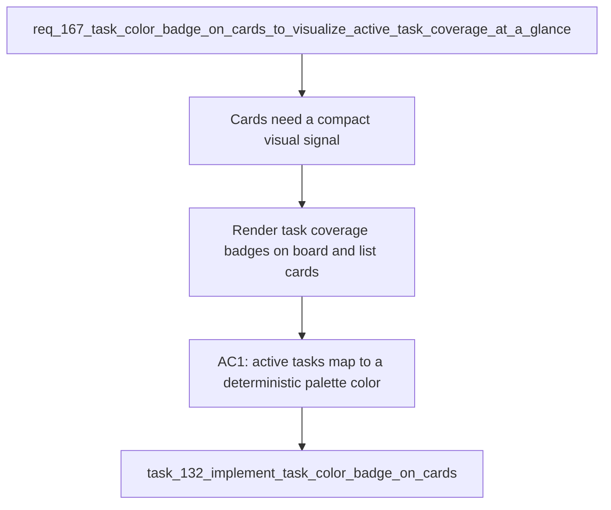

## item_310_render_task_coverage_badges_on_board_and_list_cards - Render task coverage badges on board and list cards
> From version: 1.25.2
> Schema version: 1.0
> Status: Done
> Understanding: 100%
> Confidence: 98%
> Progress: 100%
> Complexity: Medium
> Theme: UI
> Reminder: Update status/understanding/confidence/progress and linked request/task references when you edit this doc.

# Problem
Cards in the board and list views needed a compact visual signal showing task coverage without opening the detail panel. A small dot in the card corner makes active task coverage scannable while keeping the card layout readable.

# Scope
- In: deterministic color dots for task cards and cards covered by an active task.
- Out: detail panel badges, activity view badges, column-header badges, and user-configurable colors.

# Acceptance criteria
- AC1: Each active task (`Status` not Done/Archived/Obsolete) has a deterministic color derived from its numeric ID (`taskNumber % 10`).
- AC2: Task cards display their own color dot in the top-right corner.
- AC3: Backlog and request cards in an active task's `usedBy` chain display that task's color dot in the top-right corner.
- AC6: The dots do not appear in board column headers, the detail panel, or the activity view.
- AC7: `npm run test` continues to pass with 410+ tests.

# AC Traceability
- AC1 -> `media/renderBoardApp.js`. Proof: `getTaskColor(id)` returns a stable palette entry for the same task ID.
- AC2 -> `media/renderBoardApp.js`. Proof: task cards render `.card__task-dot` in board and list modes.
- AC3 -> `media/renderBoardApp.js`. Proof: cards linked through `usedBy` render the same dot as the task they reference.
- AC6 -> `media/renderBoardApp.js` and `media/renderDetails.js`. Proof: dot injection is limited to `createItemCard`.
- AC7 -> `tests/webview.board-renderer.test.ts`. Proof: full test suite remains green.

# Decision framing
- Product framing: Consider
- Product signals: navigation and discoverability
- Product follow-up: No product brief required for this shipped slice.
- Architecture framing: Not needed
- Architecture follow-up: No architecture decision required; this reads existing `usedBy` data only.

# Links
- Product brief(s): (none)
- Architecture decision(s): (none)
- Request: `req_167_task_color_badge_on_cards_to_visualize_active_task_coverage_at_a_glance`
- Primary task(s): `task_132_implement_task_color_badge_on_cards`

# AI Context
- Summary: Render deterministic task coverage dots on task cards and on backlog/request cards covered by an active task.
- Keywords: task badge, color dot, usedBy, task coverage, board, list view, deterministic palette
- Use when: Working on the rendered badge surface or its direct regression tests.
- Skip when: Working on detail-panel-only or activity-view-only UI.

# References
- `media/renderBoardApp.js`
- `media/css/board.css`
- `tests/webview.board-renderer.test.ts`

# Priority
- Impact: Medium
- Urgency: Normal

# Notes
- Implemented and validated in commit `5db9aed`.
- Sibling slice `item_311` covers stacking and lifecycle behavior.
- This item stays bounded to the card rendering surface.
