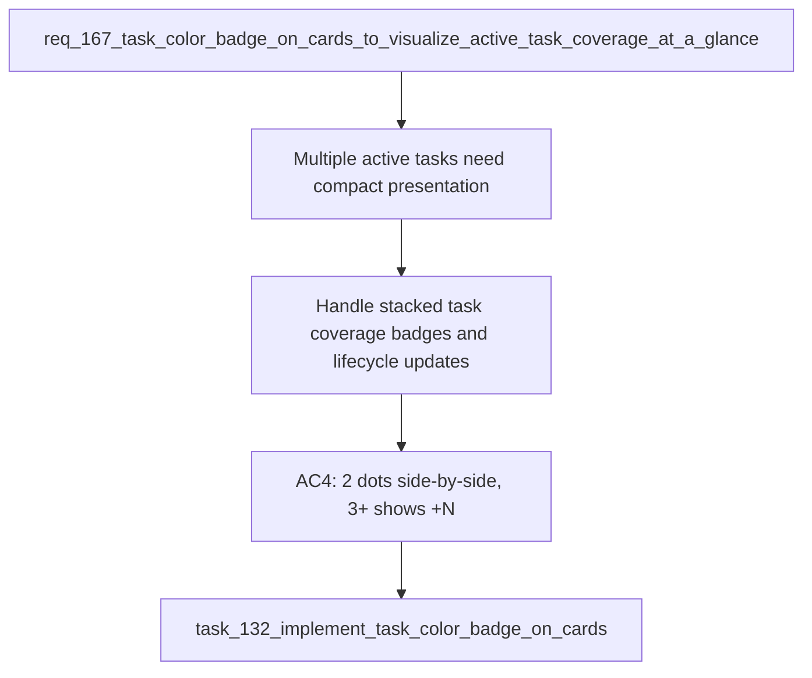

## item_311_handle_stacked_task_coverage_badges_and_active_lifecycle_updates - Handle stacked task coverage badges and active lifecycle updates
> From version: 1.25.2
> Schema version: 1.0
> Status: Done
> Understanding: 100%
> Confidence: 98%
> Progress: 100%
> Complexity: Medium
> Theme: UI
> Reminder: Update status/understanding/confidence/progress and linked request/task references when you edit this doc.

# Problem
When a card is covered by multiple active tasks, the UI needs a compact way to show more than one task color without crowding the card. The badge also has to disappear automatically when a task becomes inactive so the board stays accurate on the next render.

# Scope
- In: stacked badge rendering for 2+ active tasks and live removal when a task closes.
- Out: new indexer data, tooltips, user-configurable palettes, and badges outside card surfaces.

# Acceptance criteria
- AC4: When an item is covered by 2+ active tasks, up to 2 dots are shown side-by-side. If 3+, the first dot is shown with a micro-label `+N`.
- AC5: When a task closes (`Done`, `Archived`, or `Obsolete`), its dot disappears from all cards without any manual action.
- AC6: The dots do not appear in board column headers, the detail panel, or the activity view.
- AC7: `npm run test` continues to pass with 410+ tests.

# AC Traceability
- AC4 -> `media/renderBoardApp.js`. Proof: active tasks render one dot for 1, two dots for 2, and one dot plus `+N` for 3+.
- AC5 -> `media/renderBoardApp.js`. Proof: closed tasks are filtered out before badge rendering, so the next render removes the dot.
- AC6 -> `media/renderBoardApp.js` and `media/renderDetails.js`. Proof: badge injection exists only in card creation.
- AC7 -> `tests/webview.board-renderer.test.ts`. Proof: the renderer suite still passes end to end.

# Decision framing
- Product framing: Consider
- Product signals: navigation and discoverability
- Product follow-up: No product brief required for this shipped slice.
- Architecture framing: Not needed
- Architecture follow-up: No architecture decision required; this is a pure render-layer rule.

# Links
- Product brief(s): (none)
- Architecture decision(s): (none)
- Request: `req_167_task_color_badge_on_cards_to_visualize_active_task_coverage_at_a_glance`
- Primary task(s): `task_132_implement_task_color_badge_on_cards`

# AI Context
- Summary: Render compact stacked task coverage badges and hide them again as soon as a task closes.
- Keywords: task badge, overflow, +N, active lifecycle, usedBy, board, list view
- Use when: Working on multi-task badge presentation or lifecycle behavior.
- Skip when: Working on detail-panel-only UI or indexer changes.

# References
- `media/renderBoardApp.js`
- `media/css/board.css`
- `tests/webview.board-renderer.test.ts`

# Priority
- Impact: Medium
- Urgency: Normal

# Notes
- Implemented and validated in commit `5db9aed`.
- Sibling slice `item_310` covers the basic rendered dot surface.
- This item is intentionally narrow so it stays independently understandable.
