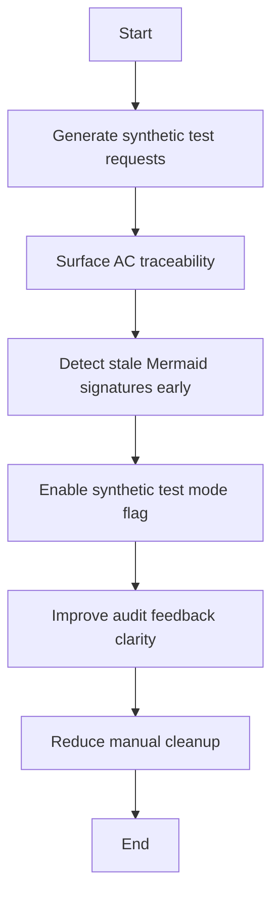

## item_312_am_liorer_la_cr_ation_de_requests_de_test_et_la_pr_validation_du_flow_manager - Improve test request creation and flow manager pre-validation
> From version: 1.25.4
> Schema version: 1.0
> Status: Draft
> Understanding: 92%
> Confidence: 92%
> Progress: 0%
> Complexity: Medium
> Theme: Workflow
> Reminder: Update status/understanding/confidence/progress and linked request/task references when you edit this doc.

# Problem
- Make the flow manager better at generating synthetic requests for testing and smoke checks.
- Reduce the amount of manual cleanup needed after `flow new`, `flow split`, and `flow promote`.
- Catch the most common audit problems earlier, before the request has to be hand-fixed after generation.
- - We just created a synthetic request to test Logics pastilles, and it exposed a few friction points.
- - The generated docs were technically valid, but they needed several manual fixes before they were pleasant to use or easy to audit.

# Scope
- In: one coherent delivery slice from the source request.
- Out: unrelated sibling slices that should stay in separate backlog items instead of widening this doc.
- We just created a synthetic request to test Logics pastilles, and it exposed a few friction points.
- The generated docs were technically valid, but they needed several manual fixes before they were pleasant to use or easy to audit.

# Acceptance criteria
- AC1: Test or smoke-test requests can be generated with a more opinionated template that fits synthetic scenarios better than the default generic request shape.
- AC2: The flow manager can surface or create AC traceability in a form that matches the request, backlog item, and task chain used by the audit.
- AC3: The flow manager can detect stale Mermaid signatures or other doc-shape issues earlier, ideally during generation or promotion instead of only at lint or audit time.
- AC4: A synthetic test mode or equivalent flag exists so operators can ask for a smaller, fixture-friendly request shape without hand-editing the result heavily.
- AC5: The audit and validation feedback is more actionable for creators, making it clear what to fix and where to fix it before the docs are used downstream.

# AC Traceability
- AC1 -> Scope: Test or smoke-test requests can be generated with a more opinionated template that fits synthetic scenarios better than the default generic request shape.. Proof: capture validation evidence in this doc.
- AC2 -> Scope: The flow manager can surface or create AC traceability in a form that matches the request, backlog item, and task chain used by the audit.. Proof: capture validation evidence in this doc.
- AC3 -> Scope: The flow manager can detect stale Mermaid signatures or other doc-shape issues earlier, ideally during generation or promotion instead of only at lint or audit time.. Proof: capture validation evidence in this doc.
- AC4 -> Scope: A synthetic test mode or equivalent flag exists so operators can ask for a smaller, fixture-friendly request shape without hand-editing the result heavily.. Proof: capture validation evidence in this doc.
- AC5 -> Scope: The audit and validation feedback is more actionable for creators, making it clear what to fix and where to fix it before the docs are used downstream.. Proof: capture validation evidence in this doc.

# Decision framing
- Product framing: Not needed
- Product signals: (none detected)
- Product follow-up: No product brief follow-up is expected based on current signals.
- Architecture framing: Consider
- Architecture signals: data model and persistence
- Architecture follow-up: Review whether an architecture decision is needed before implementation becomes harder to reverse.

# Links
- Product brief(s): (none yet)
- Architecture decision(s): (none yet)
- Request: `req_169_am_liorer_la_cr_ation_de_requests_de_test_et_la_pr_validation_du_flow_manager`
- Primary task(s): `task_133_am_liorer_la_cr_ation_de_requests_de_test_et_la_pr_validation_du_flow_manager`

# AI Context
- Summary: Improve synthetic request generation, traceability, and prevalidation in the Logics flow manager.
- Keywords: flow manager, request generation, smoke test, fixture, traceability, mermaid, audit
- Use when: Use when you need better generated requests and earlier validation for synthetic or test-oriented workflow docs.
- Skip when: Skip when the work is a normal product delivery slice or unrelated workflow maintenance.
# Priority
- Impact:
- Urgency:

# Notes
- Derived from request `req_169_am_liorer_la_cr_ation_de_requests_de_test_et_la_pr_validation_du_flow_manager`.
- Source file: `logics/request/req_169_am_liorer_la_cr_ation_de_requests_de_test_et_la_pr_validation_du_flow_manager.md`.
- Keep this backlog item as one bounded delivery slice; create sibling backlog items for the remaining request coverage instead of widening this doc.
- Request context seeded into this backlog item from `logics/request/req_169_am_liorer_la_cr_ation_de_requests_de_test_et_la_pr_validation_du_flow_manager.md`.
