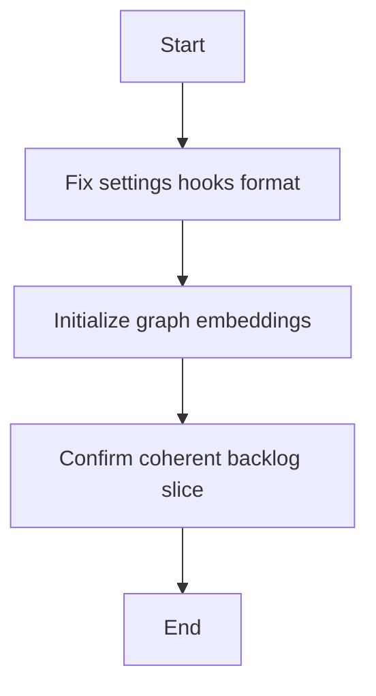

## item_313_fix_settings_hooks_format_and_initialize_graph_embeddings - fix settings hooks format and initialize graph embeddings
> From version: 1.25.4
> Schema version: 1.0
> Status: In progress
> Understanding: 96%
> Confidence: 94%
> Progress: 25%
> Complexity: Low
> Theme: Maintenance
> Reminder: Update status/understanding/confidence/progress and linked request/task references when you edit this doc.

# Problem
- Deliver the bounded slice for fix settings hooks format and initialize graph embeddings without widening scope.

# Scope
- In: one coherent delivery slice from the source request.
- Out: unrelated sibling slices that should stay in separate backlog items instead of widening this doc.

# Acceptance criteria
- AC1: Confirm fix settings hooks format and initialize graph embeddings delivers one coherent backlog slice.

# AC Traceability
- AC1 -> Scope: Deliver the bounded slice for fix settings hooks format and initialize graph embeddings. Proof: capture validation evidence in this doc.
- AC2 -> Scope: No separate slice beyond the settings hooks format and embeddings fix. Proof: the linked request and task keep the scope bounded and traceable.
- AC3 -> Scope: No separate slice beyond the settings hooks format and embeddings fix. Proof: the linked request and task keep the scope bounded and traceable.
- AC4 -> Scope: No separate slice beyond the settings hooks format and embeddings fix. Proof: the linked request and task keep the scope bounded and traceable.
- AC5 -> Scope: No separate slice beyond the settings hooks format and embeddings fix. Proof: the linked request and task keep the scope bounded and traceable.

# Decision framing
- Product framing: Required
- Product signals: experience scope
- Product follow-up: Create or link a product brief before implementation moves deeper into delivery.
- Architecture framing: Not needed
- Architecture signals: (none detected)
- Architecture follow-up: No architecture decision follow-up is expected based on current signals.

# Links
- Product brief(s): `logics/product/prod_007_graph_embeddings_for_audit_discovery.md`
- Architecture decision(s): (none yet)
- Request: `logics/request/req_170_address_codebase_audit_findings_from_april_2026_settings_hooks_graph_embeddings_and_test_fragmentation.md`
- Primary task(s): `logics/tasks/task_134_wave_1_maintenance_hardening_graph_embeddings_coverage_and_static_analysis.md`

# AI Context
- Summary: fix settings hooks format and initialize graph embeddings
- Keywords: fix, settings, hooks, format, and, initialize, graph, embeddings
- Use when: Use when implementing or reviewing the delivery slice for fix settings hooks format and initialize graph embeddings.
- Skip when: Skip when the change is unrelated to this delivery slice or its linked request.
# Priority
- Impact:
- Urgency:

# Notes
