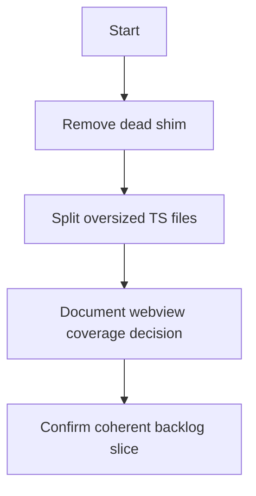

## item_315_remove_dead_shim_split_oversized_ts_files_and_document_webview_coverage_decision - remove dead shim split oversized ts files and document webview coverage decision
> From version: 1.25.4
> Schema version: 1.0
> Status: Done
> Understanding: 96%
> Confidence: 94%
> Progress: 100%
> Complexity: Medium
> Theme: Maintenance
> Reminder: Update status/understanding/confidence/progress and linked request/task references when you edit this doc.

# Problem
- Deliver the bounded slice for remove dead shim split oversized ts files and document webview coverage decision without widening scope.

# Scope
- In: one coherent delivery slice from the source request.
- Out: unrelated sibling slices that should stay in separate backlog items instead of widening this doc.

# Acceptance criteria
- AC1: Confirm remove dead shim split oversized ts files and document webview coverage decision delivers one coherent backlog slice.

# AC Traceability
- AC1 -> Scope: Deliver the bounded slice for remove dead shim split oversized ts files and document webview coverage decision. Proof: capture validation evidence in this doc.
- AC2 -> Scope: No separate slice beyond the dead shim, file split, and webview coverage decision work. Proof: the linked request and task keep the scope bounded and traceable.
- AC3 -> Scope: No separate slice beyond the dead shim, file split, and webview coverage decision work. Proof: the linked request and task keep the scope bounded and traceable.
- AC4 -> Scope: No separate slice beyond the dead shim, file split, and webview coverage decision work. Proof: the linked request and task keep the scope bounded and traceable.
- AC5 -> Scope: No separate slice beyond the dead shim, file split, and webview coverage decision work. Proof: the linked request and task keep the scope bounded and traceable.

# Decision framing
- Product framing: Not needed
- Product signals: (none detected)
- Product follow-up: No product brief follow-up is expected based on current signals.
- Architecture framing: Not needed
- Architecture signals: (none detected)
- Architecture follow-up: No architecture decision follow-up is expected based on current signals.

# Links
- Product brief(s): (none yet)
- Architecture decision(s): (none yet)
- Request: `logics/request/req_171_address_post_audit_coverage_regressions_dead_shim_and_file_size_drift.md`
- Primary task(s): `logics/tasks/task_134_wave_1_maintenance_hardening_graph_embeddings_coverage_and_static_analysis.md`

# AI Context
- Summary: remove dead shim split oversized ts files and document webview coverage decision
- Keywords: remove, dead, shim, split, oversized, files, and, document
- Use when: Use when implementing or reviewing the delivery slice for remove dead shim split oversized ts files and document webview coverage decision.
- Skip when: Skip when the change is unrelated to this delivery slice or its linked request.
# References
- `logics/skills/logics-ui-steering/SKILL.md`

# Priority
- Impact:
- Urgency:

# Notes
