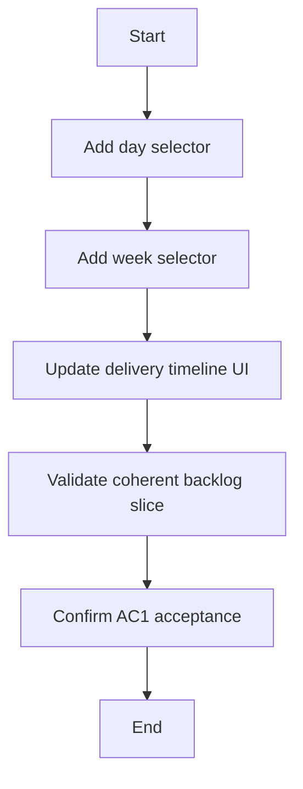

## item_320_add_day_and_week_period_selector_to_delivery_timeline_in_logics_insights - add day and week period selector to delivery timeline in logics insights
> From version: 1.25.4
> Schema version: 1.0
> Status: Ready
> Understanding: 95%
> Confidence: 92%
> Progress: 0%
> Complexity: Low
> Theme: UI
> Reminder: Update status/understanding/confidence/progress and linked request/task references when you edit this doc.

# Problem
- Deliver the bounded slice for add day and week period selector to delivery timeline in logics insights without widening scope.

# Scope
- In: one coherent delivery slice from the source request.
- Out: unrelated sibling slices that should stay in separate backlog items instead of widening this doc.

# Acceptance criteria
- AC1: Confirm add day and week period selector to delivery timeline in logics insights delivers one coherent backlog slice.

# AC Traceability
- AC1 -> Scope: Deliver the bounded slice for add day and week period selector to delivery timeline in logics insights. Proof: capture validation evidence in this doc.

# Decision framing
- Product framing: Not needed
- Product signals: (none detected)
- Product follow-up: No product brief follow-up is expected based on current signals.
- Architecture framing: Not needed
- Architecture signals: (none detected)
- Architecture follow-up: No architecture decision follow-up is expected based on current signals.

# Links
- Product brief(s): (none yet)
- Architecture decision(s): (none yet)
- Request: `logics/request/req_175_add_day_and_week_period_selector_to_delivery_timeline_in_logics_insights.md`
- Primary task(s): `logics/tasks/task_135_wave_2_ui_features_card_cells_compact_mode_insights_sections_and_final_ci_validation.md`

# AI Context
- Summary: add day and week period selector to delivery timeline in logics insights
- Keywords: add, day, and, week, period, selector, timeline, logics
- Use when: Use when implementing or reviewing the delivery slice for add day and week period selector to delivery timeline in logics insights.
- Skip when: Skip when the change is unrelated to this delivery slice or its linked request.
# Priority
- Impact:
- Urgency:

# Notes
