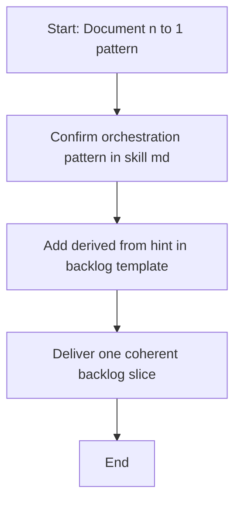

## item_324_document_n_to_1_orchestration_pattern_in_skill_md_and_add_derived_from_hint_in_backlog_template - document n to 1 orchestration pattern in skill md and add derived from hint in backlog template
> From version: 1.25.4
> Schema version: 1.0
> Status: Ready
> Understanding: 95%
> Confidence: 95%
> Progress: 0%
> Complexity: Low
> Theme: Maintenance
> Reminder: Update status/understanding/confidence/progress and linked request/task references when you edit this doc.

# Problem
- Deliver the bounded slice for document n to 1 orchestration pattern in skill md and add derived from hint in backlog template without widening scope.

# Scope
- In: one coherent delivery slice from the source request.
- Out: unrelated sibling slices that should stay in separate backlog items instead of widening this doc.

# Acceptance criteria
- AC1: Confirm document n to 1 orchestration pattern in skill md and add derived from hint in backlog template delivers one coherent backlog slice.

# AC Traceability
- AC1 -> Scope: Deliver the bounded slice for document n to 1 orchestration pattern in skill md and add derived from hint in backlog template. Proof: capture validation evidence in this doc.

# Decision framing
- Product framing: Not needed
- Product signals: (none detected)
- Product follow-up: No product brief follow-up is expected based on current signals.
- Architecture framing: Not needed
- Architecture signals: (none detected)
- Architecture follow-up: No architecture decision follow-up is expected based on current signals.

# Links
- Product brief(s): (none yet)
- Architecture decision(s): (none yet)
- Request: `logics/request/req_177_fix_flow_manager_to_guide_derived_from_link_pattern_when_a_task_covers_a_backlog_item.md`
- Primary task(s): `logics/tasks/task_134_wave_1_maintenance_hardening_graph_embeddings_coverage_and_static_analysis.md`

# AI Context
- Summary: document n to 1 orchestration pattern in skill md and add derived from hint in backlog template
- Keywords: document, orchestration, pattern, skill, and, add, derived, hint
- Use when: Use when implementing or reviewing the delivery slice for document n to 1 orchestration pattern in skill md and add derived from hint in backlog template.
- Skip when: Skip when the change is unrelated to this delivery slice or its linked request.
# Priority
- Impact:
- Urgency:

# Notes
