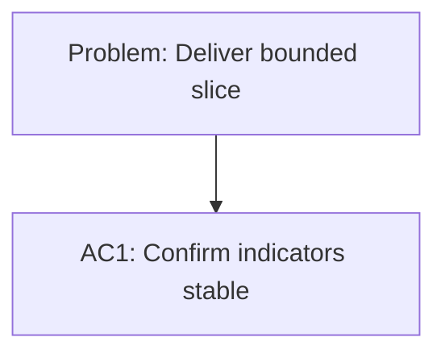

## item_325_allow_logics_indicators_to_stay_stable_for_non_semantic_document_edits - Allow Logics indicators to stay stable for non-semantic document edits
> From version: 1.26.1
> Schema version: 1.0
> Status: Done
> Understanding: 90%
> Confidence: 85%
> Progress: 100%
> Complexity: Medium
> Theme: General
> Reminder: Update status/understanding/confidence/progress and linked request/task references when you edit this doc.

# Problem
- Deliver the bounded slice for Allow Logics indicators to stay stable for non-semantic document edits without widening scope.

# Scope
- In: one coherent delivery slice from the source request.
- Out: unrelated sibling slices that should stay in separate backlog items instead of widening this doc.

# Acceptance criteria
- AC1: Confirm Allow Logics indicators to stay stable for non-semantic document edits delivers one coherent backlog slice.

# AC Traceability
- AC1 -> Scope: Deliver the bounded slice for Allow Logics indicators to stay stable for non-semantic document edits. Proof: capture validation evidence in this doc.

# Decision framing
- Product framing: Not needed
- Product signals: (none detected)
- Product follow-up: No product brief follow-up is expected based on current signals.
- Architecture framing: Not needed
- Architecture signals: (none detected)
- Architecture follow-up: No architecture decision follow-up is expected based on current signals.

# Links
- Product brief(s): (none yet)
- Architecture decision(s): (none yet)
- Request: `logics/request/req_182_allow_logics_indicators_to_stay_unchanged_for_non_semantic_document_edits.md`
- Primary task(s): `task_136_allow_logics_indicators_to_stay_stable_for_non_semantic_document_edits`
<!-- When creating a task from this item, add: Derived from `this file path` in the task # Links section -->

# AI Context
- Summary: Allow Logics indicators to stay stable for non-semantic document edits
- Keywords: allow, logics, indicators, stay, stable, for, non-semantic, document
- Use when: Use when implementing or reviewing the delivery slice for Allow Logics indicators to stay stable for non-semantic document edits.
- Skip when: Skip when the change is unrelated to this delivery slice or its linked request.
# Priority
- Impact:
- Urgency:

# Notes
- Added an explicit maintenance-edit marker path in the workflow doc linter so non-semantic edits can stay stable without forcing indicator churn.
- The linter still blocks semantic edits that omit indicator updates.

# Report
- Delivered the bounded slice for the maintenance-edit rule and validated it with end-to-end linter coverage.
- Validation: `npm test -- tests/logicsDocLinter.test.ts`, `npm run lint:ts`.
