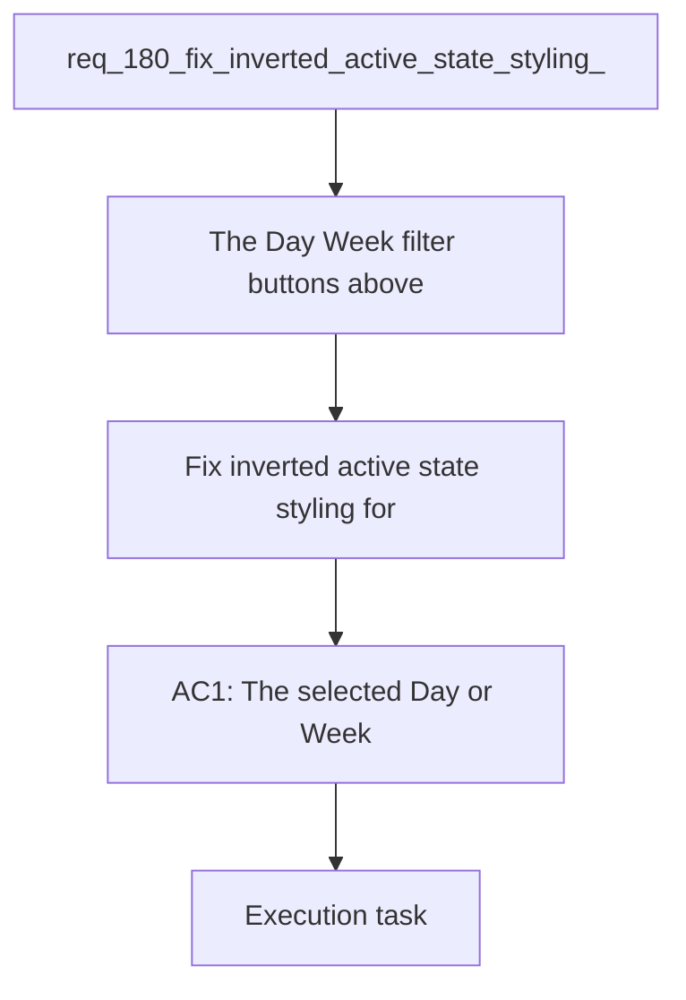

## item_326_fix_inverted_active_state_styling_for_delivery_timeline_period_buttons - Fix inverted active state styling for delivery timeline period buttons
> From version: 1.26.1
> Schema version: 1.0
> Status: Done
> Understanding: 95%
> Confidence: 90%
> Progress: 100%
> Complexity: Low
> Theme: UI
> Reminder: Update status/understanding/confidence/progress and linked request/task references when you edit this doc.

# Problem
- The Day / Week filter buttons above the Delivery timeline in Logics Insights are functionally correct, but the active state reads visually inverted or weaker than the inactive state.
- The selected button should feel clearly pressed, highlighted, or current, while the unselected button should recede.
- The issue is visual only; the filter behavior and timeline data switching should stay unchanged.
- In Day mode, the timeline legend is too verbose for the available space, showing labels like `Mar 13` and `Apr 12`.
- The day-mode legend should use a compact but still readable format such as `Mar13` or `Apr12` so the chart remains scannable without truncation or crowding.
- The Delivery timeline period selector was introduced in `req_175` and implemented in `item_320`. The buttons currently toggle the timeline correctly, but the styling makes the selected state feel backwards or confusing at a glance.
- This is most likely a local styling/token problem in the Logics Insights webview, not a data or state-management bug. The fix should focus on the button states, spacing, contrast, and pressed/active affordance without changing the underlying period selector logic.

# Scope
- In: one coherent delivery slice from the source request.
- Out: unrelated sibling slices that should stay in separate backlog items instead of widening this doc.

# Acceptance criteria
- AC1: The selected Day or Week button is visually stronger than the unselected button and reads as the active filter.
- AC2: The inactive button remains visually subdued enough that the selection is unambiguous at a glance.
- AC3: The fix does not change period-switch behavior, labels, or the underlying timeline data.
- AC4: The visual state remains correct on initial render and after toggling between Day and Week.
- AC5: In Day mode, the timeline uses a more compact month-day legend format than full labels like `Mar 13` or `Apr 12`, so the chart stays readable at typical panel widths.
- AC6: The compact legend format remains unambiguous enough that users can still tell which dates the bars represent.
- AC7: Tests or snapshots cover the active/inactive presentation and the compact day-mode legend so the styling does not regress silently.

# AC Traceability
- AC1 -> Scope: The selected Day or Week button is visually stronger than the unselected button and reads as the active filter.. Proof: capture validation evidence in this doc.
- AC2 -> Scope: The inactive button remains visually subdued enough that the selection is unambiguous at a glance.. Proof: capture validation evidence in this doc.
- AC3 -> Scope: The fix does not change period-switch behavior, labels, or the underlying timeline data.. Proof: capture validation evidence in this doc.
- AC4 -> Scope: The visual state remains correct on initial render and after toggling between Day and Week.. Proof: capture validation evidence in this doc.
- AC5 -> Scope: In Day mode, the timeline uses a more compact month-day legend format than full labels like `Mar 13` or `Apr 12`, so the chart stays readable at typical panel widths.. Proof: capture validation evidence in this doc.
- AC6 -> Scope: The compact legend format remains unambiguous enough that users can still tell which dates the bars represent.. Proof: capture validation evidence in this doc.
- AC7 -> Scope: Tests or snapshots cover the active/inactive presentation and the compact day-mode legend so the styling does not regress silently.. Proof: capture validation evidence in this doc.

# Decision framing
- Product framing: Consider
- Product signals: navigation and discoverability
- Product follow-up: Review whether a product brief is needed before scope becomes harder to change.
- Architecture framing: Consider
- Architecture signals: data model and persistence
- Architecture follow-up: Review whether an architecture decision is needed before implementation becomes harder to reverse.

# Links
- Product brief(s): (none yet)
- Architecture decision(s): (none yet)
- Request: `req_180_fix_inverted_active_state_styling_for_delivery_timeline_period_buttons`
- Primary task(s): `task_137_fix_inverted_active_state_styling_for_delivery_timeline_period_buttons`

# AI Context
- Summary: Fix the visual active/inactive state styling for the Delivery timeline period buttons in Logics Insights and compact the...
- Keywords: timeline, delivery, period selector, Day, Week, active state, selected button, inactive button, styling, UI, legend, compact labels
- Use when: Use when reviewing or implementing the Delivery timeline period buttons and the Day-mode legend reads too verbose or the selected state reads backwards.
- Skip when: Skip when the problem is about the timeline data itself, the selector behavior, or unrelated button styles.
# References
- `logics/skills/logics-ui-steering/SKILL.md`

# Priority
- Impact:
- Urgency:

# Notes
- Derived from request `req_180_fix_inverted_active_state_styling_for_delivery_timeline_period_buttons`.
- Source file: `logics/request/req_180_fix_inverted_active_state_styling_for_delivery_timeline_period_buttons.md`.
- Keep this backlog item as one bounded delivery slice; create sibling backlog items for the remaining request coverage instead of widening this doc.
- Request context seeded into this backlog item from `logics/request/req_180_fix_inverted_active_state_styling_for_delivery_timeline_period_buttons.md`.

# Report
- Delivered the Delivery timeline period button contrast fix and the compact Day legend formatting.
- Validation: `npm test -- tests/logicsHtml.test.ts`, `npm run lint:ts`.
