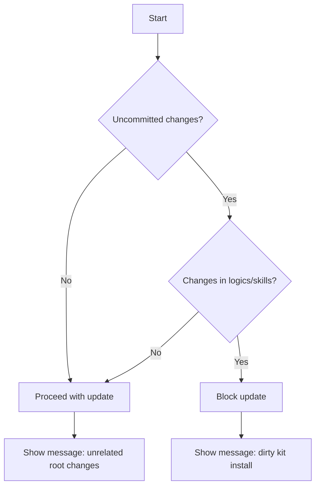

## item_327_allow_kit_update_when_unrelated_root_changes_are_uncommitted - Allow kit update when unrelated root changes are uncommitted
> From version: 1.26.1
> Schema version: 1.0
> Status: Ready
> Understanding: 95%
> Confidence: 90%
> Progress: 0%
> Complexity: Medium
> Theme: Workflow
> Reminder: Update status/understanding/confidence/progress and linked request/task references when you edit this doc.

# Problem
- The kit update action should not be blocked just because the repository root has unrelated uncommitted changes.
- The current safety check feels too broad if it treats the whole workspace as a single unit instead of focusing on the `logics/skills` install state that the update actually touches.
- Users should still be protected from updating when `logics/skills` itself is dirty or when the install type is incompatible with an automated update.
- The allowed path should be "root has unrelated changes, but `logics/skills` is clean".
- The update path currently shells out to git before refreshing the kit. That is useful for protecting the submodule or standalone kit install, but it can become frustrating when a repo has unrelated local edits elsewhere in the root.
- The desired behavior is narrower:

# Scope
- In: one coherent delivery slice from the source request.
- Out: unrelated sibling slices that should stay in separate backlog items instead of widening this doc.

# Acceptance criteria
- AC1: Kit update proceeds when the repository has uncommitted changes outside `logics/skills`.
- AC2: Kit update still blocks when `logics/skills` itself has uncommitted changes.
- AC3: The existing behavior for canonical submodule, standalone clone, and fallback installs remains intact.
- AC4: The user-facing message clearly distinguishes between a dirty kit install and unrelated root changes.
- AC5: The update path is covered by tests for both the allowed and blocked cases.

# AC Traceability
- AC1 -> Scope: Kit update proceeds when the repository has uncommitted changes outside `logics/skills`.. Proof: capture validation evidence in this doc.
- AC2 -> Scope: Kit update still blocks when `logics/skills` itself has uncommitted changes.. Proof: capture validation evidence in this doc.
- AC3 -> Scope: The existing behavior for canonical submodule, standalone clone, and fallback installs remains intact.. Proof: capture validation evidence in this doc.
- AC4 -> Scope: The user-facing message clearly distinguishes between a dirty kit install and unrelated root changes.. Proof: capture validation evidence in this doc.
- AC5 -> Scope: The update path is covered by tests for both the allowed and blocked cases.. Proof: capture validation evidence in this doc.

# Decision framing
- Product framing: Not needed
- Product signals: (none detected)
- Product follow-up: No product brief follow-up is expected based on current signals.
- Architecture framing: Consider
- Architecture signals: data model and persistence
- Architecture follow-up: Review whether an architecture decision is needed before implementation becomes harder to reverse.

# Links
- Product brief(s): (none yet)
- Architecture decision(s): (none yet)
- Request: `req_178_allow_kit_update_when_unrelated_root_changes_are_uncommitted`
- Primary task(s): `task_139_allow_kit_update_when_unrelated_root_changes_are_uncommitted`

# AI Context
- Summary: The kit update action should not be blocked just because the repository root has unrelated uncommitted changes.
- Keywords: allow, kit, update, unrelated, root, changes, are, uncommitted
- Use when: Use when implementing or reviewing the delivery slice for Allow kit update when unrelated root changes are uncommitted.
- Skip when: Skip when the change is unrelated to this delivery slice or its linked request.
# Priority
- Impact:
- Urgency:

# Notes
- Derived from request `req_178_allow_kit_update_when_unrelated_root_changes_are_uncommitted`.
- Source file: `logics/request/req_178_allow_kit_update_when_unrelated_root_changes_are_uncommitted.md`.
- Keep this backlog item as one bounded delivery slice; create sibling backlog items for the remaining request coverage instead of widening this doc.
- Request context seeded into this backlog item from `logics/request/req_178_allow_kit_update_when_unrelated_root_changes_are_uncommitted.md`.
