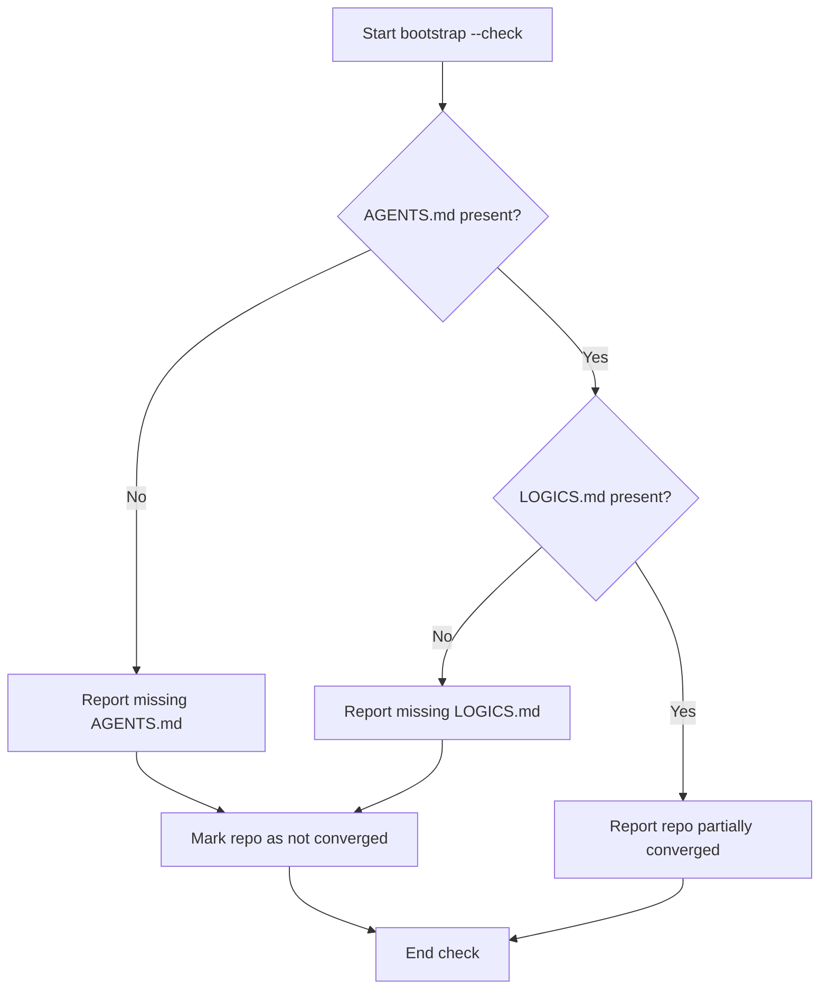

## item_328_extend_bootstrap_convergence_checks_to_cover_agents_and_logics_files - Extend bootstrap convergence checks to cover AGENTS and LOGICS files
> From version: 1.26.1
> Schema version: 1.0
> Status: Ready
> Understanding: 95%
> Confidence: 90%
> Progress: 0%
> Complexity: Medium
> Theme: Workflow
> Reminder: Update status/understanding/confidence/progress and linked request/task references when you edit this doc.

# Problem
- Bootstrap currently creates or repairs `AGENTS.md` and `LOGICS.md`, but the broader convergence checks do not treat those files as required repo-local bootstrap artifacts.
- That means a repo can look healthy enough for bootstrap-convergence checks while still missing one of the files that teaches the assistant how to use the Logics kit.
- The check path should surface those missing files consistently so old repos can be repaired instead of silently drifting.
- `AGENTS.md` and `LOGICS.md` should be treated as required convergence files, not just bootstrap outputs.
- The bootstrapper already knows how to create `AGENTS.md` and `LOGICS.md`. The gap is not file generation, but consistency in the detection and reporting path:
- - `bootstrap --check` should flag missing assistant context files;

# Scope
- In: one coherent delivery slice from the source request.
- Out: unrelated sibling slices that should stay in separate backlog items instead of widening this doc.

# Acceptance criteria
- AC1: `bootstrap --check` reports missing `AGENTS.md` and `LOGICS.md` when either file is absent.
- AC2: The bootstrap convergence inspection used by the plugin includes `AGENTS.md` and `LOGICS.md` in its missing-path output.
- AC3: The user-facing status or prompt makes it clear that the repo is only partially converged until those files exist.
- AC4: The new check remains idempotent and does not rewrite files that are already correct.
- AC5: Tests cover both the missing-file case and the already-converged case.

# AC Traceability
- AC1 -> Scope: `bootstrap --check` reports missing `AGENTS.md` and `LOGICS.md` when either file is absent.. Proof: capture validation evidence in this doc.
- AC2 -> Scope: The bootstrap convergence inspection used by the plugin includes `AGENTS.md` and `LOGICS.md` in its missing-path output.. Proof: capture validation evidence in this doc.
- AC3 -> Scope: The user-facing status or prompt makes it clear that the repo is only partially converged until those files exist.. Proof: capture validation evidence in this doc.
- AC4 -> Scope: The new check remains idempotent and does not rewrite files that are already correct.. Proof: capture validation evidence in this doc.
- AC5 -> Scope: Tests cover both the missing-file case and the already-converged case.. Proof: capture validation evidence in this doc.

# Decision framing
- Product framing: Not needed
- Product signals: (none detected)
- Product follow-up: No product brief follow-up is expected based on current signals.
- Architecture framing: Consider
- Architecture signals: data model and persistence
- Architecture follow-up: Review whether an architecture decision is needed before implementation becomes harder to reverse.

# Links
- Product brief(s): (none yet)
- Architecture decision(s): (none yet)
- Request: `req_179_extend_bootstrap_convergence_checks_to_cover_agents_and_logics_files`
- Primary task(s): `task_140_extend_bootstrap_convergence_checks_to_cover_agents_and_logics_files`

# AI Context
- Summary: Bootstrap currently creates or repairs AGENTS.md and LOGICS.md, but the broader convergence checks do not treat those files...
- Keywords: extend, bootstrap, convergence, checks, cover, agents, and, logics
- Use when: Use when implementing or reviewing the delivery slice for Extend bootstrap convergence checks to cover AGENTS and LOGICS files.
- Skip when: Skip when the change is unrelated to this delivery slice or its linked request.

# Priority
- Impact:
- Urgency:

# Notes
- Derived from request `req_179_extend_bootstrap_convergence_checks_to_cover_agents_and_logics_files`.
- Source file: `logics/request/req_179_extend_bootstrap_convergence_checks_to_cover_agents_and_logics_files.md`.
- Keep this backlog item as one bounded delivery slice; create sibling backlog items for the remaining request coverage instead of widening this doc.
- Request context seeded into this backlog item from `logics/request/req_179_extend_bootstrap_convergence_checks_to_cover_agents_and_logics_files.md`.
