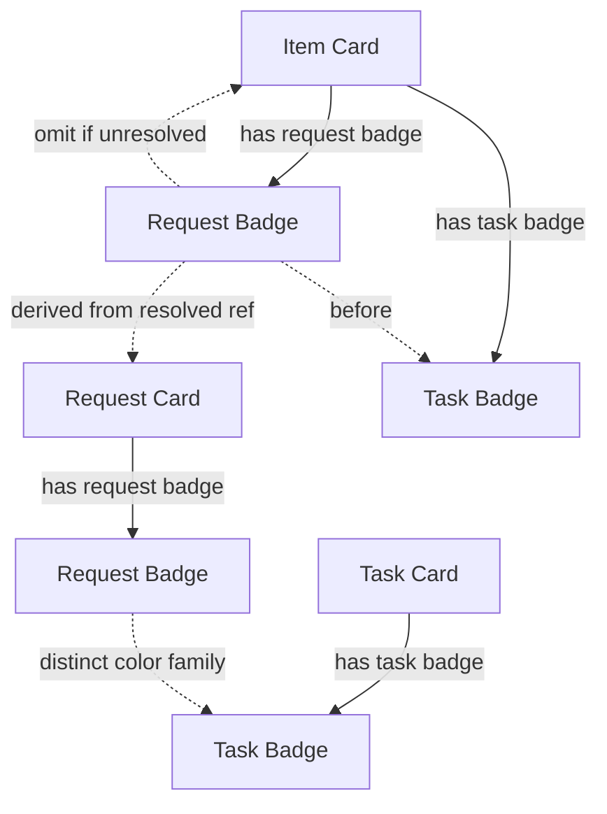

## item_329_add_request_color_badges_to_items_and_requests_to_visualize_request_task_linkage - Add request color badges to items and requests to visualize request-task linkage
> From version: 1.26.1
> Schema version: 1.0
> Status: Ready
> Understanding: 95%
> Confidence: 90%
> Progress: 0%
> Complexity: Medium
> Theme: UI
> Reminder: Update status/understanding/confidence/progress and linked request/task references when you edit this doc.

# Problem
- The plugin already uses a compact color badge to show task coverage on task cards and covered item cards.
- The current task badge colors are not separated enough from one another, so distinct tasks can look too similar at a glance.
- The request badge layer should inherit the same stronger visual separation, with request colors amplified as well so request and task families stay easy to tell apart.
- We now need the same idea for request-to-item linkage so an item can show both the request it came from and the task that currently covers it.
- Request cards should also carry their own compact color badge so the provenance is visible from both sides.
- The request badge should use a distinct and visibly stronger color family from the task badge if possible, so the two signals remain readable at a glance.
- The implementation should prefer resolved references, and fall back safely when the request linkage is not available instead of guessing.
- Badge colors should be deterministic from the request identity so the same request stays visually consistent across renders.
- The existing task badge work proves the card surface can support compact relationship markers without crowding the UI.
- This request extends that pattern:

# Scope
- In: one coherent delivery slice from the source request.
- Out: unrelated sibling slices that should stay in separate backlog items instead of widening this doc.

# Acceptance criteria
- AC1: Request cards display a compact request badge using a color family that is visibly distinct from task badges and strong enough to keep separate requests readable at a glance.
- AC2: Item cards that are linked to both a request and a task display both badges, with the request badge before the task badge.
- AC3: The request badge is derived from a real resolved reference, not a guessed or duplicated lineage.
- AC4: If the request reference cannot be resolved cleanly, the UI fails soft and omits the request badge rather than rendering incorrect linkage.
- AC5: Existing task badge behavior remains intact, with a palette strong enough to keep different active tasks visually separable while staying subordinate only by ordering, not by loss of clarity.
- AC6: Tests cover both the request-card rendering and the item-card dual-badge rendering, including the fallback path and the stronger palette differentiation.

# AC Traceability
- AC1 -> Scope: Request cards display a compact request badge using a color family that is visibly distinct from task badges and strong enough to keep separate requests readable at a glance.. Proof: capture validation evidence in this doc.
- AC2 -> Scope: Item cards that are linked to both a request and a task display both badges, with the request badge before the task badge.. Proof: capture validation evidence in this doc.
- AC3 -> Scope: The request badge is derived from a real resolved reference, not a guessed or duplicated lineage.. Proof: capture validation evidence in this doc.
- AC4 -> Scope: If the request reference cannot be resolved cleanly, the UI fails soft and omits the request badge rather than rendering incorrect linkage.. Proof: capture validation evidence in this doc.
- AC5 -> Scope: Existing task badge behavior remains intact, with a palette strong enough to keep different active tasks visually separable while staying subordinate only by ordering, not by loss of clarity.. Proof: capture validation evidence in this doc.
- AC6 -> Scope: Tests cover both the request-card rendering and the item-card dual-badge rendering, including the fallback path and the stronger palette differentiation.. Proof: capture validation evidence in this doc.

# Decision framing
- Product framing: Not needed
- Product signals: (none detected)
- Product follow-up: No product brief follow-up is expected based on current signals.
- Architecture framing: Consider
- Architecture signals: data model and persistence
- Architecture follow-up: Review whether an architecture decision is needed before implementation becomes harder to reverse.

# Links
- Product brief(s): (none yet)
- Architecture decision(s): (none yet)
- Request: `req_185_add_request_color_badges_to_items_and_requests_to_visualize_request_task_linkage`
- Primary task(s): `task_141_add_request_color_badges_to_items_and_requests_to_visualize_request_task_linkage`

# AI Context
- Summary: Add request badges to request cards and item cards so the request lineage appears beside the existing task...
- Keywords: request badge, task badge, lineage, usedBy, request-task linkage, compact color badge, fallback, item card, request card
- Use when: Use when planning or implementing the request-to-item badge layer that sits alongside the existing task badge.
- Skip when: Skip when the change is only about task coverage, unrelated UI, or non-card-based reference surfaces.

# Priority
- Impact:
- Urgency:

# Notes
- Derived from request `req_185_add_request_color_badges_to_items_and_requests_to_visualize_request_task_linkage`.
- Source file: `logics/request/req_185_add_request_color_badges_to_items_and_requests_to_visualize_request_task_linkage.md`.
- Keep this backlog item as one bounded delivery slice; create sibling backlog items for the remaining request coverage instead of widening this doc.
- Request context seeded into this backlog item from `logics/request/req_185_add_request_color_badges_to_items_and_requests_to_visualize_request_task_linkage.md`.
