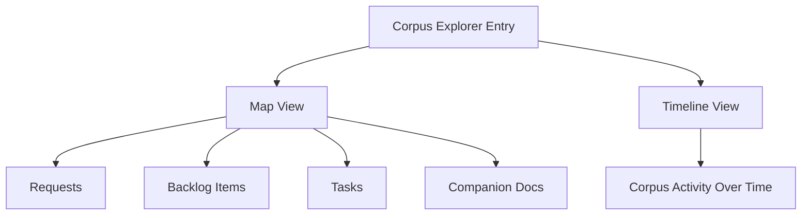

## item_331_add_a_corpus_explorer_with_map_and_timeline_views_to_logics_insights - Add a corpus explorer with map and timeline views to Logics Insights
> From version: 1.26.1
> Schema version: 1.0
> Status: Ready
> Understanding: 95%
> Confidence: 90%
> Progress: 0%
> Complexity: Medium
> Theme: UI
> Reminder: Update status/understanding/confidence/progress and linked request/task references when you edit this doc.

# Problem
- Logics Insights already shows stats and timelines, but it still lacks a visual way to understand the corpus as a connected system.
- A corpus explorer should help operators see how the current project is shaped across requests, backlog items, tasks, and companion docs.
- The best fit is likely a single Insights surface with two complementary views: a relationship map and a delivery timeline.
- This should feel like a corpus lens, not a generic dashboard.
- The repository already has related work in `req_134` and `item_257` for generated corpus index and relationship views, plus timeline and velocity work in `req_159`, `req_175`, `req_176`, `item_288`, and `item_289`.
- This request asks for a more visual, operator-friendly entry point inside Logics Insights:

# Scope
- In: one coherent delivery slice from the source request.
- Out: unrelated sibling slices that should stay in separate backlog items instead of widening this doc.

# Acceptance criteria
- AC1: Logics Insights includes a corpus explorer entry point that is clearly tied to the current repository corpus.
- AC2: The explorer offers a map view that shows relationships between requests, backlog items, tasks, and companion docs.
- AC3: The explorer offers a timeline view that shows corpus activity or evolution over time.
- AC4: The map and timeline views are complementary and can be switched without losing the selected project context.
- AC5: The default view is usable for the current project without requiring extra setup or navigation.
- AC6: The UI remains readable in a compact panel, with no fake data or decorative filler.
- AC7: Tests or snapshots cover the explorer entry point and at least one representative map/timeline rendering state.

# AC Traceability
- AC1 -> Scope: Logics Insights includes a corpus explorer entry point that is clearly tied to the current repository corpus.. Proof: capture validation evidence in this doc.
- AC2 -> Scope: The explorer offers a map view that shows relationships between requests, backlog items, tasks, and companion docs.. Proof: capture validation evidence in this doc.
- AC3 -> Scope: The explorer offers a timeline view that shows corpus activity or evolution over time.. Proof: capture validation evidence in this doc.
- AC4 -> Scope: The map and timeline views are complementary and can be switched without losing the selected project context.. Proof: capture validation evidence in this doc.
- AC5 -> Scope: The default view is usable for the current project without requiring extra setup or navigation.. Proof: capture validation evidence in this doc.
- AC6 -> Scope: The UI remains readable in a compact panel, with no fake data or decorative filler.. Proof: capture validation evidence in this doc.
- AC7 -> Scope: Tests or snapshots cover the explorer entry point and at least one representative map/timeline rendering state.. Proof: capture validation evidence in this doc.

# Decision framing
- Product framing: Required
- Product signals: navigation and discoverability, experience scope
- Product follow-up: Create or link a product brief before implementation moves deeper into delivery.
- Architecture framing: Consider
- Architecture signals: data model and persistence
- Architecture follow-up: Review whether an architecture decision is needed before implementation becomes harder to reverse.

# Links
- Product brief(s): `prod_008_add_a_corpus_explorer_with_map_and_timeline_views_to_logics_insights`
- Architecture decision(s): (none yet)
- Request: `req_184_add_a_corpus_explorer_with_map_and_timeline_views_to_logics_insights`
- Primary task(s): `task_142_add_a_corpus_explorer_with_map_and_timeline_views_to_logics_insights`

# AI Context
- Summary: Add a corpus explorer inside Logics Insights with map and timeline views for the current project corpus.
- Keywords: corpus explorer, map view, timeline view, insights, relationships, project lens, current project, navigation
- Use when: Use when planning a new Insights surface that visualizes the corpus as a connected map and as a temporal path.
- Skip when: Skip when the change is only about the existing counts, velocity cards, or unrelated navigation surfaces.

# Priority
- Impact:
- Urgency:

# Notes
- Derived from request `req_184_add_a_corpus_explorer_with_map_and_timeline_views_to_logics_insights`.
- Source file: `logics/request/req_184_add_a_corpus_explorer_with_map_and_timeline_views_to_logics_insights.md`.
- Keep this backlog item as one bounded delivery slice; create sibling backlog items for the remaining request coverage instead of widening this doc.
- Request context seeded into this backlog item from `logics/request/req_184_add_a_corpus_explorer_with_map_and_timeline_views_to_logics_insights.md`.
