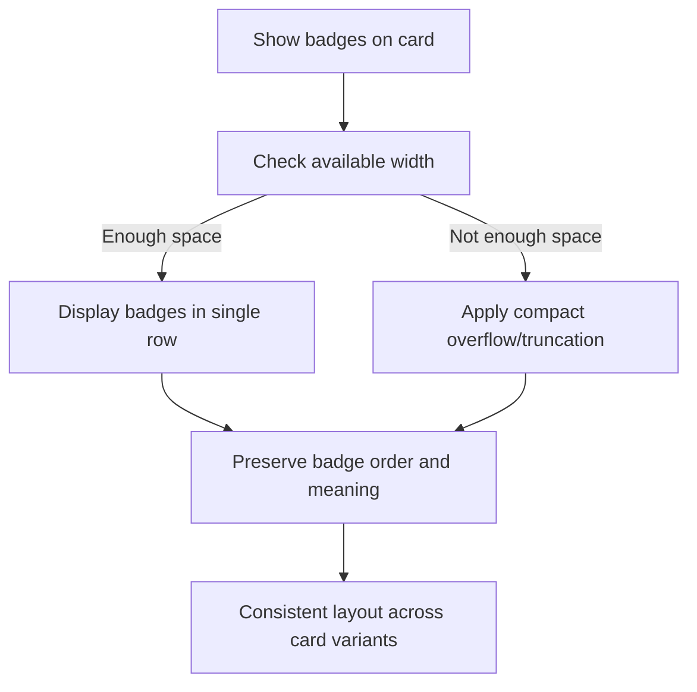

## item_334_handle_badge_overflow_and_wrapping_on_cards - Handle Badge Overflow and Wrapping on Cards
> From version: 1.27.0
> Schema version: 1.0
> Status: Ready
> Understanding: 94%
> Confidence: 88%
> Progress: 0%
> Complexity: Medium
> Theme: UI
> Reminder: Update status/understanding/confidence/progress and linked request/task references when you edit this doc.

# Problem
- The card surfaces currently show several compact badges at once, including `PROD`, `ADR`, `DELIVERY`, request/task lineage, and percentage or state chips.
- Those badges sometimes wrap onto a second line, which makes cards taller and harder to scan vertically.
- We want the badge area to stay on a single horizontal row whenever possible so the card height remains stable and the signal is easier to read at a glance.
- The change should preserve the existing badge meaning and ordering, not replace or rename the badges.
- If the row cannot fit, prefer a compact overflow strategy over vertical wrapping so the card does not become noisy.
- The solution should apply consistently across the card variants that already render these badges.
- The current UI already uses small badges as quick metadata signals, but their layout can become unstable when several badges are present together.
- This request focuses on layout only:

# Scope
- In: one coherent delivery slice from the source request.
- Out: unrelated sibling slices that should stay in separate backlog items instead of widening this doc.

# Acceptance criteria
- AC1: Cards that already show multiple badges keep those badges on a single horizontal row by default.
- AC2: The badge row does not wrap into a second line under normal card widths.
- AC3: If the available space is too small, the layout uses a compact overflow or truncation strategy instead of breaking the row.
- AC4: The existing badge order and meanings remain unchanged.
- AC5: The layout change applies consistently to the affected card variants without altering their underlying data or badge logic.

# AC Traceability
- AC1 -> Scope: Cards that already show multiple badges keep those badges on a single horizontal row by default.. Proof: capture validation evidence in this doc.
- AC2 -> Scope: The badge row does not wrap into a second line under normal card widths.. Proof: capture validation evidence in this doc.
- AC3 -> Scope: If the available space is too small, the layout uses a compact overflow or truncation strategy instead of breaking the row.. Proof: capture validation evidence in this doc.
- AC4 -> Scope: The existing badge order and meanings remain unchanged.. Proof: capture validation evidence in this doc.
- AC5 -> Scope: The layout change applies consistently to the affected card variants without altering their underlying data or badge logic.. Proof: capture validation evidence in this doc.

# Decision framing
- Product framing: Not needed
- Product signals: (none detected)
- Product follow-up: No product brief follow-up is expected based on current signals.
- Architecture framing: Consider
- Architecture signals: data model and persistence
- Architecture follow-up: Review whether an architecture decision is needed before implementation becomes harder to reverse.

# Links
- Product brief(s): (none yet)
- Architecture decision(s): (none yet)
- Request: `req_186_keep_card_badges_on_a_single_row`
- Primary task(s): `task_XXX_example`
<!-- When creating a task from this item, add: Derived from `this file path` in the task # Links section -->

# AI Context
- Summary: Keep multiple card badges on one row so the cards stay compact and readable.
- Keywords: badge row, card density, nowrap, compact overflow, PROD, ADR, DELIVERY, request badge, task badge
- Use when: Use when planning or implementing the badge strip layout on cards that show several metadata chips at once.
- Skip when: Skip when the work is about badge color, badge meaning, or a different card surface.
# References
- `logics/skills/logics-ui-steering/SKILL.md`

# Priority
- Impact:
- Urgency:

# Notes
- Derived from request `req_186_keep_card_badges_on_a_single_row`.
- Source file: `logics/request/req_186_keep_card_badges_on_a_single_row.md`.
- Keep this backlog item as one bounded delivery slice; create sibling backlog items for the remaining request coverage instead of widening this doc.
- Request context seeded into this backlog item from `logics/request/req_186_keep_card_badges_on_a_single_row.md`.
