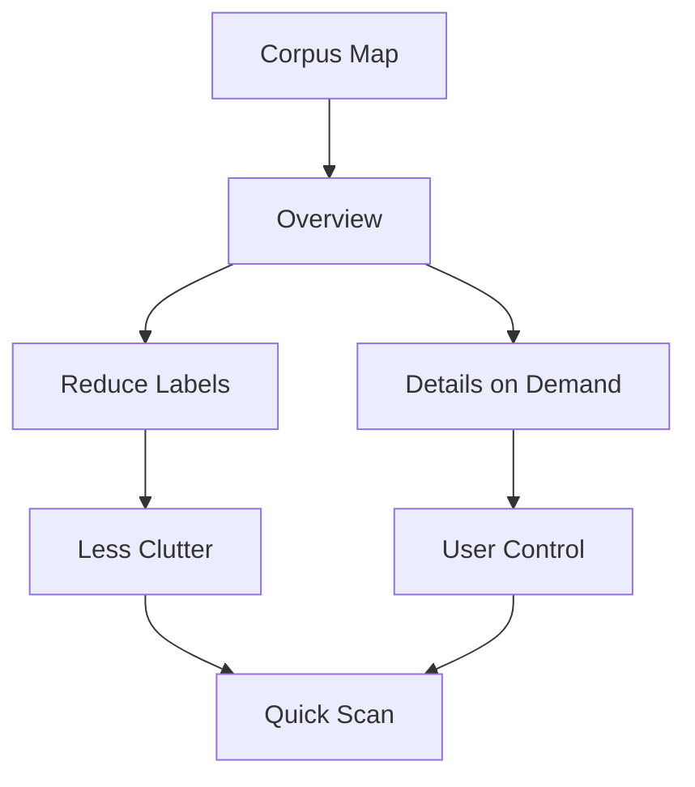

## item_338_reduce_map_labels_and_add_details_on_demand - Reduce map labels and add details on demand
> From version: 1.27.0
> Schema version: 1.0
> Status: Done
> Understanding: 90%
> Confidence: 85%
> Progress: 100%
> Complexity: Medium
> Theme: General
> Reminder: Update status/understanding/confidence/progress and linked request/task references when you edit this doc.

# Problem
- Make the corpus relationship map readable at a glance in Logics Insights.
- Reduce visual clutter from overlapping labels, dense edges, and repeated counts.
- Keep the overview useful without forcing the user to parse the full graph.
- - The current corpus map is too dense for quick scanning.
- - Node labels overlap near the center, edge labels add noise, and the right panel already carries detailed counts.

# Scope
- In: one coherent delivery slice from the source request.
- Out: unrelated sibling slices that should stay in separate backlog items instead of widening this doc.

# Acceptance criteria
- AC1: The request clearly states that the map must be readable at a glance.
- AC2: The request explains that the map should stay an overview and not duplicate all detail from the side panel.
- AC3: The request leaves room for a simpler hierarchy, reduced labels, or details-on-demand.

# AC Traceability
- AC1 -> Scope: The request clearly states that the map must be readable at a glance.. Proof: capture validation evidence in this doc.
- AC2 -> Scope: The request explains that the map should stay an overview and not duplicate all detail from the side panel.. Proof: capture validation evidence in this doc.
- AC3 -> Scope: The request leaves room for a simpler hierarchy, reduced labels, or details-on-demand.. Proof: capture validation evidence in this doc.

# Decision framing
- Product framing: Not needed
- Product signals: (none detected)
- Product follow-up: No product brief follow-up is expected based on current signals.
- Architecture framing: Consider
- Architecture signals: data model and persistence
- Architecture follow-up: Review whether an architecture decision is needed before implementation becomes harder to reverse.

# Links
- Product brief(s): (none yet)
- Architecture decision(s): (none yet)
- Request: `req_187_improve_corpus_map_readability`
- Primary task(s): `task_147_reduce_map_labels_and_add_details_on_demand`
<!-- When creating a task from this item, add: Derived from `this file path` in the task # Links section -->

# AI Context
- Summary: Improve corpus map readability
- Keywords: improve, corpus, map, readability
- Use when: Use when framing scope, context, and acceptance checks for Improve corpus map readability.
- Skip when: Skip when the work targets another feature, repository, or workflow stage.
# References
- `logics/skills/logics-ui-steering/SKILL.md`

# Priority
- Impact:
- Urgency:

# Notes
- Derived from request `req_187_improve_corpus_map_readability`.
- Source file: `logics/request/req_187_improve_corpus_map_readability.md`.
- Keep this backlog item as one bounded delivery slice; create sibling backlog items for the remaining request coverage instead of widening this doc.
- Request context seeded into this backlog item from `logics/request/req_187_improve_corpus_map_readability.md`.
- Task `task_147_reduce_map_labels_and_add_details_on_demand` was finished via `logics_flow.py finish task` on 2026-04-12.
