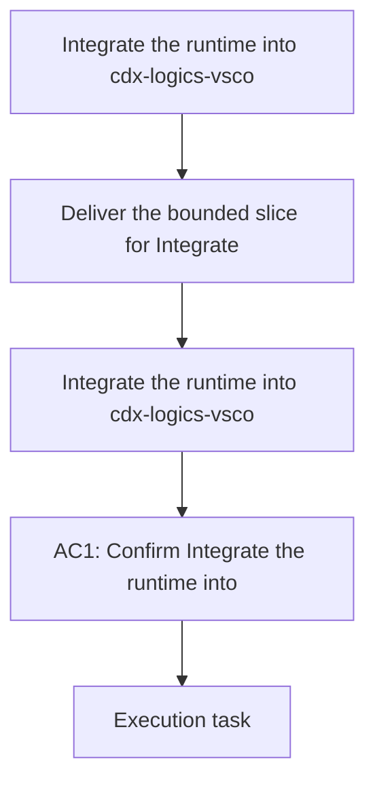

## item_339_integrate_the_runtime_into_cdx_logics_vscode_and_remove_the_skills_checkout - Integrate the runtime into cdx-logics-vscode and remove the skills checkout
> From version: 1.28.0
> Schema version: 1.0
> Status: Ready
> Understanding: 90%
> Confidence: 85%
> Progress: 0%
> Complexity: Medium
> Theme: General
> Reminder: Update status/understanding/confidence/progress and linked request/task references when you edit this doc.

# Problem
- Deliver the bounded slice for Integrate the runtime into cdx-logics-vscode and remove the skills checkout without widening scope.

# Scope
- In: one coherent delivery slice from the source request.
- Out: unrelated sibling slices that should stay in separate backlog items instead of widening this doc.

# Acceptance criteria
- AC1: The runtime is bundled into `cdx-logics-vscode` and the separate skills checkout is removed.
- AC3: The client repo stays content-only with no managed runtime scaffolding.
- AC5: The migration removes the legacy kit boundary without a residual compatibility requirement.
- AC7: The runtime architecture moves product semantics into Python and leaves only plugin shell work in TypeScript.

# AC Traceability
- AC1 -> Scope: Deliver the bounded slice for Integrate the runtime into cdx-logics-vscode and remove the skills checkout. Proof: the runtime is bundled into `cdx-logics-vscode` and the separate skills checkout is removed.
- AC3 -> Scope: Deliver the bounded slice for Integrate the runtime into cdx-logics-vscode and remove the skills checkout. Proof: the client repo stays content-only with no managed runtime scaffolding.
- AC5 -> Scope: Deliver the bounded slice for Integrate the runtime into cdx-logics-vscode and remove the skills checkout. Proof: the migration removes the legacy kit boundary without a residual compatibility requirement.
- AC7 -> Scope: Deliver the bounded slice for Integrate the runtime into cdx-logics-vscode and remove the skills checkout. Proof: the runtime architecture moves product semantics into Python and leaves only plugin shell work in TypeScript.

# Decision framing
- Product framing: Required
- Product signals: conversion journey
- Product follow-up: Create or link a product brief before implementation moves deeper into delivery.
- Architecture framing: Not needed
- Architecture signals: (none detected)
- Architecture follow-up: No architecture decision follow-up is expected based on current signals.

# Links
- Product brief(s): `logics/product/prod_009_logics_cli_as_the_primary_operator_surface_and_unified_runtime_api.md`
- Architecture decision(s): (none yet)
- Request: `logics/request/req_188_unify_logics_into_a_bundled_cli_and_integrated_runtime.md`
- Primary task(s): `logics/tasks/task_148_integrate_the_runtime_into_cdx_logics_vscode_and_remove_the_skills_checkout.md`
<!-- When creating a task from this item, add: Derived from `this file path` in the task # Links section -->

# AI Context
- Summary: Integrate the runtime into cdx-logics-vscode and remove the skills checkout
- Keywords: integrate, the, runtime, cdx-logics-vscode, and, remove, skills, checkout
- Use when: Use when implementing or reviewing the delivery slice for Integrate the runtime into cdx-logics-vscode and remove the skills checkout.
- Skip when: Skip when the change is unrelated to this delivery slice or its linked request.
# Priority
- Impact:
- Urgency:

# Notes
