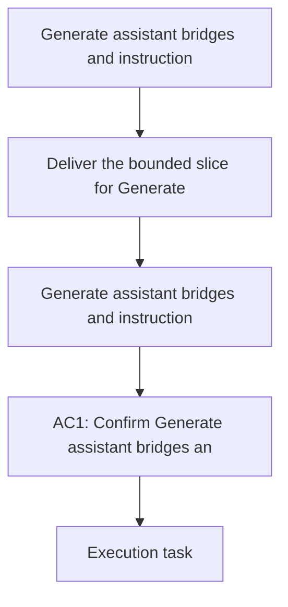

## item_341_generate_assistant_bridges_and_instructions_from_the_integrated_runtime - Generate assistant bridges and instructions from the integrated runtime
> From version: 1.28.0
> Schema version: 1.0
> Status: Ready
> Understanding: 90%
> Confidence: 85%
> Progress: 0%
> Complexity: Medium
> Theme: General
> Reminder: Update status/understanding/confidence/progress and linked request/task references when you edit this doc.

# Problem
- Deliver the bounded slice for Generate assistant bridges and instructions from the integrated runtime without widening scope.

# Scope
- In: one coherent delivery slice from the source request.
- Out: unrelated sibling slices that should stay in separate backlog items instead of widening this doc.

# Acceptance criteria
- AC4: Skills, bridges, and assistant instructions are toolchain-derived instead of hand-maintained.

# AC Traceability
- AC4 -> Scope: Deliver the bounded slice for Generate assistant bridges and instructions from the integrated runtime. Proof: skills, bridges, and assistant instructions are toolchain-derived instead of hand-maintained.

# Decision framing
- Product framing: Not needed
- Product signals: (none detected)
- Product follow-up: No product brief follow-up is expected based on current signals.
- Architecture framing: Not needed
- Architecture signals: (none detected)
- Architecture follow-up: No architecture decision follow-up is expected based on current signals.

# Links
- Product brief(s): `logics/product/prod_009_logics_cli_as_the_primary_operator_surface_and_unified_runtime_api.md`
- Architecture decision(s): (none yet)
- Request: `logics/request/req_188_unify_logics_into_a_bundled_cli_and_integrated_runtime.md`
- Primary task(s): `logics/tasks/task_150_generate_assistant_bridges_and_instructions_from_the_integrated_runtime.md`
<!-- When creating a task from this item, add: Derived from `this file path` in the task # Links section -->

# AI Context
- Summary: Generate assistant bridges and instructions from the integrated runtime
- Keywords: generate, assistant, bridges, and, instructions, the, integrated, runtime
- Use when: Use when implementing or reviewing the delivery slice for Generate assistant bridges and instructions from the integrated runtime.
- Skip when: Skip when the change is unrelated to this delivery slice.
# Priority
- Impact:
- Urgency:

# Notes
