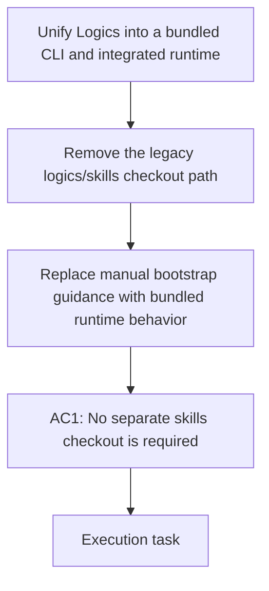

## item_342_remove_the_legacy_logics_skills_submodule_and_manual_bootstrap_path - Remove the legacy logics/skills submodule and manual bootstrap path
> From version: 1.28.0
> Schema version: 1.0
> Status: Ready
> Understanding: 96%
> Confidence: 90%
> Progress: 0%
> Complexity: Medium
> Theme: Runtime packaging and repository hygiene
> Reminder: Update status/understanding/confidence/progress and linked request/task references when you edit this doc.

# Problem
- The repository still carries a live `logics/skills` submodule, manual bootstrap instructions, and public docs that describe the legacy checkout path, which contradicts the promised no-separate-checkout runtime model.

# Scope
- In: remove the submodule from the normal repository shape, delete manual checkout/bootstrap guidance, and update public docs and onboarding copy to describe the bundled-runtime path instead of the legacy checkout path.
- Out: unrelated runtime behavior changes, plugin UX changes, or CLI surface redesign.

# Acceptance criteria
- AC1: The repository no longer requires a separate `logics/skills` checkout for normal use.
- AC3: The client repo remains content-only with no manually managed runtime scaffolding or legacy checkout guidance.

# AC Traceability
- AC1 -> Scope: Remove the legacy `logics/skills` checkout path and manual bootstrap guidance from code and docs. Proof: normal use no longer depends on a separate skills checkout.
- AC3 -> Scope: Keep the repo content-only by eliminating manual runtime scaffolding and legacy checkout messaging from the source tree. Proof: users do not need to maintain a local skills checkout or follow legacy bootstrap instructions.

# Decision framing
- Product framing: Required
- Product signals: conversion journey
- Product follow-up: Create or link a product brief before implementation moves deeper into delivery.
- Architecture framing: Not needed
- Architecture signals: (none detected)
- Architecture follow-up: No architecture decision follow-up is expected based on current signals.

# Links
- Product brief(s): `logics/product/prod_009_logics_cli_as_the_primary_operator_surface_and_unified_runtime_api.md`
- Architecture decision(s): (none yet)
- Request: `logics/request/req_188_unify_logics_into_a_bundled_cli_and_integrated_runtime.md`
- Primary task(s): (none yet)
<!-- When creating a task from this item, add: Derived from `this file path` in the task # Links section -->

# AI Context
- Summary: Remove the legacy `logics/skills` submodule, manual bootstrap path, and public legacy docs.
- Keywords: skills, submodule, bootstrap, bundled runtime, repository hygiene, docs
- Use when: Use when removing the old checkout-based runtime path and replacing it with bundled-runtime behavior.
- Skip when: Skip when the change is unrelated to the repository's runtime bootstrap path.
# Priority
- Impact:
- Urgency:

# Notes
