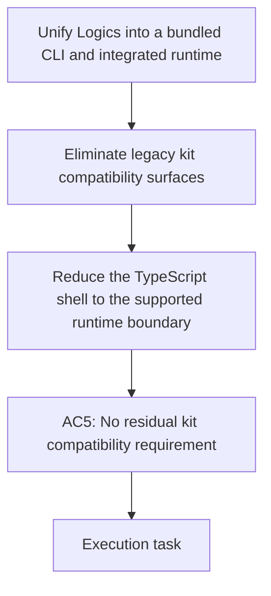

## item_343_eliminate_legacy_cdx_logics_kit_compatibility_surfaces_from_the_extension_runtime - Eliminate legacy cdx-logics-kit compatibility surfaces from the extension runtime
> From version: 1.28.0
> Schema version: 1.0
> Status: Ready
> Understanding: 96%
> Confidence: 90%
> Progress: 0%
> Complexity: High
> Theme: Runtime integration and TypeScript boundary reduction
> Reminder: Update status/understanding/confidence/progress and linked request/task references when you edit this doc.

# Problem
- The extension still branches on `logics/skills` and `cdx-logics-kit` compatibility, which keeps the legacy boundary alive in operational code and messaging.

# Scope
- In: remove legacy kit-compatibility branches from runtime detection, status messaging, and workspace gating where the bundled runtime is now authoritative.
- Out: unrelated UI polish, new product surfaces, or Python CLI feature expansion.

# Acceptance criteria
- AC5: The migration removes the legacy `cdx-logics-kit` boundary without a residual compatibility requirement for normal use.
- AC7: The canonical product logic remains in Python, with TypeScript limited to the minimal VS Code shell boundary.

# AC Traceability
- AC5 -> Scope: Remove legacy kit-compatibility branches from runtime detection and status logic. Proof: normal use no longer depends on the historical kit boundary.
- AC7 -> Scope: Keep TypeScript as a thin shell by moving workflow semantics into Python. Proof: the extension stops encoding kit-boundary behavior as a normal code path.

# Decision framing
- Product framing: Required
- Product signals: conversion journey
- Product follow-up: Create or link a product brief before implementation moves deeper into delivery.
- Architecture framing: Not needed
- Architecture signals: (none detected)
- Architecture follow-up: No architecture decision follow-up is expected based on current signals.

# Links
- Product brief(s): `logics/product/prod_009_logics_cli_as_the_primary_operator_surface_and_unified_runtime_api.md`
- Architecture decision(s): (none yet)
- Request: `logics/request/req_188_unify_logics_into_a_bundled_cli_and_integrated_runtime.md`
- Primary task(s): (none yet)
<!-- When creating a task from this item, add: Derived from `this file path` in the task # Links section -->

# AI Context
- Summary: Remove compatibility branches and messaging tied to the legacy cdx-logics-kit boundary.
- Keywords: compatibility, kit boundary, TypeScript shell, Python runtime, logics skills
- Use when: Use when pruning the extension/runtime from legacy kit detection and compatibility messaging.
- Skip when: Skip when the change is unrelated to the bundled-runtime migration.
# Priority
- Impact:
- Urgency:

# Notes
