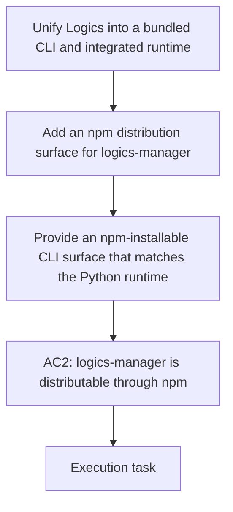

## item_344_add_an_npm_distribution_surface_for_logics_manager - Add an npm distribution surface for logics-manager
> From version: 1.28.0
> Schema version: 1.0
> Status: Ready
> Understanding: 94%
> Confidence: 86%
> Progress: 0%
> Complexity: High
> Theme: Runtime packaging and release tooling
> Reminder: Update status/understanding/confidence/progress and linked request/task references when you edit this doc.

# Problem
- The Python CLI is installable through `pip`, but there is no equivalent npm distribution surface for `logics-manager`, which leaves the npm promise incomplete.

# Scope
- In: define and implement a supported npm-facing packaging or wrapper path for `logics-manager`, with clear install and execution behavior.
- Out: broader CLI feature work, plugin UI changes, or unrelated release engineering.

# Acceptance criteria
- AC2: `logics-manager` has a supported npm distribution surface in addition to `pip`.
- AC6: The package surface remains predictable for both human users and automation.

# AC Traceability
- AC2 -> Scope: Add a supported npm distribution surface for `logics-manager`. Proof: the CLI can be installed or consumed through npm as well as pip.
- AC6 -> Scope: Keep the packaging and entrypoint behavior stable for both scripts and humans. Proof: the distribution path preserves the canonical CLI contract.

# Decision framing
- Product framing: Required
- Product signals: conversion journey
- Product follow-up: Create or link a product brief before implementation moves deeper into delivery.
- Architecture framing: Not needed
- Architecture signals: (none detected)
- Architecture follow-up: No architecture decision follow-up is expected based on current signals.

# Links
- Product brief(s): `logics/product/prod_009_logics_cli_as_the_primary_operator_surface_and_unified_runtime_api.md`
- Architecture decision(s): (none yet)
- Request: `logics/request/req_188_unify_logics_into_a_bundled_cli_and_integrated_runtime.md`
- Primary task(s): (none yet)
<!-- When creating a task from this item, add: Derived from `this file path` in the task # Links section -->

# AI Context
- Summary: Add an npm distribution surface for the canonical `logics-manager` CLI.
- Keywords: npm, packaging, logics-manager, distribution, CLI
- Use when: Use when making `logics-manager` consumable through npm as well as pip.
- Skip when: Skip when the change is unrelated to packaging or distribution.
# Priority
- Impact:
- Urgency:

# Notes
