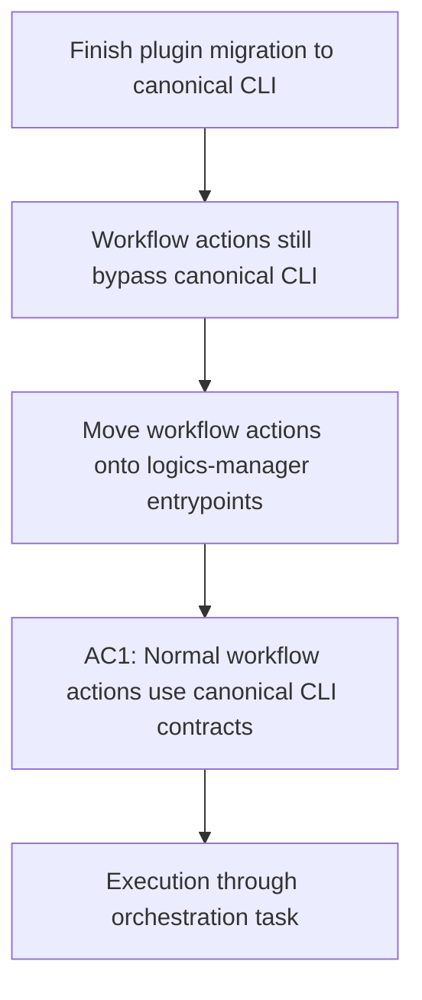

## item_345_route_plugin_workflow_actions_through_canonical_logics_manager_entrypoints - Route plugin workflow actions through canonical logics-manager entrypoints
> From version: 1.28.1
> Schema version: 1.0
> Status: Done
> Understanding: 99%
> Confidence: 92%
> Progress: 100%
> Complexity: Medium
> Theme: Runtime integration
> Reminder: Update status/understanding/confidence/progress and linked request/task references when you edit this doc.

# Problem
- The plugin still routes part of its workflow behavior through direct script calls or runtime-internal entrypoints instead of consistently invoking the canonical `logics-manager` surface.

# Scope
- In:
  - inventory the plugin-triggered workflow actions that should belong to the canonical CLI contract;
  - move those actions to `logics-manager` subcommands or an explicit canonical wrapper over the integrated runtime;
  - update tests so the plugin contract checks CLI-facing behavior rather than internal script layout;
  - include assistant-triggered workflow entrypoints exposed through the plugin when they still bypass the canonical runtime contract.
- Out:
  - legacy diagnostics and migration messaging not directly tied to workflow action routing;
  - unrelated UI changes.

# Acceptance criteria
- AC1: Normal plugin workflow actions use `logics-manager` entrypoints or an explicitly defined canonical wrapper instead of ad hoc direct script paths.
- AC2: The extension no longer needs private knowledge of internal workflow script locations for the migrated actions.
- AC3: Automated tests cover the migrated plugin-to-CLI routing contract.

# AC Traceability
- Request AC1 -> This backlog slice. Proof: canonical operator-surface actions route through the CLI contract.
- Request AC4 -> This backlog slice. Proof: tests and user-visible behavior align with the thin-client model.

# Decision framing
- Product framing: Required
- Product signals: operator contract
- Product follow-up: Reuse `prod_009`; do not create a new product brief unless the operator surface changes beyond the current migration goal.
- Architecture framing: Not needed

# Links
- Product brief(s): `logics/product/prod_009_logics_cli_as_the_primary_operator_surface_and_unified_runtime_api.md`
- Architecture decision(s): (none yet)
- Request: `logics/request/req_189_finish_plugin_migration_to_canonical_logics_manager_cli_surface.md`
- Primary task(s): `logics/tasks/task_151_orchestrate_plugin_migration_to_the_canonical_logics_manager_cli_surface.md`

# AI Context
- Summary: Move plugin workflow actions onto the canonical `logics-manager` surface.
- Keywords: plugin, workflow, cli, logics-manager, runtime integration
- Use when: Use when migrating request creation, promotion, fixer, and adjacent workflow actions away from direct internal scripts.
- Skip when: Skip when the work is only about diagnostics, migration copy, or documentation of the contract.

# Priority
- Impact: High
- Urgency: High

# Notes
- This slice covers the operator path that most directly affects whether the plugin is truly a thin client over the integrated runtime.
- Closure note: companion-doc creation is now routed through `logics-manager flow companion`, so part of this slice is already delivered.
- Audit note: request-authoring still prefers the historical `$logics-flow-manager` agent id in `src/logicsViewProviderSupport.ts`, so assistant-triggered workflow entrypoints are not yet fully converged on the canonical CLI naming/contract.
- Remaining proof target: close the gap between plugin-triggered CLI routing and assistant-triggered workflow routing so the extension does not advertise one naming contract in its agent layer and a different one in its runtime commands.
- 2026-04-23 implementation note: guided request handoff now prefers non-legacy request-authoring agents before falling back to `$logics-flow-manager`, and the copied prompt now frames `logics-manager` as the canonical workflow surface with any flow-manager mention downgraded to compatibility wording.
- 2026-04-23 closure note: the plugin and generated assistant bridges no longer route through or advertise the historical `flow-manager` contract; canonical `logics-manager` / `hybrid-assist` surfaces are now the only assistant-facing workflow path in the extension.
- - Task `task_151_orchestrate_plugin_migration_to_the_canonical_logics_manager_cli_surface` was finished via `logics-manager flow finish task` on 2026-04-23.
