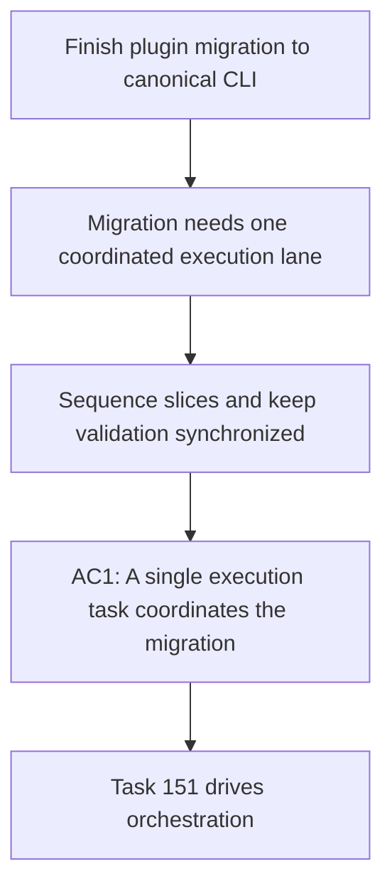

## item_346_orchestrate_plugin_migration_to_the_canonical_logics_manager_cli_surface - Orchestrate plugin migration to the canonical logics-manager CLI surface
> From version: 1.28.0
> Schema version: 1.0
> Status: Ready
> Understanding: 96%
> Confidence: 89%
> Progress: 0%
> Complexity: Medium
> Theme: Runtime integration
> Reminder: Update status/understanding/confidence/progress and linked request/task references when you edit this doc.

# Problem
- The request needs an execution lane that coordinates the remaining slices, keeps the migration commit-ready by wave, and validates that the plugin contract converges on the canonical CLI surface instead of drifting across several partial cleanups.

# Scope
- In:
  - sequence the implementation slices in a coherent order;
  - keep the linked request, backlog items, and validation evidence synchronized during delivery;
  - close the migration through one orchestration task that tracks cross-slice risks and final contract alignment.
- Out:
  - replacing the implementation work owned by the linked sibling backlog items.

# Acceptance criteria
- AC1: There is a single execution task that coordinates the linked plugin migration slices end to end.
- AC2: The orchestration lane keeps validation, linked Logics docs, and migration checkpoints synchronized throughout delivery.
- AC3: The final closeout can state clearly which gaps under `req_189` are closed, which remain, and why.

# AC Traceability
- Request AC1 -> This backlog slice. Proof: migration sequencing keeps the canonical CLI contract as the unifying target.
- Request AC2 -> This backlog slice. Proof: orchestration includes the legacy-compatibility cleanup slices.
- Request AC4 -> This backlog slice. Proof: final delivery can report a coherent plugin contract instead of scattered partial changes.

# Decision framing
- Product framing: Required
- Product signals: conversion journey
- Product follow-up: Reuse `prod_009`; keep this slice scoped to execution orchestration.
- Architecture framing: Not needed

# Links
- Product brief(s): `logics/product/prod_009_logics_cli_as_the_primary_operator_surface_and_unified_runtime_api.md`
- Architecture decision(s): (none yet)
- Request: `logics/request/req_189_finish_plugin_migration_to_canonical_logics_manager_cli_surface.md`
- Primary task(s): `logics/tasks/task_151_orchestrate_plugin_migration_to_the_canonical_logics_manager_cli_surface.md`

# AI Context
- Summary: Coordinate the remaining plugin migration slices and their validation.
- Keywords: orchestration, plugin, cli, migration, validation
- Use when: Use when sequencing the implementation slices and maintaining a coherent delivery wave.
- Skip when: Skip when the work is only one isolated code change without cross-slice coordination.

# Priority
- Impact: High
- Urgency: High

# Notes
- This item exists to keep the migration from degenerating into unrelated cleanups with no clear finish line.
