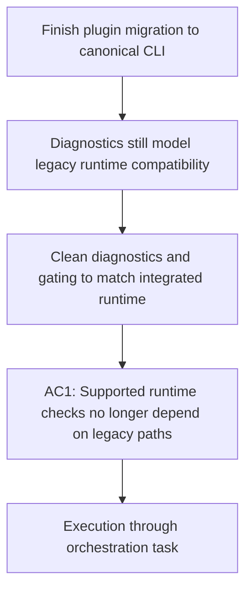

## item_347_remove_legacy_runtime_compatibility_surfaces_from_plugin_diagnostics_and_gating - Remove legacy runtime compatibility surfaces from plugin diagnostics and gating
> From version: 1.28.0
> Schema version: 1.0
> Status: In progress
> Understanding: 98%
> Confidence: 90%
> Progress: 82%
> Complexity: Medium
> Theme: Runtime integration
> Reminder: Update status/understanding/confidence/progress and linked request/task references when you edit this doc.

# Problem
- The extension still exposes residual diagnostics, gating logic, and migration messages that model `logics/skills` or `cdx-logics-kit` as a normal runtime shape instead of a historical migration concern.
- The assistant/runtime-global layer still exposes adjacent legacy cues as well, including bridge IDs, prompt wording, and supported-variant naming that make `flow-manager` and `skills` appear closer to the product contract than `logics-manager`.

# Scope
- In:
  - remove or narrow legacy compatibility branches from runtime checks, environment diagnostics, and repair/gating messages;
  - preserve only clearly justified migration or troubleshooting handling where it is still needed;
  - update tests so the supported steady-state model is the integrated `logics-manager` runtime;
  - treat assistant-facing compatibility labels and bridge naming as part of the same supported-state cleanup when they misrepresent the canonical runtime model.
- Out:
  - workflow-action routing work that belongs to the canonical CLI entrypoint slice;
  - general documentation and packaging updates that do not affect diagnostics or gating behavior.

# Acceptance criteria
- AC1: Normal plugin diagnostics and gating no longer describe legacy kit compatibility as a supported steady-state runtime requirement.
- AC2: Any retained legacy messaging is explicitly framed as migration/troubleshooting support rather than the normal product path.
- AC3: Automated tests validate the supported integrated-runtime diagnostics contract.
- AC4: Assistant/runtime-global labels that still mention historical `flow-manager` or `skills` behavior are either removed, explicitly marked as compatibility naming, or justified as non-product aliases.

# AC Traceability
- Request AC2 -> This backlog slice. Proof: legacy runtime compatibility stops being treated as a normal operational contract.
- Request AC3 -> This backlog slice. Proof: any residual exceptions are explicit and justified.
- Request AC4 -> This backlog slice. Proof: user-facing copy reflects the thin-client model.

# Decision framing
- Product framing: Required
- Product signals: operator contract
- Product follow-up: Reuse `prod_009`; do not expand this slice into unrelated runtime packaging work.
- Architecture framing: Not needed

# Links
- Product brief(s): `logics/product/prod_009_logics_cli_as_the_primary_operator_surface_and_unified_runtime_api.md`
- Architecture decision(s): (none yet)
- Request: `logics/request/req_189_finish_plugin_migration_to_canonical_logics_manager_cli_surface.md`
- Primary task(s): `logics/tasks/task_151_orchestrate_plugin_migration_to_the_canonical_logics_manager_cli_surface.md`

# AI Context
- Summary: Remove the remaining legacy runtime compatibility behavior from plugin diagnostics and gating.
- Keywords: diagnostics, gating, legacy, plugin, runtime migration
- Use when: Use when cleaning up supported-state checks, repair flows, and operator messaging after the integrated runtime migration.
- Skip when: Skip when the work only changes canonical CLI routing or documentation.

# Priority
- Impact: High
- Urgency: High

# Notes
- This slice is the main cleanup lane for the residual `item_343` style gaps that still leak into plugin behavior.
- Audit note: current examples include `CLAUDE_BRIDGE_VARIANTS` still publishing a `flow-manager` bridge with a `$logics-flow-manager` fallback prompt, plus plugin-side request-authoring selection still preferring that historical agent id.
- Closure note: recent runtime messaging cleanup already reduced the product-facing emphasis on `cdx-logics-kit` and old runtime-source wording, but the assistant/runtime-global layer still leaks a legacy supported-state model.
- Remaining proof target: legacy naming that survives for compatibility must be explicitly labeled as such; otherwise it still fails the supported-state contract even if the underlying runtime behavior is already canonical.
- 2026-04-23 implementation note: the generated Claude workflow bridge now tells operators to prefer `python3 -m logics_manager flow ...` and labels `$logics-flow-manager` as compatibility-only wording rather than the normal product contract.
- 2026-04-23 diagnostics note: runtime-source inspection and bootstrap-facing test coverage now use repo-local runtime wording instead of presenting `cdx-logics-kit` / legacy checkout language as the canonical supported-state label.
- 2026-04-23 bridge note: plugin/runtime bridge availability now keys off the canonical `hybrid-assist` Claude bridge; a compatibility-only `flow-manager` bridge no longer counts as the normal supported bridge state for diagnostics and repair prompts.
- 2026-04-23 internal-contract note: the Claude bridge status snapshot now exposes canonical bridge variants explicitly, so plugin repair logic no longer has to re-derive canonical-vs-compatibility intent from a broader supported-variants list.
