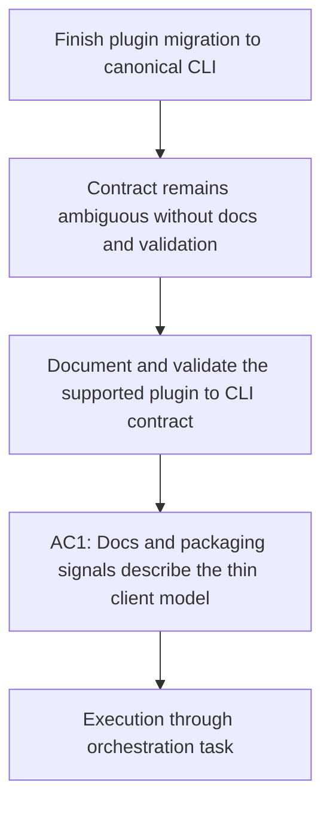

## item_348_document_and_validate_the_canonical_plugin_to_cli_contract - Document and validate the canonical plugin to CLI contract
> From version: 1.28.0
> Schema version: 1.0
> Status: Ready
> Understanding: 95%
> Confidence: 87%
> Progress: 0%
> Complexity: Medium
> Theme: Runtime integration
> Reminder: Update status/understanding/confidence/progress and linked request/task references when you edit this doc.

# Problem
- Even after code migration, the product remains ambiguous unless tests, packaging signals, and operator-facing wording consistently describe the plugin as a thin client over the canonical `logics-manager` contract.

# Scope
- In:
  - document the supported plugin-to-CLI contract where the product currently communicates runtime behavior;
  - align tests and packaging-facing signals with the canonical integrated-runtime model;
  - make any residual exceptions explicit and reviewable.
- Out:
  - deep runtime refactors that belong to the workflow-routing or diagnostics cleanup slices.

# Acceptance criteria
- AC1: User-visible documentation and packaging-facing signals describe the plugin as a thin client over the integrated `logics-manager` runtime.
- AC2: Tests validate the canonical plugin-to-CLI contract and any intentional exceptions.
- AC3: The resulting contract is reviewable without reading private runtime implementation details.

# AC Traceability
- Request AC3 -> This backlog slice. Proof: remaining exceptions are documented rather than implicit.
- Request AC4 -> This backlog slice. Proof: documentation, tests, and packaging signals consistently describe the thin-client runtime model.

# Decision framing
- Product framing: Required
- Product signals: operator contract
- Product follow-up: Reuse `prod_009`; this slice should finish the communication and validation layer of the migration.
- Architecture framing: Not needed

# Links
- Product brief(s): `logics/product/prod_009_logics_cli_as_the_primary_operator_surface_and_unified_runtime_api.md`
- Architecture decision(s): (none yet)
- Request: `logics/request/req_189_finish_plugin_migration_to_canonical_logics_manager_cli_surface.md`
- Primary task(s): `logics/tasks/task_151_orchestrate_plugin_migration_to_the_canonical_logics_manager_cli_surface.md`

# AI Context
- Summary: Document and validate the supported plugin-to-CLI contract after the runtime migration.
- Keywords: documentation, validation, plugin, cli contract, packaging
- Use when: Use when aligning docs, tests, and packaging-facing behavior with the canonical runtime contract.
- Skip when: Skip when the work is only about moving code paths without updating the contract evidence around them.

# Priority
- Impact: Medium
- Urgency: Medium

# Notes
- This slice is where the migration becomes explicit and durable instead of only being inferred from implementation details.
