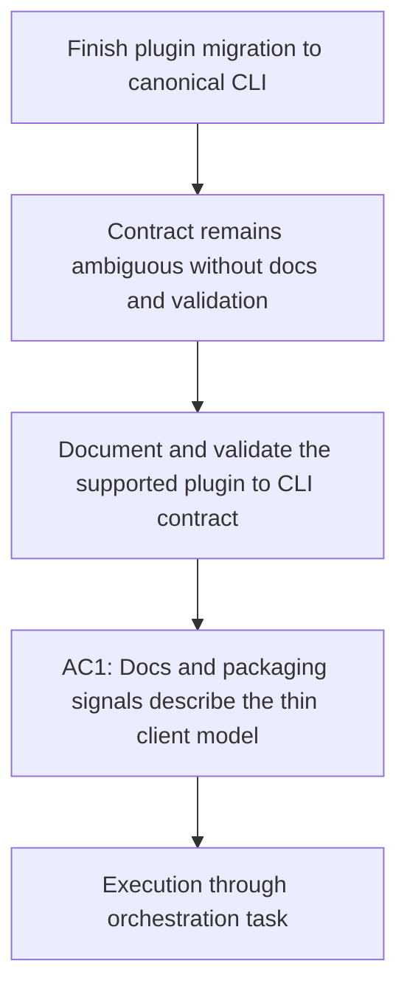

## item_348_document_and_validate_the_canonical_plugin_to_cli_contract - Document and validate the canonical plugin to CLI contract
> From version: 1.28.1
> Schema version: 1.0
> Status: Done
> Understanding: 98%
> Confidence: 91%
> Progress: 100%
> Complexity: Medium
> Theme: Runtime integration
> Reminder: Update status/understanding/confidence/progress and linked request/task references when you edit this doc.

# Problem
- Even after code migration, the product remains ambiguous unless tests, packaging signals, and operator-facing wording consistently describe the plugin as a thin client over the canonical `logics-manager` contract.
- The assistant-surface audit shows that this ambiguity still exists today: `logics/instructions.md` is already canonical, but generated Claude bridges, fallback prompts, request-authoring defaults, and several tests still present `flow-manager` as the visible workflow label.

# Scope
- In:
  - document the supported plugin-to-CLI contract where the product currently communicates runtime behavior;
  - align tests and packaging-facing signals with the canonical integrated-runtime model;
  - make any residual exceptions explicit and reviewable;
  - include assistant-facing generated instructions, bridge prompts, and request-authoring defaults in that contract evidence.
- Out:
  - deep runtime refactors that belong to the workflow-routing or diagnostics cleanup slices.

# Acceptance criteria
- AC1: User-visible documentation and packaging-facing signals describe the plugin as a thin client over the integrated `logics-manager` runtime.
- AC2: Tests validate the canonical plugin-to-CLI contract and any intentional exceptions.
- AC3: The resulting contract is reviewable without reading private runtime implementation details.
- AC4: Assistant-facing generated artifacts clearly distinguish canonical `logics-manager` usage from any retained compatibility naming such as `flow-manager`.

# AC Traceability
- Request AC3 -> This backlog slice. Proof: remaining exceptions are documented rather than implicit.
- Request AC4 -> This backlog slice. Proof: documentation, tests, and packaging signals consistently describe the thin-client runtime model.

# Decision framing
- Product framing: Required
- Product signals: operator contract
- Product follow-up: Reuse `prod_009`; this slice should finish the communication and validation layer of the migration.
- Architecture framing: Not needed

# Links
- Product brief(s): `logics/product/prod_009_logics_cli_as_the_primary_operator_surface_and_unified_runtime_api.md`
- Architecture decision(s): (none yet)
- Request: `logics/request/req_189_finish_plugin_migration_to_canonical_logics_manager_cli_surface.md`
- Primary task(s): `logics/tasks/task_151_orchestrate_plugin_migration_to_the_canonical_logics_manager_cli_surface.md`

# AI Context
- Summary: Document and validate the supported plugin-to-CLI contract after the runtime migration.
- Keywords: documentation, validation, plugin, cli contract, packaging
- Use when: Use when aligning docs, tests, and packaging-facing behavior with the canonical runtime contract.
- Skip when: Skip when the work is only about moving code paths without updating the contract evidence around them.

# Priority
- Impact: Medium
- Urgency: Medium

# Notes
- This slice is where the migration becomes explicit and durable instead of only being inferred from implementation details.
- Audit note: generated assistant instructions are already mostly aligned, so the remaining work is to close the mismatch between those instructions and the visible bridge/prompt labels that still advertise `$logics-flow-manager`.
- Validation note: the audit gives a clean contrast set for this slice:
  - canonical evidence already exists in `logics/instructions.md` and the generated Claude instructions;
  - residual mismatch still exists in bridge IDs, fallback prompts, request-authoring defaults, and wording such as the `README.md` reference to the "flow-manager guarded finish command".
- Remaining proof target: after this slice, a reviewer should be able to inspect docs/tests/generated artifacts and see one explicit canonical contract, plus any intentionally retained aliasing called out as compatibility only.
- 2026-04-23 implementation note: README closeout wording and generated Claude bridge prompts now describe `logics-manager` as the canonical finish/workflow surface, leaving `flow-manager` only as a documented compatibility alias where it still exists.
- 2026-04-23 validation note: plugin/runtime diagnostic wording in tests and runtime-source inspection now refer to a repo-local Logics runtime checkout rather than the historical kit branding, reducing assistant/runtime-global ambiguity in the review surface.
- 2026-04-23 validation note: runtime and extension tests now prove that a compatibility-only Claude `flow-manager` bridge does not satisfy the canonical bridge contract; repair messaging points back to the canonical bridge files instead.
- 2026-04-23 validation note: bridge-status snapshots now carry an explicit canonical-variants field, reducing the amount of implicit compatibility logic reviewers need to infer from UI repair behavior.
- 2026-04-23 validation note: the production environment snapshot contract is now smaller and more canonical; legacy `skills`/`flow-manager-script` booleans survive only in test fixtures for now, not in the runtime surface consumed by the extension.
- 2026-04-23 validation note: the production bridge snapshot now omits `supportedVariants`, confirming that reviewers only need to reason about detected variants and explicitly canonical variants in the supported runtime path.
- 2026-04-23 validation note: the major plugin/runtime fixtures now mirror the reduced production snapshot contract, so reviewers no longer need to mentally discount dead bridge/runtime fields that only existed in tests.
- 2026-04-23 validation note: dead legacy helper coverage was removed and healthy-Claude fixture coverage now points to the canonical assistant publication instead of the historical `flow-manager` shape.
- 2026-04-23 closure note: generated assistant bridges, runtime snapshots, guided request prompts, and test evidence now expose one explicit canonical contract only: `logics-manager` for workflow commands and `logics-hybrid-delivery-assistant` for assistant-facing bridge prompts.
- - Task `task_151_orchestrate_plugin_migration_to_the_canonical_logics_manager_cli_surface` was finished via `logics-manager flow finish task` on 2026-04-23.
