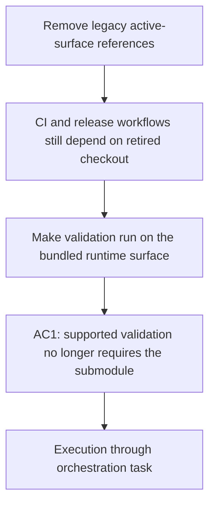

## item_349_remove_legacy_checkout_and_release_workflow_dependencies_from_ci_validation - Remove legacy checkout and release workflow dependencies from CI validation
> From version: 2.0.0
> Schema version: 1.0
> Status: Ready
> Understanding: 100%
> Confidence: 95%
> Progress: 0%
> Complexity: Medium
> Theme: Runtime migration and CI hygiene
> Reminder: Update status/understanding/confidence/progress and linked request/task references when you edit this doc.

# Problem
- CI and release workflows still require a `logics/skills` submodule checkout, which makes validation depend on a retired repository boundary and breaks when the referenced commit is no longer fetchable.

# Scope
- In:
  - remove the submodule checkout from the supported CI and release validation paths;
  - update workflow steps so validation runs against the bundled runtime surface instead of the retired kit checkout;
  - adjust submodule metadata handling where it is only needed for historical compatibility.
- Out:
  - TypeScript runtime detection changes;
  - docs and contributor guidance cleanup;
  - archival corpus rewrites.

# Acceptance criteria
- AC1: Supported CI and release validation runs no longer require a `logics/skills` checkout.
- AC2: `main` GitHub Actions completes without a submodule fetch failure caused by the retired kit boundary.
- AC3: Workflow configuration no longer presents `cdx-logics-kit` or `logics/skills` as the normal validation dependency.

# AC Traceability
- Request AC1 -> This backlog slice. Proof: supported validation no longer depends on the retired checkout path.
- Request AC5 -> This backlog slice. Proof: the active workflow surface no longer contains `logics/skills` or `cdx-logics-kit` references.

# Decision framing
- Product framing: Required
- Product signals: conversion journey
- Product follow-up: Reuse `prod_009`; do not widen this slice beyond CI/release validation cleanup.
- Architecture framing: Not needed
- Architecture signals: (none detected)
- Architecture follow-up: No architecture decision follow-up is expected based on current signals.

# Links
- Product brief(s): `logics/product/prod_009_logics_cli_as_the_primary_operator_surface_and_unified_runtime_api.md`
- Architecture decision(s): (none yet)
- Request: `logics/request/req_190_remove_legacy_logics_skills_and_cdx_logics_kit_references_from_active_surfaces.md`
- Primary task(s): `logics/tasks/task_152_orchestrate_removal_of_legacy_logics_skills_and_cdx_logics_kit_references.md`

# AI Context
- Summary: Remove the legacy submodule checkout from CI and release validation.
- Keywords: ci, release, checkout, submodule, validation, bundled runtime
- Use when: Use when the workflow layer still depends on the retired kit checkout.
- Skip when: Skip when the change only touches runtime code or documentation.
# Priority
- Impact: High
- Urgency: High

# Notes
- This slice is the one that directly unblocks the failing GitHub Actions checkout.
- Validation should prove that the workflow no longer needs the retired submodule for normal supported runs.
