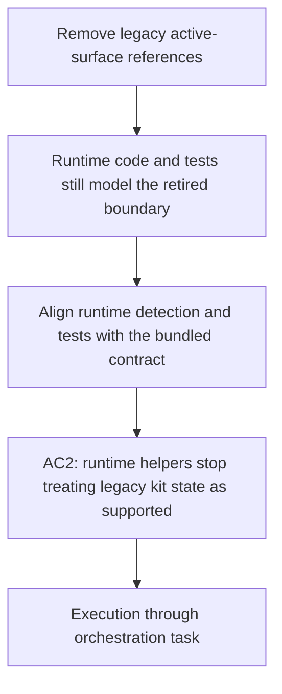

## item_350_remove_legacy_runtime_detection_and_bootstrap_signals_from_typescript_and_tests - Remove legacy runtime detection and bootstrap signals from TypeScript and tests
> From version: 2.0.0
> Schema version: 1.0
> Status: Ready
> Understanding: 100%
> Confidence: 95%
> Progress: 0%
> Complexity: High
> Theme: Runtime integration and test contract cleanup
> Reminder: Update status/understanding/confidence/progress and linked request/task references when you edit this doc.

# Problem
- The extension runtime still treats `logics/skills` and `cdx-logics-kit` as meaningful bootstrap or update signals in TypeScript code and in the tests that protect those branches.

# Scope
- In:
  - remove legacy kit-boundary checks from runtime detection and bootstrap logic;
  - update tests so they validate the bundled runtime contract instead of the retired repo boundary;
  - adjust fixtures that mirror production snapshots or bootstrap state.
- Out:
  - CI workflow cleanup;
  - contributor docs cleanup;
  - archival corpus rewrites.

# Acceptance criteria
- AC2: `src/logicsProviderUtils.ts` and `src/workflowSupport.ts` no longer treat `logics/skills` or `cdx-logics-kit` as a supported runtime state, bootstrap signal, or blocking update path.
- AC5: A targeted scan of the active runtime and test surfaces returns no `logics/skills` or `cdx-logics-kit` hits.
- AC6: Any retained mention is explicitly migration-only, not part of the supported state model.

# AC Traceability
- Request AC2 -> This backlog slice. Proof: runtime helpers and tests no longer encode the retired boundary as normal behavior.
- Request AC5 -> This backlog slice. Proof: the active runtime/test surface no longer contains legacy hits.

# Decision framing
- Product framing: Required
- Product signals: operator contract
- Product follow-up: Reuse `prod_009`; keep this slice focused on the runtime contract surface.
- Architecture framing: Not needed
- Architecture signals: (none detected)
- Architecture follow-up: No architecture decision follow-up is expected based on current signals.

# Links
- Product brief(s): `logics/product/prod_009_logics_cli_as_the_primary_operator_surface_and_unified_runtime_api.md`
- Architecture decision(s): (none yet)
- Request: `logics/request/req_190_remove_legacy_logics_skills_and_cdx_logics_kit_references_from_active_surfaces.md`
- Primary task(s): `logics/tasks/task_152_orchestrate_removal_of_legacy_logics_skills_and_cdx_logics_kit_references.md`

# AI Context
- Summary: Remove legacy runtime detection and bootstrap signals from the TypeScript runtime and its tests.
- Keywords: runtime, bootstrap, detection, tests, legacy, compatibility
- Use when: Use when the runtime logic still carries support for the retired kit boundary.
- Skip when: Skip when the work is only about CI workflow syntax or docs.
# Priority
- Impact: High
- Urgency: High

# Notes
- The target is the supported-state contract, not historical narrative tests.
- Fixtures should be updated to mirror the bundled runtime contract rather than the legacy boundary.
