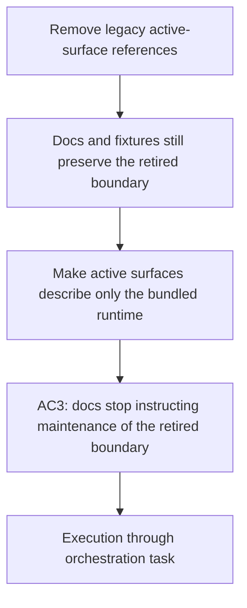

## item_351_remove_legacy_docs_lint_and_fixture_references_from_active_surfaces - Remove legacy docs, lint, and fixture references from active surfaces
> From version: 2.0.0
> Schema version: 1.0
> Status: Ready
> Understanding: 100%
> Confidence: 95%
> Progress: 0%
> Complexity: Medium
> Theme: Runtime migration and repository hygiene
> Reminder: Update status/understanding/confidence/progress and linked request/task references when you edit this doc.

# Problem
- Contributor-facing docs, lint config, and a subset of fixtures still teach or preserve the retired `logics/skills` / `cdx-logics-kit` boundary as if it were part of the supported normal path.

# Scope
- In:
  - update `README.md` and `CONTRIBUTING.md` so they describe the bundled-runtime path only;
  - remove legacy path assumptions from lint/config and fixture data where they are no longer needed;
  - confine historical mentions to archival docs if they are still useful for provenance.
- Out:
  - CI workflow changes;
  - runtime detection logic;
  - archival corpus rewrites.

# Acceptance criteria
- AC3: `README.md`, `CONTRIBUTING.md`, and other active contributor-facing docs no longer instruct normal use or maintenance of the retired submodule boundary.
- AC4: `eslint.config.js` and active test fixtures no longer preserve the legacy layout unless explicitly marked archival or migration-only.
- AC6: Remaining legacy mentions are confined to the archival corpus and are explicitly treated as historical context, not supported behavior.

# AC Traceability
- Request AC3 -> This backlog slice. Proof: active docs no longer instruct keeping `logics/skills` initialized.
- Request AC4 -> This backlog slice. Proof: lint/config and fixtures no longer encode the retired layout as normal.
- Request AC6 -> This backlog slice. Proof: historical mentions remain only in archival surfaces.

# Decision framing
- Product framing: Required
- Product signals: operator contract
- Product follow-up: Reuse `prod_009`; keep archival cleanup separate from active-surface cleanup.
- Architecture framing: Not needed
- Architecture signals: (none detected)
- Architecture follow-up: No architecture decision follow-up is expected based on current signals.

# Links
- Product brief(s): `logics/product/prod_009_logics_cli_as_the_primary_operator_surface_and_unified_runtime_api.md`
- Architecture decision(s): (none yet)
- Request: `logics/request/req_190_remove_legacy_logics_skills_and_cdx_logics_kit_references_from_active_surfaces.md`
- Primary task(s): `logics/tasks/task_152_orchestrate_removal_of_legacy_logics_skills_and_cdx_logics_kit_references.md`

# AI Context
- Summary: Remove legacy documentation, lint, and fixture references from active surfaces.
- Keywords: documentation, lint, fixtures, repository hygiene, legacy, bundled runtime
- Use when: Use when active docs or fixtures still teach the retired boundary as normal.
- Skip when: Skip when the work is only about runtime code or CI workflow logic.
# Priority
- Impact: Medium
- Urgency: Medium

# Notes
- The archival corpus can keep provenance, but active docs and config should not teach the retired boundary as supported behavior.
