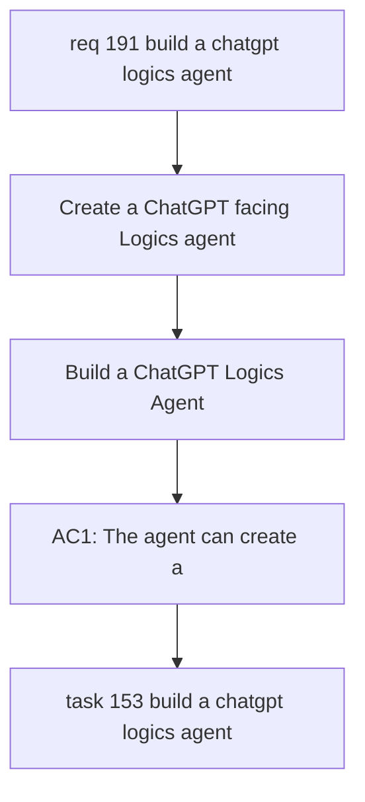

## item_352_build_a_chatgpt_logics_agent - Build a ChatGPT Logics Agent
> From version: 2.0.5
> Schema version: 1.0
> Status: Ready
> Understanding: 90%
> Confidence: 85%
> Progress: 0%
> Complexity: High
> Theme: Operator workflow and runtime integration
> Reminder: Update status/understanding/confidence/progress and linked request/task references when you edit this doc.

# Problem
Create a ChatGPT-facing Logics agent that turns product conversation into structured Logics documents while leaving implementation work to Codex.
Make the first version local-first: the MCP server runs on the operator machine, acts only inside this repository, and exposes a narrow set of safe Logics actions to ChatGPT through an HTTPS-compatible access path.

# Scope
- In:
  - local MCP action surface for ChatGPT to create and promote Logics documents
  - canonical `logics-manager` usage for every workflow write
  - validation and diff reporting after every write action
  - path and command restrictions that keep the agent bounded to Logics workflow work
- Out:
  - unrestricted shell access
  - direct code implementation by ChatGPT
  - public hosted multi-tenant Logics service
  - automatic Codex execution from ChatGPT in the first slice

# Acceptance criteria
- AC1: The agent can create a Logics request from a ChatGPT conversation through a bounded MCP action.
- AC2: The agent can promote existing workflow docs only through canonical `logics-manager` commands.
- AC3: The MCP surface rejects arbitrary shell execution and absolute path writes.
- AC4: Each write returns the changed artifact path, validation status, and a human-readable diff summary.
- AC5: Codex remains the execution agent and can later consume generated tasks without extra translation.

# AC Traceability
- request-AC1 -> This backlog slice. Proof: AC1: The agent can create a Logics request from a ChatGPT conversation through a bounded MCP action.
- request-AC2 -> This backlog slice. Proof: AC2: The agent can promote existing workflow docs only through canonical `logics-manager` commands.
- request-AC3 -> This backlog slice. Proof: AC3: The MCP surface rejects arbitrary shell execution and absolute path writes.
- request-AC4 -> This backlog slice. Proof: AC4: Each write returns the changed artifact path, validation status, and a human-readable diff summary.
- request-AC5 -> This backlog slice. Proof: AC5: Codex remains the execution agent and can later consume generated tasks without extra translation.

# Decision framing
- Product framing: Not needed
- Product signals: (none detected)
- Product follow-up: No product brief follow-up is expected based on current signals.
- Architecture framing: Not needed
- Architecture signals: (none detected)
- Architecture follow-up: No architecture decision follow-up is expected based on current signals.

# Links
- Product brief(s): `logics/product/prod_010_chatgpt_logics_agent.md`
- Architecture decision(s): `logics/architecture/adr_022_chatgpt_logics_agent_mcp_contract.md`
- Request: `logics/request/req_191_build_a_chatgpt_logics_agent.md`
- Primary task(s): `logics/tasks/task_153_build_a_chatgpt_logics_agent.md`

# AI Context
- Summary: Build a ChatGPT Logics Agent
- Keywords: backlog-groom, request, build a chatgpt logics agent, bounded slice
- Use when: Use when implementing or reviewing the delivery slice for Build a ChatGPT Logics Agent.
- Skip when: Skip when the change is unrelated to this delivery slice or its linked request.

# Priority
- Impact:
- Urgency:

# Notes
- Hybrid rationale: Derived from request `req_191_build_a_chatgpt_logics_agent` and kept bounded to one coherent delivery slice.
- Source file: `logics/request/req_191_build_a_chatgpt_logics_agent.md`.
- Generated locally by logics-manager.

# Tasks
- `task_153_build_a_chatgpt_logics_agent`
