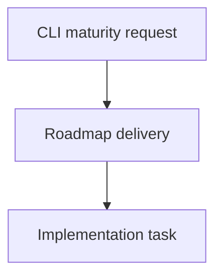

## item_361_mature_cli_product_contracts - Mature CLI product contracts
> From version: 2.1.2
> Schema version: 1.0
> Status: Done
> Understanding: 90%
> Confidence: 85%
> Progress: 100%
> Complexity: High
> Theme: Operator workflow and runtime integration
> Reminder: Update status/understanding/confidence/progress and linked request/task references when you edit this doc.

# Problem
- The CLI is now safe enough for primary use, but its long-term product contract still needs documentation, shared implementation primitives, subprocess coverage, and clearer mutation resilience.
- Without these follow-ups, future commands can drift back toward mixed stdout, duplicated path logic, or untraceable product decisions.

# Scope
- In:
  - one coherent delivery slice from the source request
- Out:
  - unrelated sibling slices that should stay in separate backlog items instead of widening this doc

# Acceptance criteria
- AC1: JSON output rules and target path forms are documented for CLI operators.
- AC2: A shared renderer/path-policy direction is implemented or explicitly prepared for incremental adoption.
- AC3: Subprocess coverage exercises installed-style CLI execution, including the npm wrapper.
- AC4: Remaining multi-file mutation and ID allocation risks are either mitigated or documented with tests/limitations.
- AC5: Request, backlog, task, and product briefs reference each other consistently.

# AC Traceability
- request-AC1 -> This backlog slice. Proof: JSON contract documentation and subprocess validation are in scope.
- request-AC2 -> This backlog slice. Proof: CLI target forms and path boundary behavior are in scope.
- request-AC3 -> This backlog slice. Proof: Shared CLI helper direction is in scope.
- request-AC4 -> This backlog slice. Proof: Multi-file mutation and ID allocation risks are tracked.
- request-AC5 -> This backlog slice. Proof: Product brief lineage is explicitly linked.

# Decision framing
- Product framing: Required
- Product signals: CLI is now the primary operator surface; product briefs exist for hardening, mutation safety, and maturity roadmap.
- Product follow-up: Use `logics/product/prod_015_cli_product_maturity_roadmap.md` as the roadmap reference.
- Architecture framing: Not needed
- Architecture signals: (none detected)
- Architecture follow-up: No architecture decision follow-up is expected based on current signals.

# Links
- Product brief(s): `prod_013_cli_primary_usage_audit_and_hardening`, `prod_014_cli_mutation_safety_and_automation_contract`, `prod_015_cli_product_maturity_roadmap`
- Architecture decision(s): (none yet)
- Request: `logics/request/req_197_mature_cli_product_contracts.md`
- Primary task(s): `logics/tasks/task_162_mature_cli_product_contracts.md`

# AI Context
- Summary: Mature CLI product contracts
- Keywords: backlog-groom, request, mature cli product contracts, bounded slice
- Use when: Use when implementing or reviewing the delivery slice for Mature CLI product contracts.
- Skip when: Skip when the change is unrelated to this delivery slice or its linked request.

# Priority
- Impact: High for CLI users, scripted workflows, npm wrapper users, and agent-driven maintenance.
- Urgency: Medium; urgent safety fixes are shipped, but maturity work prevents regression.

# Notes
- Hybrid rationale: Derived from request `req_197_mature_cli_product_contracts` and kept bounded to one coherent delivery slice.
- Source file: `logics/request/req_197_mature_cli_product_contracts.md`.
- Generated locally by logics-manager.
- Task `task_162_mature_cli_product_contracts` was finished via `logics-manager flow finish task` on 2026-06-07.

# Tasks
- `task_162_mature_cli_product_contracts`
