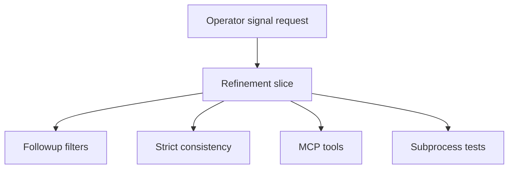

## item_362_refine_logics_operator_signal_commands - Refine Logics operator signal commands
> From version: 2.1.2
> Schema version: 1.0
> Status: Done
> Understanding: 90%
> Confidence: 85%
> Progress: 100%
> Complexity: High
> Theme: Operator workflow and runtime integration
> Reminder: Update status/understanding/confidence/progress and linked request/task references when you edit this doc.

# Problem
The initial operator signal commands were useful but still needed product hardening: follow-up output was noisy across closed history, product consistency needed a release-check mode, MCP did not expose the new signals, and subprocess coverage did not yet lock the top-level command contracts.

# Scope
- In:
  - follow-up filtering and title cleanup
  - product consistency strict mode
  - MCP read-only signal tools
  - subprocess JSON coverage
  - README triage guidance
- Out:
  - code-review-graph integration
  - VS Code UI changes
  - remote service or database-backed signal calculation

# Acceptance criteria
- AC1: `followups` defaults to open actionable work and supports source/closed-state filters.
- AC2: `product-consistency` supports strict release-check behavior and no longer reports valid proposed briefs as blocking.
- AC3: Read-only operator signal commands are available through MCP.
- AC4: Subprocess tests cover the new commands and the `--json` alias.
- AC5: README guidance documents the operator triage flow.
- AC6: Follow-up request title suggestions are concise and shell-safe.

# AC Traceability
- request-AC1 -> This backlog slice. Proof: follow-up filtering and source/closed-state controls are in scope.
- request-AC2 -> This backlog slice. Proof: strict product consistency behavior is in scope.
- request-AC3 -> This backlog slice. Proof: MCP exposure is in scope.
- request-AC4 -> This backlog slice. Proof: subprocess coverage is in scope.
- request-AC5 -> This backlog slice. Proof: README triage guidance is in scope.
- request-AC6 -> This backlog slice. Proof: title cleanup is in scope.

# Decision framing
- Product framing: Required
- Product signals: Builds on operator-signal product brief `prod_016_logics_operator_signal_refinement`.
- Product follow-up: Product brief is linked and implemented by this slice.
- Architecture framing: Not needed
- Architecture signals: (none detected)
- Architecture follow-up: No architecture decision follow-up is expected based on current signals.

# Links
- Product brief(s): `logics/product/prod_016_logics_operator_signal_refinement.md`
- Architecture decision(s): (none yet)
- Request: `logics/request/req_198_refine_logics_operator_signal_commands.md`
- Primary task(s): `logics/tasks/task_163_refine_logics_operator_signal_commands.md`

# AI Context
- Summary: Refine Logics operator signal commands
- Keywords: backlog-groom, request, refine logics operator signal commands, bounded slice
- Use when: Use when implementing or reviewing the delivery slice for Refine Logics operator signal commands.
- Skip when: Skip when the change is unrelated to this delivery slice or its linked request.

# Priority
- Impact: High for operators and assistants using Logics as a session handoff surface.
- Urgency: Medium; the commands already exist, but noisy output and missing MCP access reduce their usefulness.

# Notes
- Hybrid rationale: Derived from request `req_198_refine_logics_operator_signal_commands` and kept bounded to one coherent delivery slice.
- Source file: `logics/request/req_198_refine_logics_operator_signal_commands.md`.
- Generated locally by logics-manager.
- Task `task_163_refine_logics_operator_signal_commands` was finished via `logics-manager flow finish task` on 2026-06-07.

# Tasks
- `task_163_refine_logics_operator_signal_commands`
