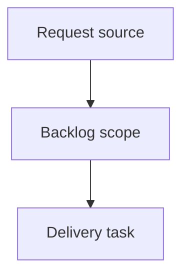

## item_363_implement_flow_deliver_from_product - Implement flow deliver from product
> From version: 2.1.2
> Schema version: 1.0
> Status: Done
> Understanding: 90%
> Confidence: 85%
> Progress: 100%
> Complexity: Medium
> Theme: Operator workflow
> Reminder: Update status/understanding/confidence/progress and linked request/task references when you edit this doc.

# Problem
- Deliver a bounded backlog slice for implement flow deliver from product.

# Scope
- In:
  - one coherent delivery slice from the operator request.
- Out:
  - unrelated sibling slices.

# Acceptance criteria
- AC1: The backlog slice stays bounded for implement flow deliver from product.
- AC2: The backlog slice is reviewable and promotable into a task.

# AC Traceability
- request-AC1 -> This backlog slice. Proof: bounded delivery slice.
- request-AC2 -> This backlog slice. Proof: promotable backlog item.
- request-AC3 -> This backlog slice. Proof: delivery chain includes a task-ready backlog item.

# Decision framing
- Product framing: Not needed
- Architecture framing: Not needed

# Links
- Product brief(s): `prod_017_logics_delivery_loop_ergonomics`
- Architecture decision(s): (none yet)
- Request: `logics/request/req_199_implement_flow_deliver_from_product.md`
- Primary task(s): `task_164_implement_flow_deliver_from_product`

# AI Context
- Summary: Implement flow deliver from product
- Keywords: backlog, promote, slice, implement flow deliver from product
- Use when: You need a bounded backlog item for Implement flow deliver from product.
- Skip when: The change should go straight to implementation detail.

# Priority
- Impact:
- Urgency:

# Notes
- Generated locally by logics-manager.
- Task `task_164_implement_flow_deliver_from_product` was finished via `logics-manager flow finish task` on 2026-06-07.

# Tasks
- `task_164_implement_flow_deliver_from_product`
