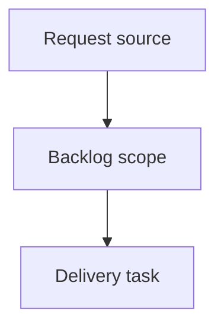

## item_364_implement_agent_closeout_loop_ergonomics - Implement agent closeout loop ergonomics
> From version: 2.1.2
> Schema version: 1.0
> Status: Ready
> Understanding: 90%
> Confidence: 85%
> Progress: 0%
> Complexity: Medium
> Theme: Operator workflow
> Reminder: Update status/understanding/confidence/progress and linked request/task references when you edit this doc.

# Problem
- Deliver a bounded backlog slice for implement agent closeout loop ergonomics.

# Scope
- In:
  - one coherent delivery slice from the operator request.
- Out:
  - unrelated sibling slices.

# Acceptance criteria
- AC1: The backlog slice stays bounded for implement agent closeout loop ergonomics.
- AC2: The backlog slice is reviewable and promotable into a task.

# AC Traceability
- request-AC1 -> This backlog slice. Proof: bounded delivery slice.
- request-AC2 -> This backlog slice. Proof: promotable backlog item.
- request-AC3 -> This backlog slice. Proof: delivery chain includes a task-ready backlog item.

# Decision framing
- Product framing: Not needed
- Architecture framing: Not needed

# Links
- Product brief(s): `prod_018_agent_closeout_loop_ergonomics`
- Architecture decision(s): (none yet)
- Request: `logics/request/req_200_implement_agent_closeout_loop_ergonomics.md`
- Primary task(s): (none yet)

# AI Context
- Summary: Implement agent closeout loop ergonomics
- Keywords: backlog, promote, slice, implement agent closeout loop ergonomics
- Use when: You need a bounded backlog item for Implement agent closeout loop ergonomics.
- Skip when: The change should go straight to implementation detail.

# Priority
- Impact:
- Urgency:

# Notes
- Generated locally by logics-manager.

# Tasks
- `task_165_implement_agent_closeout_loop_ergonomics`
