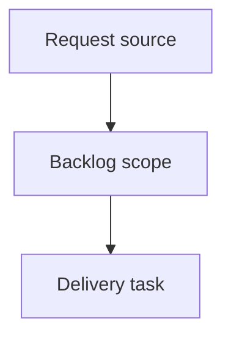

## item_365_add_a_local_web_viewer_for_cli_driven_logics_work - Add a local web viewer for CLI-driven Logics work
> From version: 2.2.0
> Schema version: 1.0
> Status: Ready
> Understanding: 90%
> Confidence: 85%
> Progress: 0%
> Complexity: High
> Theme: Operator workflow and runtime integration
> Reminder: Update status/understanding/confidence/progress and linked request/task references when you edit this doc.

# Problem
Give CLI-first Logics operators a visual feedback surface for browsing workflow docs, relationships, validation state, and markdown content without launching VS Code.
Reuse the existing VS Code webview experience where possible through a standalone local browser viewer.
Keep the CLI as the canonical workflow entrypoint while adding a richer local read surface for document-heavy work.

# Scope
- In:
  - one coherent delivery slice from the source request
- Out:
  - unrelated sibling slices that should stay in separate backlog items instead of widening this doc

# Acceptance criteria
- AC1: The product direction explains why CLI output alone is insufficient for document-heavy Logics work.
- AC2: The first version is scoped as a local browser viewer, not a VS Code replacement or cloud service.
- AC3: The proposal preserves the CLI/runtime as the authority for data and future mutations.
- AC4: The brief identifies reuse points from the existing webview and the need for a host adapter boundary.
- AC5: Security and scope guardrails are explicit, especially localhost-only behavior by default.

# AC Traceability
- request-AC1 -> This backlog slice. Proof: AC1: The product direction explains why CLI output alone is insufficient for document-heavy Logics work.
- request-AC2 -> This backlog slice. Proof: AC2: The first version is scoped as a local browser viewer, not a VS Code replacement or cloud service.
- request-AC3 -> This backlog slice. Proof: AC3: The proposal preserves the CLI/runtime as the authority for data and future mutations.
- request-AC4 -> This backlog slice. Proof: AC4: The brief identifies reuse points from the existing webview and the need for a host adapter boundary.
- request-AC5 -> This backlog slice. Proof: AC5: Security and scope guardrails are explicit, especially localhost-only behavior by default.

# Decision framing
- Product framing: Not needed
- Product signals: (none detected)
- Product follow-up: No product brief follow-up is expected based on current signals.
- Architecture framing: Not needed
- Architecture signals: (none detected)
- Architecture follow-up: No architecture decision follow-up is expected based on current signals.

# Links
- Product brief(s): `logics/product/prod_020_local_web_viewer_for_cli_driven_logics_work.md`
- Architecture decision(s): (none yet)
- Request: `logics/request/req_201_add_a_local_web_viewer_for_cli_driven_logics_work.md`
- Primary task(s): `logics/tasks/task_166_add_a_local_web_viewer_for_cli_driven_logics_work.md`

# AI Context
- Summary: Add a local web viewer for CLI-driven Logics work
- Keywords: backlog-groom, request, add a local web viewer for cli-driven logics work, bounded slice
- Use when: Use when implementing or reviewing the delivery slice for Add a local web viewer for CLI-driven Logics work.
- Skip when: Skip when the change is unrelated to this delivery slice or its linked request.

# Priority
- Impact:
- Urgency:

# Notes
- Hybrid rationale: Derived from request `req_201_add_a_local_web_viewer_for_cli_driven_logics_work` and kept bounded to one coherent delivery slice.
- Source file: `logics/request/req_201_add_a_local_web_viewer_for_cli_driven_logics_work.md`.
- Generated locally by logics-manager.

# Tasks
- `task_166_add_a_local_web_viewer_for_cli_driven_logics_work`
