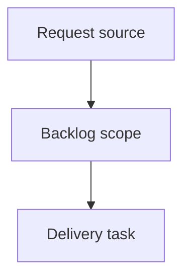

## item_366_harden_local_viewer_ux_after_first_operator_review - Harden local viewer UX after first operator review
> From version: 2.2.0
> Schema version: 1.0
> Status: Done
> Understanding: 90%
> Confidence: 85%
> Progress: 100%
> Complexity: High
> Theme: Operator workflow and runtime integration
> Reminder: Update status/understanding/confidence/progress and linked request/task references when you edit this doc.

# Problem
Make the first local viewer feel like a coherent read-only operator cockpit rather than a lightly adapted VS Code webview.
Remove confusing mutation affordances from the browser surface while preserving the CLI as the authoritative command path.
Turn document and health inspection into usable browser views instead of raw debug-style output.
Ensure the viewer lifecycle is comfortable for CLI-first use, especially clean shutdown from the terminal.

# Scope
- In:
  - one coherent delivery slice from the source request
- Out:
  - unrelated sibling slices that should stay in separate backlog items instead of widening this doc

# Acceptance criteria
- AC1: `logics-manager view` stops cleanly on `Ctrl-C` without hanging and without printing noisy `BrokenPipeError` tracebacks for interrupted browser/API requests.
- AC2: The local viewer does not present mutating actions as available browser commands in read-only mode; unavailable future actions are hidden, disabled with clear copy, or moved out of the primary action path.
- AC3: The primary document action is clear and read-only, using viewer-appropriate wording such as `Read document` or `Preview`; `Open` no longer implies editing in the local browser surface.
- AC4: Document view renders markdown through the shared markdown renderer or an equivalent browser-safe path, including headings, lists, links, tables, code blocks, and readable long-line behavior.
- AC5: The local viewer shell has dedicated styling for the topbar, status/meta line, document panel, and responsive layout so it feels intentional outside VS Code.
- AC6: Health view summarizes lint and audit results visually, highlights blocking issues and warnings, and provides a path to inspect affected documents instead of dumping raw JSON as the primary display.
- AC7: The read-only local viewer behavior is covered by focused tests or a harness check for action availability, document rendering, health rendering, and shutdown behavior where practical.

# AC Traceability
- request-AC1 -> This backlog slice. Proof: AC1: `logics-manager view` stops cleanly on `Ctrl-C` without hanging and without printing noisy `BrokenPipeError` tracebacks for interrupted browser/API requests.
- request-AC2 -> This backlog slice. Proof: AC2: The local viewer does not present mutating actions as available browser commands in read-only mode; unavailable future actions are hidden, disabled with clear copy, or moved out of the primary action path.
- request-AC3 -> This backlog slice. Proof: AC3: The primary document action is clear and read-only, using viewer-appropriate wording such as `Read document` or `Preview`; `Open` no longer implies editing in the local browser surface.
- request-AC4 -> This backlog slice. Proof: AC4: Document view renders markdown through the shared markdown renderer or an equivalent browser-safe path, including headings, lists, links, tables, code blocks, and readable long-line behavior.
- request-AC5 -> This backlog slice. Proof: AC5: The local viewer shell has dedicated styling for the topbar, status/meta line, document panel, and responsive layout so it feels intentional outside VS Code.
- request-AC6 -> This backlog slice. Proof: AC6: Health view summarizes lint and audit results visually, highlights blocking issues and warnings, and provides a path to inspect affected documents instead of dumping raw JSON as the primary display.
- request-AC7 -> This backlog slice. Proof: AC7: The read-only local viewer behavior is covered by focused tests or a harness check for action availability, document rendering, health rendering, and shutdown behavior where practical.

# Decision framing
- Product framing: Not needed
- Product signals: (none detected)
- Product follow-up: No product brief follow-up is expected based on current signals.
- Architecture framing: Not needed
- Architecture signals: (none detected)
- Architecture follow-up: No architecture decision follow-up is expected based on current signals.

# Links
- Product brief(s): (none yet)
- Architecture decision(s): (none yet)
- Request: `req_202_harden_local_viewer_ux_after_first_operator_review`
- Primary task(s): `task_167_harden_local_viewer_ux_after_first_operator_review`

# AI Context
- Summary: Harden local viewer UX after first operator review
- Keywords: backlog-groom, request, harden local viewer ux after first operator review, bounded slice
- Use when: Use when implementing or reviewing the delivery slice for Harden local viewer UX after first operator review.
- Skip when: Skip when the change is unrelated to this delivery slice or its linked request.

# Priority
- Impact:
- Urgency:

# Notes
- Hybrid rationale: Derived from request `req_202_harden_local_viewer_ux_after_first_operator_review` and kept bounded to one coherent delivery slice.
- Source file: `logics/request/req_202_harden_local_viewer_ux_after_first_operator_review.md`.
- Generated locally by logics-manager.
- Task `task_167_harden_local_viewer_ux_after_first_operator_review` was finished via `logics-manager flow finish task` on 2026-06-07.

# Tasks
- `task_167_harden_local_viewer_ux_after_first_operator_review`
