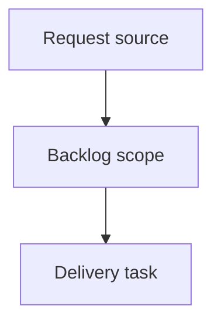

## item_367_improve_local_viewer_corpus_navigation - Improve local viewer corpus navigation
> From version: 2.2.0
> Schema version: 1.0
> Status: Ready
> Understanding: 92
> Confidence: 86
> Progress: 0
> Complexity: High
> Theme: UI
> Reminder: Update status/understanding/confidence/progress and linked request/task references when you edit this doc.

# Problem
Make the local browser viewer useful for managing a large Logics corpus, not only reading individual docs.
Add a local `Corpus insights` entry point so CLI-driven operators can see corpus health, relationship gaps, and recent activity without opening VS Code.
Redesign the filter and sort controls so operators can quickly answer practical questions such as "what is active", "what is blocked", "what needs promotion", "what is unlinked", and "what changed recently".

# Scope
- In:
  - one coherent delivery slice from the source request
- Out:
  - unrelated sibling slices that should stay in separate backlog items instead of widening this doc

# Acceptance criteria
- AC1: The local viewer exposes corpus insights from its top-level UI, including overview counts, flow health, relationship gaps, and recent activity.
- AC2: Corpus insights reuse existing indexed Logics item data where practical and avoid duplicating the full VS Code insights implementation.
- AC3: The filter and sort UI is reorganized around operator tasks, with visible search, quick stage/status filters, advanced filters, presets, active-filter count, and clear reset behavior.
- AC4: The revised controls make it easy to isolate active work, blocked work, unlinked docs, recently changed docs, companion docs, and items needing promotion.
- AC5: The local viewer remains lightweight, responsive, and read-mostly; existing read, health, refresh, and edit-document flows keep working.
- AC6: Browser-host tests and Python viewer tests cover the new insights payload/rendering and the filter/sort control behavior.

# AC Traceability
- request-AC1 -> This backlog slice. Proof: AC1: The local viewer exposes corpus insights from its top-level UI, including overview counts, flow health, relationship gaps, and recent activity.
- request-AC2 -> This backlog slice. Proof: AC2: Corpus insights reuse existing indexed Logics item data where practical and avoid duplicating the full VS Code insights implementation.
- request-AC3 -> This backlog slice. Proof: AC3: The filter and sort UI is reorganized around operator tasks, with visible search, quick stage/status filters, advanced filters, presets, active-filter count, and clear reset behavior.
- request-AC4 -> This backlog slice. Proof: AC4: The revised controls make it easy to isolate active work, blocked work, unlinked docs, recently changed docs, companion docs, and items needing promotion.
- request-AC5 -> This backlog slice. Proof: AC5: The local viewer remains lightweight, responsive, and read-mostly; existing read, health, refresh, and edit-document flows keep working.
- request-AC6 -> This backlog slice. Proof: AC6: Browser-host tests and Python viewer tests cover the new insights payload/rendering and the filter/sort control behavior.

# Decision framing
- Product framing: Not needed
- Product signals: (none detected)
- Product follow-up: No product brief follow-up is expected based on current signals.
- Architecture framing: Not needed
- Architecture signals: (none detected)
- Architecture follow-up: No architecture decision follow-up is expected based on current signals.

# Links
- Product brief(s): (none yet)
- Architecture decision(s): (none yet)
- Request: `logics/request/req_203_improve_local_viewer_corpus_navigation.md`
- Primary task(s): (none yet)

# AI Context
- Summary: Improve local viewer corpus navigation
- Keywords: backlog-groom, request, improve local viewer corpus navigation, bounded slice
- Use when: Use when implementing or reviewing the delivery slice for Improve local viewer corpus navigation.
- Skip when: Skip when the change is unrelated to this delivery slice or its linked request.

# Priority
- Impact:
- Urgency:

# Notes
- Hybrid rationale: Derived from request `req_203_improve_local_viewer_corpus_navigation` and kept bounded to one coherent delivery slice.
- Source file: `logics/request/req_203_improve_local_viewer_corpus_navigation.md`.
- Generated locally by logics-manager.

# Tasks
- `task_168_improve_local_viewer_corpus_navigation`
